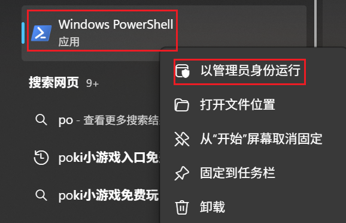

在 PyCharm 新建项目时如果没有看到 `uv` 选项，通常是因为 PyCharm 版本较旧，或者系统环境变量未正确配置。不过不用担心，你可以通过以下两种方式来使用 `uv` 管理项目：

# 使用uv管理项目

## 1. 安装uv

### 情况1

使用 `uv` 方式创建虚拟环境，如果之前用其他方式安装过 `uv` 则此处会自动识别出 `uv` 路径，如果没安装过 `uv` 直接点击 `安装 uv via pip`


### 情况2

`PyCharm`版本没有 `uv` 选项，则选择 `自定义环境`，类型选 `uv`，然后再点击 `安装 uv via pip`


安装完uv 后将 uv 路径配置在系统的 `Path` 环境变量中：例如我的路径是 `C:\Users\用户名\AppData\Roaming\Python\Scripts`

### 情况3

选项卡和下拉列表中都找不到 uv，则先手动全局安装 uv

Windows（以管理员打开 PowerShell）

```powershell
powershell -ExecutionPolicy Bypass -c "irm https://astral.sh/uv/install.ps1 | iex"
```

Mac / Linux（终端）

```bash
curl -LsSf https://astral.sh/uv/install.sh | sh
```

验证安装

关闭终端重新打开，执行

```bash
uv --version
```

## 2. 配置镜像源

为uv命令配置国内镜像源。

以管理员身份运行`Windows PowerShell`



如果运行报如下错误：


则在 `Windows PowerShell` 中设置安全策略允许本地脚本执行，方式如下：

```bash
Set-ExecutionPolicy Unrestricted -Scope CurrentUser
```

然后执行以下命令创建uv配置文件

```bash
# 在用户目录创建文件夹
mkdir -Force $env:APPDATA\uv
# 在文件夹中创建文件
New-Item -Path $env:APPDATA\uv\uv.toml -ItemType File
```

编辑 `uv.toml` 文件，添加以下内容

```bash
# 清华镜像（推荐）
index-url = "https://pypi.tuna.tsinghua.edu.cn/simple"
python-install-mirror = "https://mirror.nju.edu.cn/github-release/astral-sh/python-build-standalone/"
```

## 3. 安装指定版本的Python解释器

打开命令行终端，执行以下命令安装 `python 3.8`

```bash
# 列出已安装版本
uv python list

# 安装特定 Python 版本
uv python install 3.8
```

## 4. 创建uv项目

### 情况1\2

根据图形界面提示创建项目即可

### 情况3

PyCharm创建项目默认没有uv选项

```
#在命令终端执行
> d:
> mkdir project
> cd project
# 初始化项目
> uv init --python 3.12 my_pro
# 用pycharm打开项目（ cd my_pro）
# 在pycharm的终端中初始化uv环境
> uv venv
# 激活环境
> .venv\Scripts\activate
```

项目创建成功后，根目录下自动生成一个 `pyproject.toml`  文件。在 uv 虚拟环境中，`pyproject.toml` 是**项目依赖和配置的核心文件**，相当于项目的 “身份卡 + 依赖清单”，uv 会通过这个文件统一管理项目的 Python 版本、依赖包、构建规则等，是 uv 实现 “跨环境一致性” 的关键。

### 可能有用的命令

```bash

# 用conda虚拟环境
conda deactivate #本次禁用
conda config --set auto_activate_base false #永久禁用
```


