[TOC]


# 领域模型domain

## 第1章 消息模型 messages

### 1.1 为什么需要“消息”这个概念

在对话系统中，所有的交互本质上都是**一来一回的消息传递**。
- **用户发消息**：表达需求（文字）或指向某个具体商品/订单（对象）。
- **机器人回消息**：给出回答（文字）或指向某个具体商品/订单（对象）。

创建`atguigu/domain/messages.py` 用来定义这些“消息”。

### 1.2 FocusedObject：聚焦对象

当用户在聊天时点击了一个订单卡片或商品卡片，相当于告知系统"接下来的操作都与这个东西相关"。这个消息里就包含了一个“聚焦对象”。它告诉系统：**“我们现在正在讨论这个东西。”**

在`messages.py`中添加如下定义：

```python
class FocusedObject(BaseModel):
    """
    聚焦对象
    """
    id: str  # 对象的唯一标识（如order_id、product_id）
    type: str  # 对象类型（如 "order", "product"）
    title: str  # 对象的标题（如 “纯棉T恤”）
    attributes: dict = {} # 其他额外信息
```

`attributes` 字段的内容举例：

```json
{
    "status":"待发货",
    "amount":"8999.00",
    "created_at":"2026-04-10T10:00:00",
    "cover_url":"https://placehold.co/400x400/0052cc/ffffff?text=iPhone+15+Pro"
}
```

### 1.3 MessageType：消息枚举

这个枚举用来明确标记当前消息的“形态”，方便程序后续的逻辑判断。

在`messages.py`中添加如下定义：

```python
class MessageType(Enum):
    """
    消息类型
    """
    TEXT = "text"  # 文本类型
    OBJECT = "object"  # 对象类型
```

### 1.4 UserMessage：用户消息

在`messages.py`中添加如下定义：

```python
class UserMessage(BaseModel):
    sender_id: str  # 用户ID(必填字段)
    message_id: str  # 消息ID(必填字段)
    type: MessageType  # 消息类型（text 或 object）必填字段
    text: str | None = None  # 文本消息(用户说的话)
    object: FocusedObject | None = None  # 对象类型的消息(用户点击的对象)
```

两种典型场景：

1.  **纯文本**：用户说“我要退款”。此时 `type=TEXT`，`object=None`。
2.  **对象交互**：用户在订单卡片上点了“发送订单”。此时 `type=OBJECT`，`object` 字段会填入那个订单的 `FocusedObject`。

---

### 1.5 BotMessage：机器人消息

在`messages.py`中添加如下定义：

```python
class BotMessage(BaseModel):
    text: str | None = None # 机器人回复的话
    object: FocusedObject | None = None # 机器人返回的对象
```

机器人消息的结构更简单，只关注**回复内容**。

### 1.6 序列化

为了方便后续的操作，可以使用 `pydantic` 的 `obj.model_dump(mode='json')` 和 `cls.model_validate(data)` 做数据类型转换：

| 方法                          | 作用                     | 形象比喻                             |
| ----------------------------- | ------------------------ | ------------------------------------ |
| `obj.model_dump(mode='json')` | 把 Python 对象变成字典   | **打包**：把行李装进箱子，准备入库   |
| `cls.model_validate(data)`    | 把字典还原成 Python 对象 | **拆包**：从箱子里取出行李，恢复原样 |

**示例：**在`messages.py`中添加单元测试

```python
if __name__ == '__main__':
    fo = FocusedObject(id="1", type="2")

    # 把 Python 对象变成字典
    data = fo.model_dump(mode='json')
    # 把字典还原成 Python 对象
    obj = FocusedObject.model_validate(data)

    print(type(fo)) #FocusedObject对象
    print(type(data)) #dict字典
    print(type(obj)) #FocusedObject对象
```

### 1.7 小结

#### 1.7.1 模块

| 模块            | 核心职责                                    |
| --------------- | ------------------------------------------- |
| `FocusedObject` | 描述对话中正在讨论的具体“东西”（订单/商品） |
| `UserMessage`   | 记录用户的输入，支持文字和对象点击          |
| `BotMessage`    | 记录机器人的输出，支持文字和对象            |
| `MessageType`   | 区分消息是“文本”还是“对象”                  |

#### 1.7.2 UML类图

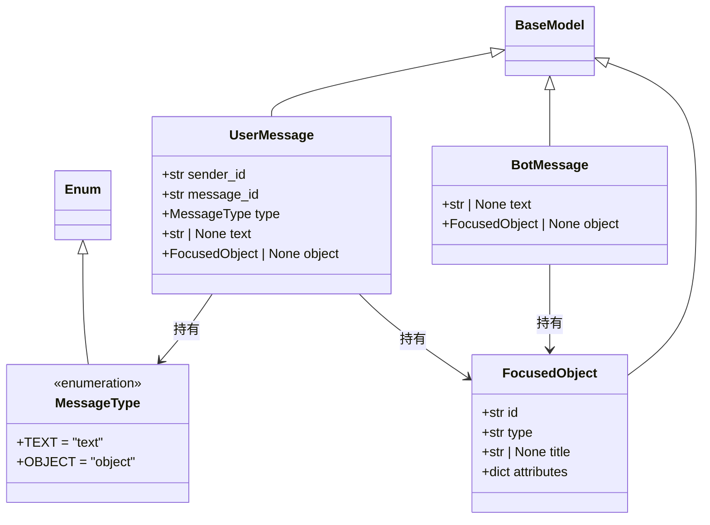
```mermaid
classDiagram
    class BaseModel
    class Enum

	class MessageType {
        <<enumeration>>
        +TEXT = "text"
        +OBJECT = "object"
    }
    class FocusedObject {
        +str id
        +str type
        +str | None title
        +dict attributes
    }
    class UserMessage {
        +str sender_id
        +str message_id
        +MessageType type
        +str | None text
        +FocusedObject | None object
    }
    class BotMessage {
        +str | None text
        +FocusedObject | None object
    }
    
    UserMessage --> MessageType : 持有
    Enum <|-- MessageType
    
    BaseModel  <|--  UserMessage
    BaseModel  <|--  BotMessage
    BaseModel <|--  FocusedObject
    UserMessage --> FocusedObject : 持有
    BotMessage --> FocusedObject : 持有
```

UML：统一建模语言

典型的UML：类图、时序图、用例图、状态机图

#### 1.7.3 完整的代码

```python
# atguigu/domain/messages.py

"""
消息类型：两种
UserMessage(用户)
BotMessage(机器人)
"""
from enum import Enum
from pydantic import BaseModel

class FocusedObject(BaseModel):
    """
    聚焦对象
    """
    id: str  # 对象的唯一标识（如order_id、product_id）
    type: str  # 对象类型（如 "order", "product"）
    title: str | None = None  # 对象的标题（如 “纯棉T恤”）
    attributes: dict = {} # 其他额外信息

class MessageType(Enum):
    TEXT = "text"  # 文本类型
    OBJECT = "object"  # 对象类型

class UserMessage(BaseModel):
    sender_id: str  # 用户ID(必填字段)
    message_id: str  # 消息ID(必填字段)
    type: MessageType  # 消息类型（text or object）必填字段
    text: str | None = None  # 文本消息
    object: FocusedObject | None = None  # 对象类型的消息

class BotMessage(BaseModel):
    text: str | None = None
    object: FocusedObject | None = None

if __name__ == '__main__':
    fo = FocusedObject(id="1", type="2")

    # 把 Python 对象变成字典
    data = fo.model_dump(mode='json')
    # 把字典还原成 Python 对象
    obj = FocusedObject.model_validate(data)

    print(type(fo)) #FocusedObject对象
    print(type(data)) #dict字典
    print(type(obj)) #FocusedObject对象

```

## 第2章 对话上下文模型 contexts

### 2.1 为什么需要"上下文"这个概念

#### 2.1.1 例1 单任务正常完成

在前一节项目概述中，我们已经知道客服系统有三类能力：任务流程、信息检索、闲聊。其中任务流程是最复杂的一类，因为它要分步骤推进，而且经常会被打断。

举几个真实的例子：

```text
例 1：单任务正常完成
用户：我要退款
客服：请告诉我你的订单号。
用户：A20240315001
客服：请简单说一下退款原因。
用户：尺码不合适
客服：好的，订单 A20240315001 的退款申请已提交……
```

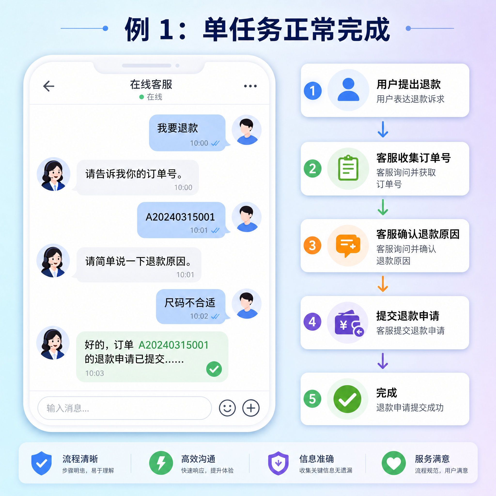

#### 2.1.2 例2 任务被另一个任务打断

```text
例 2：任务被另一个任务打断
用户：我要退款
客服：请告诉我你的订单号。
用户：先帮我查一下物流
客服：好的，我们先处理物流查询。请告诉我你的订单号。
用户：A20240315001
客服：订单 A20240315001 当前状态是运输中……
用户：继续刚才的退款
客服：好的，我们继续刚才的退款申请。请告诉我你的订单号。
```

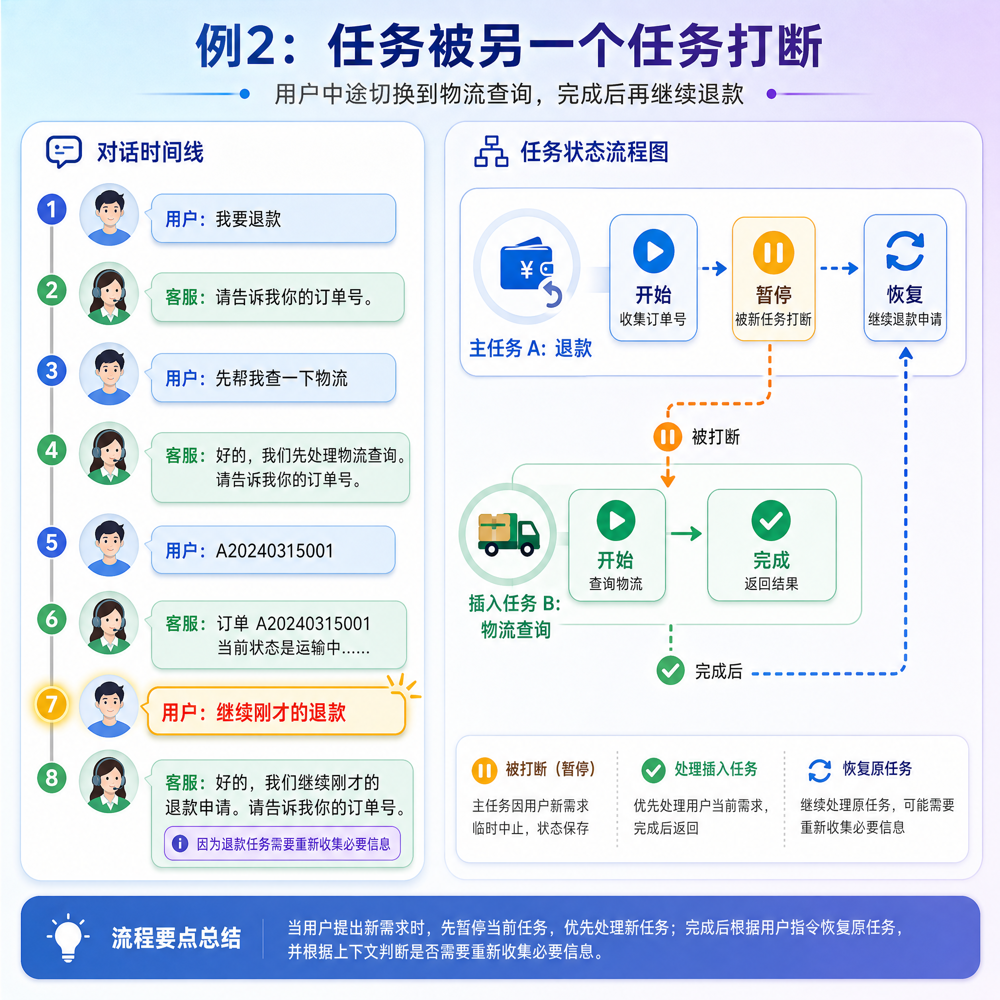

从例 2 可以看到两件事： 

- 同一时刻可能存在**多个未完成的任务**，需要区分谁是当前活跃的、谁是被搁置的
- 系统在切换任务时会插播一些"过场白"，例如"好的，我们先处理物流查询"

这两件事就分别对应了两类对象：

| 概念            | 作用                                     |
| --------------- | ---------------------------------------- |
| `TaskContext`   | **业务任务**的执行快照（用户想做的事）   |
| `SystemContext` | **系统流程**的执行快照（系统插播的过场） |

只有把"用户的任务"和"系统的过场"分开建模，多任务切换、打断恢复这些行为才说得清楚。下面我们逐一分析。

创建`atguigu/domain/contexts.py` 用来定义这些“上下文”。

### 2.2 TaskContext：业务任务的快照

#### 2.2.1 什么是“业务任务”

```python
active_task: TaskContext | None
paused_tasks: List[TaskContext]
```

用户可以在对话中同时涉及多个业务任务，例如正在办理退款时临时插问一句物流状态。系统的处理方式是：同一时刻只有一个**活跃任务**（`active_task`），被中断的任务压入**挂起列表**（`paused_tasks`），新任务处理完毕后可恢复。`paused_tasks` 是一个有序列表，按挂起的先后顺序排列。每个任务的执行进度封装在 `TaskContext` 中。

#### 2.2.2 定义TaskContext

在`contexts.py`中添加如下定义：

```python
class TaskContext(BaseModel):
    """
    业务任务上下文
    """
    flow_id: str  # 业务任务的流程ID
    step_id: str | None = None  # 业务任务下的步骤ID
    slots: dict = {}  # 业务任务执行过程中收集到的槽位数据
```

字段说明：

| 字段      | 含义                                                         |
| --------- | ------------------------------------------------------------ |
| `flow_id` | 当前业务任务对应的流程 ID，例如 `refund_request`、`order_status_query` |
| `step_id` | 当前业务任务执行到了流程中的哪一步，例如 `ask_order_number`、`ask_refund_reason` |
| `slots`   | 业务任务执行过程中收集到的数据，例如 `{"order_number": "A001", "refund_reason": "尺码不合适"}` |

可以把 `TaskContext` 类比成一份正在填的表单：

- `flow_id` 表示这是哪一种表单（退款单 / 物流单）
- `step_id` 表示当前填到了哪一格
- `slots` 表示已经填写好的内容

#### 2.2.3 场景模拟

以退款申请流程为例：

##### 第一轮

```text
用户：我要退款
客服：请告诉我你的订单号。
```

这一轮结束后，`TaskContext` 的状态是：

`flow_id` 对应配置文件中的流程名称 `refund_request`，`step_id` 对应流程内某个步骤的 `id`，`slots` 中的键来自该流程涉及的槽位定义：

```python
TaskContext(
    flow_id="refund_request",
    step_id="ask_order_number",
    slots={}
)
```

##### 第二轮

```text
用户：A20240315001
客服：请简单说一下退款原因。
```

这一轮结束后变成：

```python
TaskContext(
    flow_id="refund_request",
    step_id="ask_refund_reason",
    slots={"order_number": "A20240315001"}
)
```

##### 第三轮

```
用户：尺码不合适
客服：好的，订单A20240315001的退款申请已提交，原因是：尺码不合适。后续会尽快为你处理。
```

这一轮结束后变成：

```python
TaskContext(
    flow_id="refund_request",
    step_id="refund_submitted",
    slots={"order_number": "A20240315001", "refund_reason": "尺码不合适"}
)
```

可以看到 `step_id` 在流程中不断推进，`slots` 在不断累积。`flow_id` 只在任务开始时确定，之后整个生命周期都不变。

### 2.3 SystemContext：系统流程的快照

#### 2.3.1 什么是"系统流程"

```python
active_system_flow: SystemContext | None
```

系统流程是由系统主动发起的一类特殊交互，用于向用户传递系统级通知，例如询问缺失参数、告知任务启动或完成、说明任务被打断等。

业务任务由用户发起（例如"我要退款"），系统流程则由**系统自己发起**，用来插播一些过场话。

举几个常见的例子：

| 场景             | 系统说的话                             |
| ---------------- | -------------------------------------- |
| 任务刚开始       | "好的，我们先处理退款申请。"           |
| 任务被新任务打断 | "好的，我们先把退款放一放，先看物流。" |
| 任务被用户取消   | "好的，退款已为你取消。"               |
| 之前的任务恢复   | "好的，我们继续刚才的退款。"           |
| 需要补一个槽位   | "请告诉我你的订单号。"                 |

这些话不属于任何一个具体业务流程，它们是系统在"协调"业务流程时说的。所以我们专门为这类交互建一个上下文模型——`SystemContext`。

#### 2.3.2 定义基类SystemContext

`SystemContext` 的基础结构与 `TaskContext` 相同，同样记录流程标识和当前步骤。

在`contexts.py`中添加如下定义：

```python
class SystemContext(BaseModel):
    """
    系统流程上下文
    定义具体流程的通用属性
    """
    flow_id: str  # 系统流程的流程ID
    step_id: str | None = None  # 系统流程当前执行的步骤ID
```

字段说明：

| 字段      | 含义                                                         |
| --------- | ------------------------------------------------------------ |
| `flow_id` | 系统流程的流程ID，例如 `system_task_started`、`system_collect_information` |
| `step_id` | 系统流程当前执行的步骤ID，例如 `start`、`ask`                |

#### 2.3.3 五个子类

| 子类                       | 触发时机                                    | 系统会说的话（举例）                         |
| -------------------------- | ------------------------------------------- | -------------------------------------------- |
| `StartedSystemContext`     | 用户刚发起一个新任务                        | "好的，我们先处理退款申请。"                 |
| `InterruptedSystemContext` | 用户在 A 任务过程中切到 B 任务              | "好的，我们先把退款放一放，先处理物流查询。" |
| `CanceledSystemContext`    | 用户主动取消当前任务                        | "好的，退款申请已为你取消。"                 |
| `ResumedSystemContext`     | 用户要求恢复之前挂起的任务                  | "好的，我们继续刚才的退款申请。"             |
| `CollectSystemContext`     | 业务流程跑到 `collect` 步骤，需要用户补数据 | "请告诉我你的订单号。"                       |

### 2.4 五个 SystemContext 子类

下面逐一定义每个子类，每个子类都搭配一段交互示例，看看它出现在对话的哪个位置。

#### 2.4.1 StartedSystemContext：任务刚开始

##### 类定义

在`contexts.py`中添加如下定义：

```python
class StartedSystemContext(SystemContext):
    """
    流程开始
    """
    started_flow_id: str = ""  #新开始的业务任务ID
    started_flow_name: str = ""  #新开始的业务任务名字
```

##### 场景模拟

```text
用户：我要退款                        ← 触发"业务任务"开始
客服：好的，我们先处理退款申请。       ← 这是 "系统流程" StartedSystemContext(system_task_started) 起作用
客服：请告诉我你的订单号。             ← 这里已经进入了 "业务任务"
```

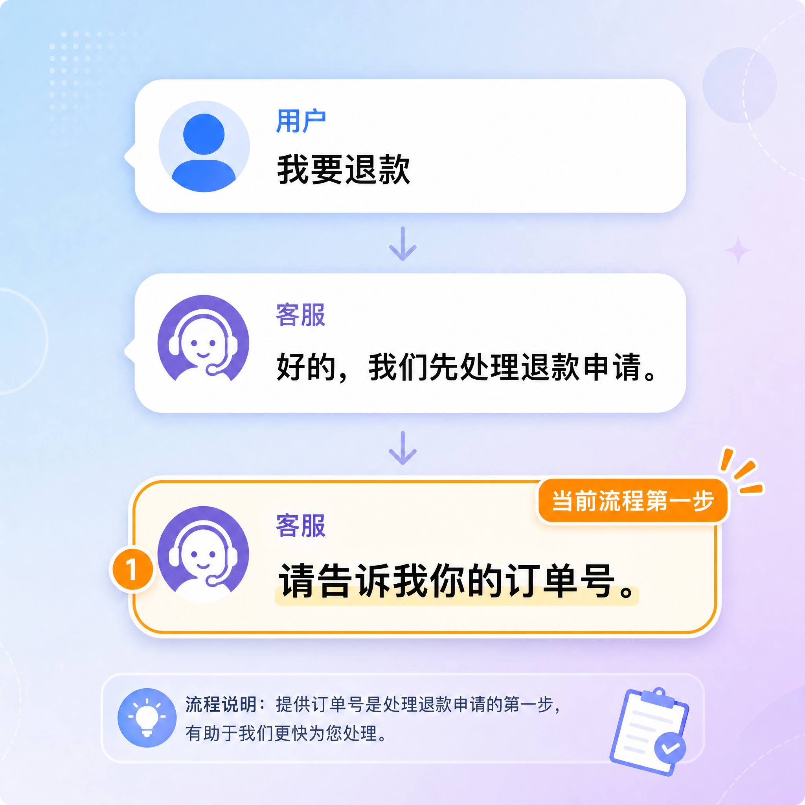

**注意**：

- 第一条机器人回复是"系统流程"产生的过场，第二条才是"业务任务"本身。
- 业务任务和系统流程**同时**存在。这一轮里"系统流程"先说话，说完就退出，然后"业务任务"继续推进。

##### 状态快照

```python
active_task = TaskContext(flow_id="refund_request", step_id="ask_order_number", slots={})
active_system_task = StartedSystemContext(
    flow_id="system_task_started",
    step_id="acknowledge",
    started_flow_id="refund_request",
    started_flow_name="退款申请",
)
```

#### 2.4.2 InterruptedSystemContext：任务被打断

##### 类定义

在`contexts.py`中添加如下定义：

```python
class InterruptedSystemContext(SystemContext):
    """
    流程中断
    """
    interrupted_flow_id: str = ""  # 被中断的旧业务任务ID
    interrupted_flow_name: str = ""  # 被中断的旧业务任务名字
    started_flow_id: str = ""  # 新开始的业务任务ID
    started_flow_name: str = ""  # 新开始的业务任务名字
```

为什么一个上下文里要装"老任务 + 新任务"两份信息？因为系统说话时要把两个名字都念出来。

任务被中断 有两种典型场景。

##### 场景模拟1

###### 场景:打断一个任务(基础)

```text
用户：我要退款
客服：好的，我们先处理退款申请。 
客服：请告诉我你的订单号。
用户：先帮我查一下物流                ← 用户中途切到另一个任务
客服：好的，我们先把退款申请放一放，先处理物流查询。   ← Interrupted
客服：请告诉我你的订单号。
```

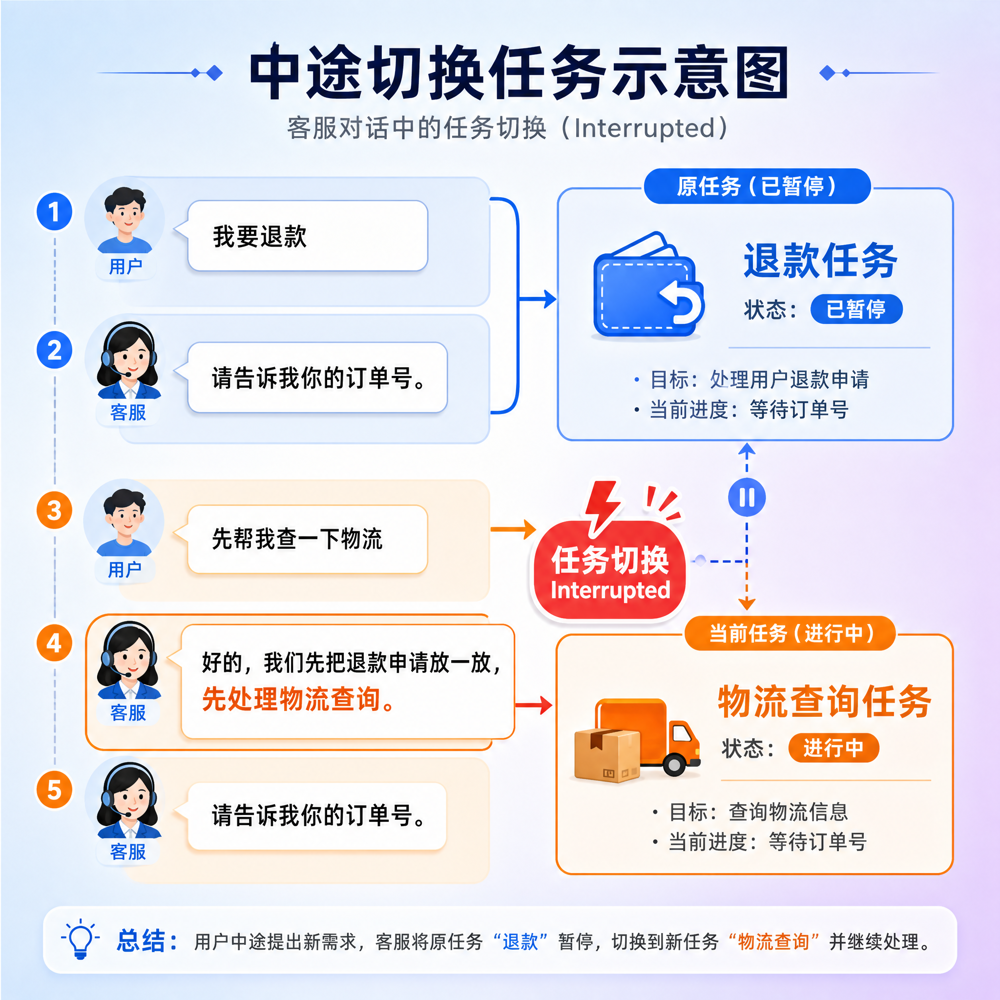

###### 状态快照

- 老的退款任务先放着（用 `interrupted_flow_name`）
- 现在开始处理新的物流查询任务（用 `started_flow_name`）

```python
paused_tasks = [TaskContext(flow_id="refund_request", ...)]   ← 退款被挂起
active_task = TaskContext(flow_id="logistics_tracking", ...)   ← 物流变成活跃
active_system_task = InterruptedSystemContext(
    flow_id="system_task_interrupted",
    step_id="acknowledge",
    interrupted_flow_id="refund_request",
    interrupted_flow_name="退款申请",
    started_flow_id="logistics_tracking",
    started_flow_name="物流查询",
)
```

##### 场景模拟2

###### 场景:打断两个任务(连环打断)

```text
用户:帮我查一下订单状态
客服:好的,我们先处理订单状态查询。      
客服:请告诉我你的订单号。
用户:先帮我查一下物流                  ← 第一次中途切换
客服:好的,我们先把订单状态查询放一放,先处理物流查询。   ← 第一次 Interrupted
客服:请告诉我你的订单号。
用户:我想申请退款                       ← 第二次中途切换
客服:好的,我们先把物流查询放一放,先处理退款申请。      ← 第二次 Interrupted
客服:请告诉我你的订单号。
```

.png)

###### 状态快照

- `paused_tasks` 不是单个字段,而是一个**列表/栈**。它的本质就是要承接"连环打断"这种场景
- `InterruptedSystemContext` 里的 `interrupted_*` 字段只记录**最近这一次**被打断的任务,而不是全部历史。系统说话只关心"刚刚被你放下的那件事",不需要把所有挂起的任务都念一遍
- 订单状态查询的信息**完整保留**在 `paused_tasks[0]` 里——`step_id`、`slots` 都在。后续如果用户说"继续刚才的订单状态查询",系统能精准恢复到 `ask_order_number` 那一步

```python
# ─── 起点:用户进入对话 ─────────────────────────────────
active_task   = None
paused_tasks  = []

# ─── 第 1 轮:"帮我查一下订单状态" ─────────────────────
active_task   = TaskContext(
    flow_id="order_status_query",
    step_id="ask_order_number",
    slots={},
)
paused_tasks  = []
active_system_task = StartedSystemContext(
    started_flow_id="order_status_query",
    started_flow_name="订单状态查询",
)

# ─── 第 2 轮:"先帮我查一下物流"(第一次打断)──────────
active_task = TaskContext(
    flow_id="logistics_tracking",
    step_id="ask_order_number",
    slots={},
)
paused_tasks  = [
    TaskContext(flow_id="order_status_query", step_id="ask_order_number", slots={}),
]
active_system_task = InterruptedSystemContext(
    interrupted_flow_id="order_status_query",
    interrupted_flow_name="订单状态查询",
    started_flow_id="logistics_tracking",
    started_flow_name="物流查询",
)

# ─── 第 3 轮:"我想申请退款"(第二次打断)────────────
active_task = TaskContext(
    flow_id="refund_request",
    step_id="ask_order_number",
    slots={},
)
paused_tasks  = [
    TaskContext(flow_id="order_status_query", step_id="ask_order_number", slots={}),
    TaskContext(flow_id="logistics_tracking", step_id="ask_order_number", slots={}),
]
active_system_task = InterruptedSystemContext(
    interrupted_flow_id="logistics_tracking",
    interrupted_flow_name="物流查询",
    started_flow_id="refund_request",
    started_flow_name="退款申请",
    flow_id= "system_task_interrupted",
    step_id = "acknowledge"
)
```

#### 2.4.3 CanceledSystemContext：任务被取消

##### 类定义

在`contexts.py`中添加如下定义：

```python
class CanceledSystemContext(SystemContext):
    """
    流程取消
    """
    canceled_flow_id: str = "" # 被取消的业务任务ID
    canceled_flow_name: str = "" # 被取消的业务任务名字
```

##### 场景模拟1

任务取消有两种典型场景，对应用户两种不同的说法

###### 场景:取消当前活跃任务

```text
用户:我要退款
客服:好的,我们先处理退款申请。      
客服:请告诉我你的订单号。
用户:算了不退了                      ← 取消正在做的任务
客服:好的,退款申请先帮你取消。
```


###### 状态快照

此时 `active_task` 被清空,不存在新任务。

注意:被取消的退款**不会**进入 `paused_tasks`,而是直接丢弃。这是和"打断"最根本的区别。

```python
# ─── 起点:用户进入退款流程 ─────────────────────────
active_task   = TaskContext(
    flow_id="refund_request",
    step_id="ask_order_number",
    slots={},
)
paused_tasks  = []
active_system_task = StartedSystemContext(
    flow_id="system_task_started",
    step_id="acknowledge",
    started_flow_id="refund_request",
    started_flow_name="退款申请",
)

# ─── "算了不退了" → 取消活跃任务 ──────────────────
active_task   = None                                ← 被丢弃,不进 paused_tasks
paused_tasks  = []
active_system_task = CanceledSystemContext(
    flow_id="system_task_canceled",
    step_id="acknowledge",
    canceled_flow_id="refund_request",
    canceled_flow_name="退款申请",
)
```

##### 场景模拟2

###### 场景:取消挂起的任务

```text
用户:我要退款
客服:请告诉我你的订单号。
用户:先帮我查一下物流                ← 退款被打断,进入 paused_tasks
客服:好的,我们先把退款放一放,先处理物流查询。
客服:请告诉我你的订单号。
用户:A20240315001
客服:订单当前状态是运输中……
用户:刚才那个退款不退了              ← 在物流任务中,取消挂起栈里的退款
客服:好的,退款申请已为你取消。
```

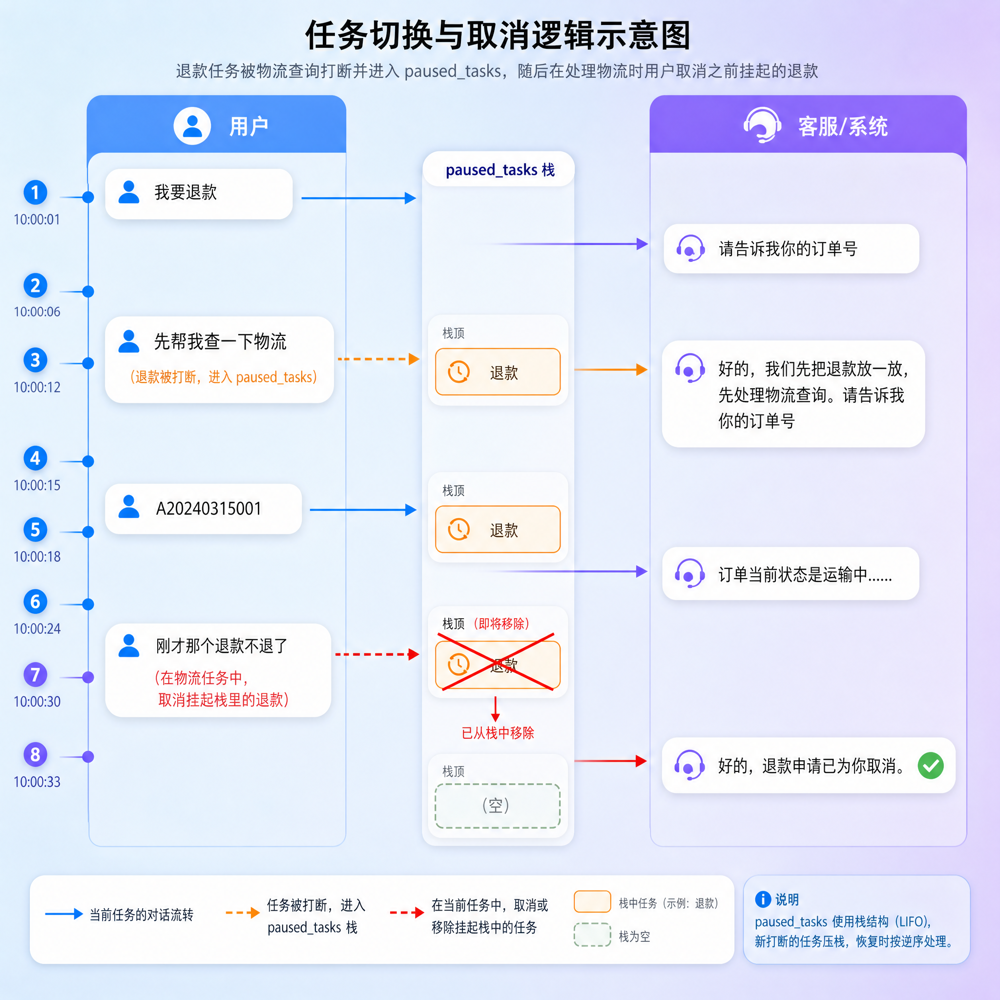

###### 状态快照

此时 `active_task` 还是物流查询(不动),被丢弃的是 `paused_tasks` 里的退款。物流流程继续往下走。

```python
# ─── 起点:退款被打断,物流查询正在跑 ───────────────
active_task = TaskContext(
    flow_id="logistics_tracking",
    step_id="show_logistics",
    slots={"order_number": "A20240315001", ...},
)
paused_tasks  = [
    TaskContext(flow_id="refund_request", step_id="ask_order_number", slots={}),
]
active_system_task = None                            ← 物流流程的过场已经结束

# ─── "刚才那个退款不退了" → 取消挂起栈里的退款 ────
active_task   = None
paused_tasks  = []                                   ← 退款从栈中被清掉
active_system_task = CanceledSystemContext(
    flow_id = "system_task_canceled"
    step_id = "acknowledge"
    canceled_flow_id="refund_request",
    canceled_flow_name="退款申请",
)
```

##### 取消 vs 打断的区别

|                  | 打断(Interrupted)                          | 取消(Canceled)                          |
| ---------------- | ------------------------------------------ | --------------------------------------- |
| 被处理的任务去向 | 进入 `paused_tasks`,后续可恢复             | 直接丢弃,不保留                         |
| 被处理的是谁     | 一定是**当前活跃任务**(因为有新任务要切入) | 可以是**活跃任务**,也可以是**挂起任务** |
| 是否伴随新任务   | 必然有(没有新任务就不会发生打断)           | 可有可无                                |
| 系统说的话       | "先把 A 放一放,处理 B"                     | "已为你取消 A"                          |

#### 2.4.4 ResumedSystemContext：任务被恢复

##### 类定义

在`contexts.py`中添加如下定义：

```python
class ResumedSystemContext(SystemContext):
    """
    流程恢复
    """
    resumed_flow_id: str = ""  # 被恢复的业务任务ID
    resumed_flow_name: str = ""  # 被恢复的业务任务名字
```

##### 场景模拟1

恢复任务有两种典型场景,对应用户两种不同的说法

接着 2.4.2 的连环打断场景往下:

###### 场景：默认恢复(用户没指明恢复哪个)

```text
(此时栈里有两个挂起任务:订单状态查询、物流查询;
 active_task 是退款申请,正在收集退款原因)

客服:请简单说一下退款原因。
用户:尺码不合适
客服:好的,订单 A20240315001 的退款申请已提交,原因是:尺码不合适。后续会尽快为你处理。
                                       ← 退款流程结束,active_task 清空
用户:继续刚才的                          ← 用户没指明,默认恢复最近挂起的
客服:好的,我们继续刚才的物流查询。       ← Resumed(恢复栈顶)
客服:请告诉我你的订单号。                ← 从物流流程之前停下的位置继续
```

.png)

###### 状态快照

注意 `paused_tasks` 从栈顶弹出了物流查询，订单状态查询还留在栈里。这就是 LIFO 语义——**后进先出**。

```python
# ─── 退款结束后 ───────────────────────────────────
active_task   = None
paused_tasks  = [
    TaskContext(flow_id="order_status_query", step_id="ask_order_number", slots={}),
    TaskContext(flow_id="logistics_tracking", step_id="ask_order_number", slots={}),
]

# ─── "继续刚才的" → 恢复栈顶(物流查询)────────────
active_task   = TaskContext(
    flow_id="logistics_tracking",
    step_id="ask_order_number",
    slots={},
)
paused_tasks  = [
    TaskContext(flow_id="order_status_query", step_id="ask_order_number", slots={}),
]
active_system_task = ResumedSystemContext(
    flow_id="system_task_resumed",
    step_id="acknowledge",
    resumed_flow_id="logistics_tracking",
    resumed_flow_name="物流查询",
)
```

##### 场景模拟2

###### 场景:精确恢复(用户明确指明)

同样从连环打断的状态出发:

```text
(此时栈里有两个挂起任务:订单状态查询、物流查询;
 active_task 是退款申请)

客服:请简单说一下退款原因。
用户:尺码不合适
客服:好的,订单 A20240315001 的退款申请已提交,原因是:尺码不合适。后续会尽快为你处理。
用户:继续刚才的订单状态查询              ← 用户明确指名,跳过栈顶
客服:好的,我们继续刚才的订单状态查询。   ← Resumed(精确匹配)
客服:请告诉我你的订单号。
```

.png)

###### 状态快照

注意这次被恢复的是**栈中间(底部)**的订单状态查询,物流查询还留在栈里没动。这种"跨过栈顶恢复"是 LIFO 默认行为做不到的,必须靠用户明确指明才能触发。

```python
# ─── 退款结束后 ───────────────────────────────────
active_task   = None
paused_tasks  = [
    TaskContext(flow_id="order_status_query", step_id="ask_order_number", slots={}),
    TaskContext(flow_id="logistics_tracking", step_id="ask_order_number", slots={}),
]

# ─── "继续刚才的订单状态查询" → 精确匹配 ─────────
active_task   = TaskContext(
    flow_id="order_status_query",
    step_id="ask_order_number",
    slots={},
)
paused_tasks  = [
    TaskContext(flow_id="logistics_tracking", step_id="ask_order_number", slots={}),
]
active_system_task = ResumedSystemContext(
    flow_id="system_task_resumed",
    step_id="acknowledge",
    resumed_flow_id="order_status_query",
    resumed_flow_name="订单状态查询",
)
```

#### 2.4.5 CollectSystemContext：收集槽位

##### 类定义

在`contexts.py`中添加如下定义：

```python
class CollectedSystemContext(SystemContext):
    """
    系统流程收集槽位信息
    """
    slot_name: str = ""  # 收集的槽位名
    response: dict = {}  # 例如：{"text":"请告诉我你的订单号"}
```

##### 场景模拟

它出现在业务流程跑到 `collect` 步骤、但用户还没提供该信息时：

```text
客服：请告诉我你的订单号。   ← CollectSystemContext 在驱动这条消息
用户：A20240315001
客服：（订单号收集到之后，返回业务任务的流程，继续下一步）
```


##### 它和前面四个的不同

|          | 前四个                                    | CollectSystemContext             |
| -------- | ----------------------------------------- | -------------------------------- |
| 触发原因 | 任务的生命周期事件（开始/打断/取消/恢复） | 业务任务主动声明"我需要这个槽位" |
| 出现频率 | 任务切换时可能会出现                      | 每次需要补槽都会出现             |
| 携带数据 | 业务流程名字                              | 槽位名 + 提示文案                |

可以这么理解：前四个是"任务级别"的过场，CollectSystemContext 是"步骤级别"的代理人——它帮业务流程把"我需要这个数据"这句话说出来，然后等用户回答。

##### 状态快照

```python
active_task = TaskContext(
    flow_id="refund_request",
    step_id="ask_order_number",      ← 业务任务流程停在 collect 步骤
    slots={}
)
active_system_task = CollectSystemContext(
    flow_id="system_collect_information",
    step_id="ask",
    slot_name="order_number",
    response={"text": "请告诉我你的订单号。"},
)
```

### 2.5 SystemContext 序列化

#### 2.5.1 问题背景

SystemContext 有多个子类，需要根据 flow_id 动态识别并实例化对应的子类对象。

在`contexts.py`中进行测试如下：

```python
if __name__ == '__main__':

    # 定义StartedSystemContext的字典数据
    data = {
        "flow_id": "system_task_started",
        "step_id": "start",
        "started_flow_id": "order_status_query",
        "started_flow_name": "订单状态查询"
    }

    # 用父类的返序列化方法没办法将子类的字段返序列化出来
    obj1 = SystemContext.model_validate(data)
    print(type(obj1))
    print(obj1)

    # 用子类的返序列化方法每次要区分到底是哪个子类对象
    obj2 = StartedSystemContext.model_validate(data)
    print(type(obj2))
    print(obj2)

```

#### 2.5.2 解决方案

使用 Pydantic Discriminated Union（区分/鉴别联合类型）

###### 步骤1：在每个子类中添加 Literal 类型的 flow_id 字段
   - 作用：作为"身份标签"，唯一标识每个子类

   - 原理：Pydantic 通过读取这个字段的值来判断应该创建哪个子类的实例

在`contexts.py`中的`SystemContext` 的所有子类中添加`flow_id`：

```python
class StartedSystemContext(SystemContext):
    ...
    # 使用 Literal 类型固定 flow_id 值，作为 Discriminated Union 的区分字段
    flow_id: Literal["system_task_started"] = "system_task_started"

class InterruptedSystemContext(SystemContext):
    ...
    flow_id: Literal["system_task_interrupted"] = "system_task_interrupted"

class CanceledSystemContext(SystemContext):
    ...
    flow_id: Literal["system_task_canceled"] = "system_task_canceled"

class ResumedSystemContext(SystemContext):
    ...
    flow_id: Literal["system_task_resumed"] = "system_task_resumed"

class CollectedSystemContext(SystemContext):
    ...
    flow_id: Literal["system_collect_information"] = "system_collect_information"
```

###### 步骤2：定义联合类型 SystemContextUnion
   - 使用 Annotated 将所有子类组合成一个联合类型
   - 通过 `Field(discriminator="flow_id")` 指定 flow_id 为区分字段
   - Pydantic 会根据 flow_id 的值自动选择正确的子类进行反序列化

在`contexts.py`中添加如下定义：

```python
# 定义系统流程的联合类型
SystemContextUnion = Annotated[
    StartedSystemContext |
    InterruptedSystemContext |
    CanceledSystemContext |
    ResumedSystemContext |
    CollectedSystemContext,
    Field(discriminator="flow_id")
]
```

###### 步骤3：创建 TypeAdapter 适配器实例
   - TypeAdapter 是 Pydantic V2 提供的工具，用于处理非 BaseModel 类型
   - 提供 validate_python() 方法替代 model_validate()

在`contexts.py`中添加如下定义：

```python
# 创建适配器实例
system_context_adapter = TypeAdapter(SystemContextUnion)
```

###### 步骤4：使用适配器进行类型转换
   - 反序列化：system_context_adapter.validate_python(data)
   - 优势：无需手动维护映射字典，代码更简洁、类型更安全

测试序列化，在`contexts.py`中添加如下测试代码：

```python
# 使用适配器的 validate_python()：替代 model_validate()
obj = system_context_adapter.validate_python(data)

print(type(obj))
print(obj)
```

### 2.6 TaskContext 与 SystemContext 的协作

最后用一张图把两类上下文的协作关系串起来。

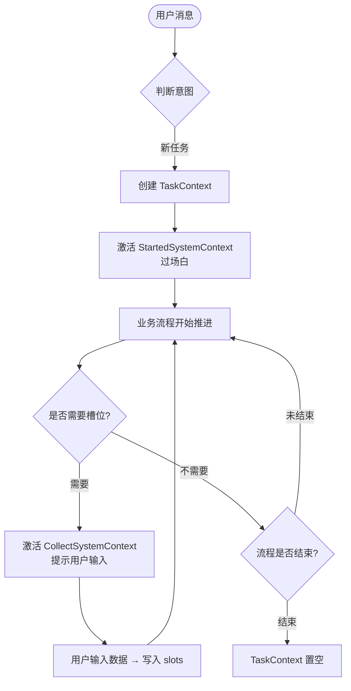
```mermaid
flowchart TD
    A(["用户消息"]) --> B{"判断意图"}
    B -->|新任务| C["创建 TaskContext"]
    C --> D["激活 StartedSystemContext<br/>过场白"]
    D --> E["业务流程开始推进"]

    E --> F{"是否需要槽位?"}
    F -->|需要| G["激活 CollectSystemContext<br/>提示用户输入"]
    G --> H["用户输入数据 → 写入 slots"]
    H --> E
    F -->|不需要| I{"流程是否结束?"}

    I -->|未结束| E
    I -->|结束| J["TaskContext 置空"]
```

再加一条任务切换的支路：

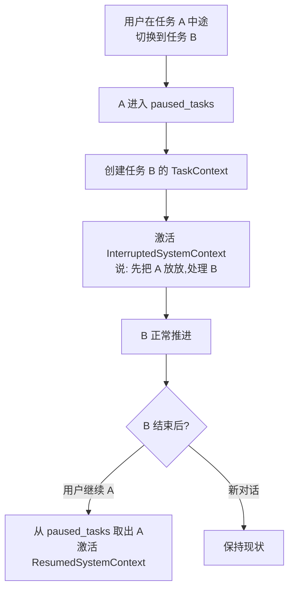
```mermaid
flowchart TD
    K["用户在任务 A 中途<br/>切换到任务 B"]
    K --> L["A 进入 paused_tasks"]
    L --> M["创建任务 B 的 TaskContext"]
    M --> N["激活 InterruptedSystemContext<br/>说: 先把 A 放放,处理 B"]
    N --> O["B 正常推进"]
    O --> P{"B 结束后?"}
    P -->|用户继续 A| Q["从 paused_tasks 取出 A<br/>激活 ResumedSystemContext"]
    P -->|新对话| R["保持现状"]
```

整个 `contexts.py` 的本质，就是用两类对象、五个子类，把"用户的事"和"系统的事"分开，再用 `flow_id` 标识每一种系统流程。

### 2.7 小结

#### 2.7.1 模块

| 模块                       | 核心职责                                 |
| -------------------------- | ---------------------------------------- |
| `TaskContext`              | 用户想做什么、做到哪一步、收集了哪些数据 |
| `SystemContext` 基类       | 系统插播的过场，统一序列化入口           |
| `StartedSystemContext`     | 任务开始的过场                           |
| `InterruptedSystemContext` | 任务被新任务打断的过场                   |
| `CanceledSystemContext`    | 任务被取消的过场                         |
| `ResumedSystemContext`     | 任务被恢复的过场                         |
| `CollectSystemContext`     | 收集槽位时的过场                         |
| `SystemContextUnion`       | 联合类型                                 |
| `system_context_adapter`   | 联合类型适配器实例                       |

#### 2.7.2 类图

`context`整体由两类对象、五个具体的系统流程子类组成

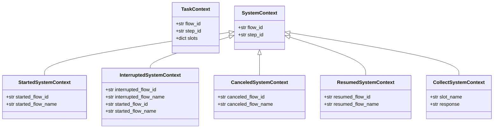
```mermaid
classDiagram
    %% 独立类
    class TaskContext {
        +str flow_id
        +str step_id
        +dict slots
    }

    %% 父基类
    class SystemContext {
        +str flow_id
        +str step_id
    }

    %% 五个子类，全部继承 SystemContext
    class StartedSystemContext {
        +str started_flow_id
        +str started_flow_name
    }
    SystemContext <|-- StartedSystemContext 

    class InterruptedSystemContext {
        +str interrupted_flow_id
        +str interrupted_flow_name
        +str started_flow_id
        +str started_flow_name
    }
    SystemContext <|-- InterruptedSystemContext

    class CanceledSystemContext {
        +str canceled_flow_id
        +str canceled_flow_name
    }
    SystemContext <|-- CanceledSystemContext

    class ResumedSystemContext {
        +str resumed_flow_id
        +str resumed_flow_name
    }
    SystemContext <|-- ResumedSystemContext

    class CollectSystemContext {
        +str slot_name
        +str response
    }
    SystemContext <|-- CollectSystemContext
```

#### 2.7.3 完整的代码

```python
# atguigu/domain/contexts.py
from typing import Literal, Annotated

from pydantic import BaseModel, Field, TypeAdapter


class TaskContext(BaseModel):
    """
    业务任务上下文
    """
    flow_id: str  # 业务任务的流程ID
    step_id: str | None = None  # 业务任务下的步骤ID
    slots: dict = {}  # 业务任务执行过程中收集到的槽位数据


class SystemContext(BaseModel):
    """
    系统流程上下文
    定义具体流程的通用属性
    """
    flow_id: str  # 系统流程的流程ID
    step_id: str | None = None  # 系统流程当前执行的步骤ID

class StartedSystemContext(SystemContext):
    """
    流程开始
    """
    started_flow_id: str = ""  # 新开始的业务任务ID
    started_flow_name: str = ""  # 新开始的业务任务名字

    # 使用 Literal 类型固定 flow_id 值，作为 Discriminated Union 的区分字段
    flow_id: Literal["system_task_started"] = "system_task_started"

class InterruptedSystemContext(SystemContext):
    """
    流程中断
    """
    interrupted_flow_id: str = ""  # 被中断的旧业务任务ID
    interrupted_flow_name: str = ""  # 被中断的旧业务任务名字
    started_flow_id: str = ""  # 新开始的业务任务ID
    started_flow_name: str = ""  # 新开始的业务任务名字
    flow_id: Literal["system_task_interrupted"] = "system_task_interrupted"

class CanceledSystemContext(SystemContext):
    """
    流程取消
    """
    canceled_flow_id: str = "" # 被取消的业务任务ID
    canceled_flow_name: str = "" # 被取消的业务任务名字
    flow_id: Literal["system_task_canceled"] = "system_task_canceled"

class ResumedSystemContext(SystemContext):
    """
    流程恢复
    """
    resumed_flow_id: str = ""  # 被恢复的业务任务ID
    resumed_flow_name: str = ""  # 被恢复的业务任务名字
    flow_id: Literal["system_task_resumed"] = "system_task_resumed"

class CollectedSystemContext(SystemContext):
    """
    系统流程收集槽位信息
    """
    slot_name: str = ""  # 收集的槽位名
    response: dict = {}  # {"text":"请告诉我你的订单号"}
    flow_id: Literal["system_collect_information"] = "system_collect_information"

# 定义系统流程的联合类型
SystemContextUnion = Annotated[
    StartedSystemContext |
    InterruptedSystemContext |
    CanceledSystemContext |
    ResumedSystemContext |
    CollectedSystemContext,
    Field(discriminator="flow_id")
]
# 创建联合类型适配器实例
system_context_adapter = TypeAdapter(SystemContextUnion)

if __name__ == '__main__':

    # 定义StartedSystemContext的字典数据
    data = {
        "flow_id": "system_task_started",
        "step_id": "start",
        "started_flow_id": "order_status_query",
        "started_flow_name": "订单状态查询"
    }

    # 用父类的序列化方法没办法将子类的字段序列化出来
    obj1 = SystemContext.model_validate(data)
    print(type(obj1))
    print(obj1)

    # 用子类的序列化方法每次要区分到底是哪个子类对象
    obj2 = StartedSystemContext.model_validate(data)
    print(type(obj2))
    print(obj2)

    # 使用适配器的 validate_python()：替代 model_validate()
    obj = system_context_adapter.validate_python(data)

    print(type(obj))
    print(obj)
```

## 第3章 对话状态模型 state 

### 3.1 为什么需要 DialogueState

在上一节我们用 `contexts.py` 解决了两件事：

- 用 `TaskContext` 记录"用户当前在做的业务任务"
- 用 `SystemContext` 记录"系统插播的过场"

但是只有这两个对象还不够。一次真实的对话，需要记的东西要多得多：

- 这个用户**正在做**哪个任务？
- 这个用户**搁置**了哪些任务？
- 当前是不是有**系统过场**在进行？
- 用户当前**聚焦**在哪个订单或者商品上？
- 这个用户**历史**上聊过哪些话？

更进一步，一次"我要退款"的处理通常会产生**多条回复**：系统先说"好的，我们先处理退款申请"，再说"请告诉我你的订单号"。如果中途报错了，我们希望整轮回滚，而不是只留半截对话记录在历史里。**所以还需要一个"暂存格子"，专门放正在处理中的那一轮**对话。

这里系统专门定义了一个聚合对象——`DialogueState`，作为整个对话状态的"中央仓库"。

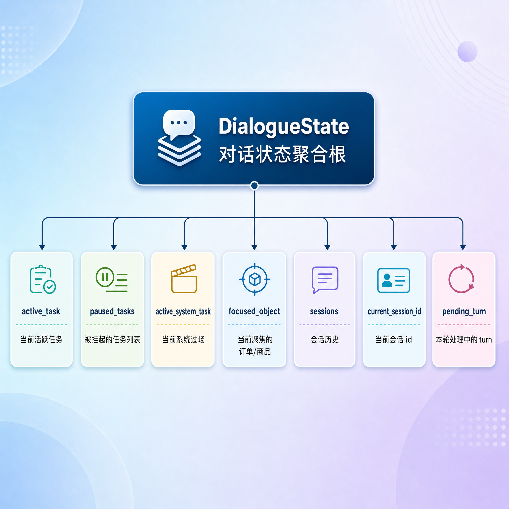

创建`atguigu/domain/state.py`，定义`DialogueState`。

### 3.2 Turn：一次对话轮次

#### 3.2.1 概念

一个 `Turn` 表示一次**完整的问答交互**：用户说一句话，机器人给出回复（可能多条消息）。

```text
用户：我要退款           ← user_message
客服：好的，我们先处理退款申请。
客服：请告诉我你的订单号。  ← bot_messages（2 条）
```


上面这一整段就是一个 Turn。

#### 3.2.2 类定义

在`state.py`中添加如下定义：

```python
class Turn(BaseModel):
    """
    本轮对话的对象
    """
    turn_id: str	# 轮次唯一标识，使用 UUID
    user_message: UserMessage 	# 这一轮用户说的那一句话
    bot_messages: list[BotMessage]	# 这一轮系统给出的所有回复
```

为什么 `bot_messages` 是列表？因为系统在一轮内经常会发多条消息：先说一句过场（"好的，我们先处理退款申请。"），再说一句业务问题（"请告诉我你的订单号。"）。

### 3.3 Session：一段会话

#### 3.3.1 概念

如果 Turn 是"一问一答"，那 Session 就是"一整段聊天"。

举例：用户上午跟客服聊了一阵，又下午回来聊。这两段聊天我们就会划成两个 Session。怎么判断要不要切到新 Session？我们后面会看到一个简单的规则：超过 60 分钟没有活动，就关闭旧 Session。

#### 3.3.2 类定义

在`state.py`中添加如下定义：

```python
class Session(BaseModel):
    """
    会话信息
    """
    session_id: str  # 会话唯一标识，使用 UUID
    started_at: float  # 会话开始的时间戳
    last_activity_at: float  # 最后一次活动的时间戳，用来判断超时
    closed_at: float | None = None  # 会话关闭时间，未关闭时为 `None`
    turns: list[Turn] = []  # 这个会话里的所有轮次
```

#### 3.3.3 一个用户的会话历史举例

```python
state.sessions = [
    Session(
        session_id="abc-123",
        started_at=1700000000.0,
        last_activity_at=1700001800.0,
        closed_at=1700005400.0,         # 已关闭
        turns=[Turn(...), Turn(...), Turn(...)],
    ),
    Session(
        session_id="def-456",
        started_at=1700090000.0,
        last_activity_at=1700090600.0,
        closed_at=None,                  # 当前活跃
        turns=[Turn(...)],
    ),
]
```

### 3.4 DialogueState：对话状态聚合根

到这里，所有零件都准备好了，可以拼起 `DialogueState` 这个聚合根。

在`state.py`中添加如下定义：

```python
class DialogueState(BaseModel):
    sender_id: str  # 用户唯一标识
    active_task: TaskContext | None = None  # 当前活跃的业务任务
    paused_tasks: list[TaskContext] = []  # 被挂起的任务列表
    active_system_task: SystemContext | None = None  # 当前执行的系统流程
    focused_object: FocusedObject | None = None # 用户当前聚焦的订单 / 商品
    sessions: list[Session] = []  # 历史会话列表
    current_session_id: str | None = None  # 当前活跃会话的ID
    pending_turn: Turn | None = None  # 正在处理中的轮次
```

下面我们为 `DialogueState` 定义方法。

### 3.5 任务相关

#### 3.5.1 涉及字段

- `active_task`
- `paused_tasks`
- `active_system_task`

回顾上一节学过的关系：

| 字段                 | 关注                 |
| -------------------- | -------------------- |
| `active_task`        | "用户当前在做什么"   |
| `paused_tasks`       | "用户挂起了哪些事"   |
| `active_system_task` | "系统现在在插播什么" |

#### 3.5.2 方法清单

在`state.py`的类 `DialogueState` 中添加如下方法：

```python
# --------------任务相关--------------------------
def start_active_task(self, active_task: TaskContext):
    """
    把传进来的 TaskContext 设为活跃任务。
    调用时机：当 TurnPlanner 判断用户发起了一个新业务任务时。
    :param active_task:
    :return:
    """
    self.active_task = active_task

def end_active_task(self):
    """
    结束业务任务
    调用时机：当业务任务流程跑到 end 步骤时。
    :return:
    """
    self.active_task = None

def cancel_active_task(self):
    """
    取消业务任务
    把活跃任务和当前系统过场都清空
    调用时机：用户主动说"算了不退了"这类取消意图时。
    :return:
    """
    self.active_task = None
    self.active_system_task = None

def interrupted_active_task(self):
    """
    中断活跃任务
    把当前活跃任务 移到挂起列表，再清空活跃任务。
    调用时机：用户在任务 A 中途切到任务 B 时。
    :return:
    """
    self.paused_tasks.append(self.active_task)
    self.active_task = None

def resumed_active_task(self, flow_id: str | None = None) -> bool:
    """
    恢复业务任务:流程ID

    如果用户没有明确指定需要恢复的具体任务，那么 flow_id = None，恢复最近的任务
    如果用户明确指定需要恢复的具体任务：
      则按 flow_id 在挂起列表里找到这个任务，恢复为活跃任务，并从挂起列表里移除。

    调用时机：用户说"继续刚才的退款"这类意图时。

    注意：任务被恢复时，step_id 和 slots 都还在，所以可以从挂起前的位置接着跑，不用从头来。

    :return: 恢复成功或失败
    """

    # 1. 判断栈中是否存在中断的业务任务
    if not self.paused_tasks:
        return False

    # 2. 如果业务流程ID不存在
    if flow_id is None:
        self.active_task = self.paused_tasks.pop()
        return True

    # 2. 如果业务流程ID存在
    for i, paused_task in enumerate(self.paused_tasks):
        if paused_task.flow_id == flow_id:
            # 激活
            self.active_task = paused_task
            # 删除
            del self.paused_tasks[i]
            return True

    return False

def start_active_system_task(self, active_system_task: SystemContext):
    """
    开启系统流程
    调用时机：每当系统要插播过场白（任务开始、打断、取消、恢复、收集槽位）时。
    :param active_system_task:
    :return:
    """
    self.active_system_task = active_system_task

def end_active_system_task(self):
    """
    结束系统流程
    :return:
    """
    self.active_system_task = None
    
def current_active_task(self):
    """
    返回当前正在执行的任务（系统流程、业务任务）
    先获取系统流程 如果获取不到 获取业务任务
    - 如果有系统流程，先返回系统流程
    - 否则返回业务任务

    为什么系统流程优先？
    因为系统流程往往是要插播一句过场白，必须先说完，然后才能让位给业务任务继续。
    :return:
    """
    return self.active_system_task or self.active_task
```

### 3.6 槽位相关

在`state.py`的类 `DialogueState` 中添加如下方法：

```python
# --------------槽位相关--------------------------
def set_slots(self, slots: dict[str, Any]):
    """
    设置槽位
    把传进来的 dict 合并到当前活跃任务的 slots 里。
    :param slots:
    :return:
    """
    self.active_task.slots.update(slots)

def remove_slot(self, slot_name: str):
    """
    移除槽位
    从当前活跃任务的 `slots` 里删一个键。比如用户输入有误，重新收集时会先清掉旧的。
    :param slot_name: 移除的槽位名
    :return:
    """
    self.active_task.slots.pop(slot_name)
```

### 3.7 会话与轮次相关

#### 3.7.1 涉及字段

- `sessions`
- `current_session_id`
- `pending_turn`

涉及方法（4 个会话方法 + 2 个轮次方法）。

#### 3.7.2 会话方法

在`state.py`的类 `DialogueState` 中添加如下方法：

```python
# -------------- session相关 --------------------------
def current_session(self) -> Session | None:
    """
    获取当前会话对象
    根据 current_session_id 在 sessions 里找出当前会话。
    :return:
    """
    for session in self.sessions:
        if session.session_id == self.current_session_id:
            return session

    return None

def start_session(self):
    """
    开启新会话
    创建一个新的 Session，加进 sessions 列表，并把它设为当前会话。
    :return:
    """
    if self.current_session() is None:
        now = time.time()
        session_id = str(uuid.uuid4())
        session = Session(
            session_id=session_id,
            started_at=now,
            last_activity_at=now
        )
        self.sessions.append(session)
        self.current_session_id = session_id

def close_current_session(self):
    """
    关闭当前会话
    给当前会话打上关闭时间戳，再把 current_session_id 置空。
    :return:
    """
    if self.current_session() is not None:
        # 1. 修改session的时间closed_at
        self.current_session().closed_at = time.time()
        # 2. 清空当前的session_id
        self.current_session_id = None

def reset_runtime_state_for_new_session(self):
    """
    重置会话状态
    session会话超时新会话开始前的"清理工作"。
    注意：
    - 它只清运行时字段：当前任务、挂起任务、系统过场、聚焦对象
    - 它不清 sessions：历史会话需要保留
    :return:
    """
    self.active_task = None
    self.active_system_task = None
    self.paused_tasks = []
    self.focused_object = None
    self.pending_turn = None
    self.current_session_id = None
```

#### 3.7.3 会话方法的协作

实际使用时，会话方法经常按下面这个顺序连起来用：

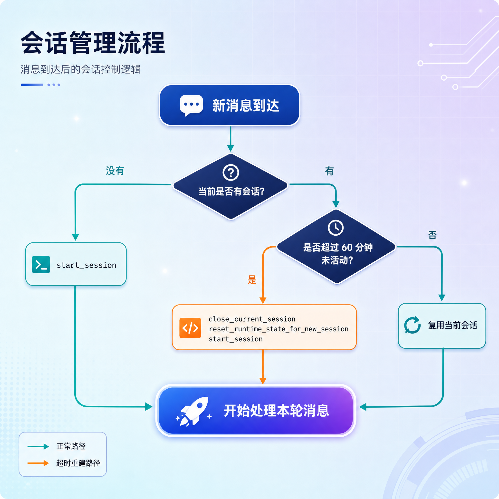

这段逻辑会在后面 `DialogueEngine` 的 `_prepare_session` 方法里看到。这一节我们只要理解他们各自负责什么就够了。

#### 3.7.4 轮次方法

在`state.py`的类 `DialogueState` 中添加如下方法：

```python
# --------------turn相关--------------------------
def begin_turn(self, message: UserMessage):
    """
    开始一个turn
    收到用户消息后，把它装进一个新的 turn 对象
    先放到 pending_turn，而不是直接进 session。
    :param message:
    :return:
    """
    if self.current_session():
        self.pending_turn = Turn(
            turn_id=str(uuid.uuid4()),
            user_message=message,
            bot_messages=[]
        )

def commit_pending_turn(self):
    """
    提交一个turn
    本轮处理完成（机器人回复也填好了）后
    把 pending_turn 追加到当前会话的 turns 里，再把 pending_turn 清空。
    :return:
    """
    if self.current_session():
        self.current_session().turns.append(self.pending_turn)
        self.pending_turn = None
```

#### 3.7.5 为什么要有pending_turn 

为什么要有 **pending_turn** 这个中间字段，这是这一节最值得停下来想一想的地方。如果我们没有 `pending_turn`，处理一轮消息看起来好像也能做：

```text
× 假设没有 pending_turn 的写法
1. 创建一个 turn对象，直接放到 current_session.turns 里
2. user_message 和 bot_message 放在这个 turn对象中
4. 处理完返回
```

这种写法在两个场景下会出问题：

**场景一：处理过程中出错**

如果引擎处理到一半异常退出，`turns` 里就留下了一个"半成品" Turn——有用户消息但回复不完整。下次再读这份历史就乱了。

**场景二：处理结果未必要落盘**

有些请求可能在中途被判定为"非法消息"、"重复消息"，直接丢弃就好。如果已经塞进 `turns`，再删就麻烦了。

所以系统采用"**两步提交**"：

```text
✓ 用 pending_turn 的写法
1. begin_turn → pending_turn = Turn(user_message, [])     ← 暂存区
2. 引擎处理，往 pending_turn.bot_messages 里 append   ← 填补回复
3. commit_pending_turn → 追加到 session.turns         ← 最终落盘
```

这样：

- 处理失败时只要丢掉 `pending_turn` 即可，`turns` 始终干净，
- 决定不入库时也只要不调用 `commit_pending_turn`，`pending_turn` 不参与持久化，它是纯粹的请求内瞬态。
- `turns` 里的每一条 Turn 都是"完整的"

完整流程图：

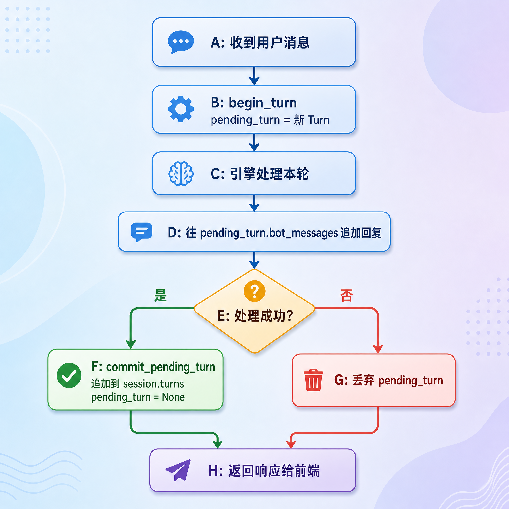

### 3.8 聚焦对象相关

在`state.py`的类 `DialogueState` 中添加如下方法：

```python
# --------------FocusedObject相关--------------------------
def set_focused_object(self, focused_object: FocusedObject):
    """
    设置聚焦对象
    调用时机：
    用户发的不是文本而是一条对象消息时,例如前端点了订单卡片
    需要把这个对象设为当前关注的对象。
    :param focused_object:
    """
    self.focused_object = focused_object
```

### 3.9 持久化

整个 `DialogueState` 不会拆成多张表，而是序列化为一个 JSON 字符串，存到 `dialogue_states` 表的 `state_json` 字段里：

| 字段         | 类型                | 说明                                   |
| ------------ | ------------------- | -------------------------------------- |
| `sender_id`  | `VARCHAR(255)` 主键 | 用户唯一标识                           |
| `state_json` | `TEXT`              | `DialogueState` 序列化后的 JSON 字符串 |

读取时反过来：从数据库读出 `state_json` → `json.loads` → `DialogueState.from_dict()`。

这种"整份 JSON"的设计在生产环境不一定最优，但在学习阶段能让你直接打开一行数据库记录就看到对话的所有状态，调试起来非常直观。

### 3.10 小结

#### 3.10.1 类图

`DialogueState` 是对话系统的核心数据结构，记录了与某位用户的完整对话上下文，它把任务、流程、会话、轮次、聚焦对象统一管起来。它以 `sender_id` 为键进行持久化存储，每次消息处理前从数据库加载，处理完毕后存回。整个处理过程中，所有对话逻辑的读写都发生在同一个 `DialogueState` 实例上。

`DialogueState` 的属性分为四组：**用户任务上下文**、**系统任务上下文**、**聚焦对象**和**会话历史**。

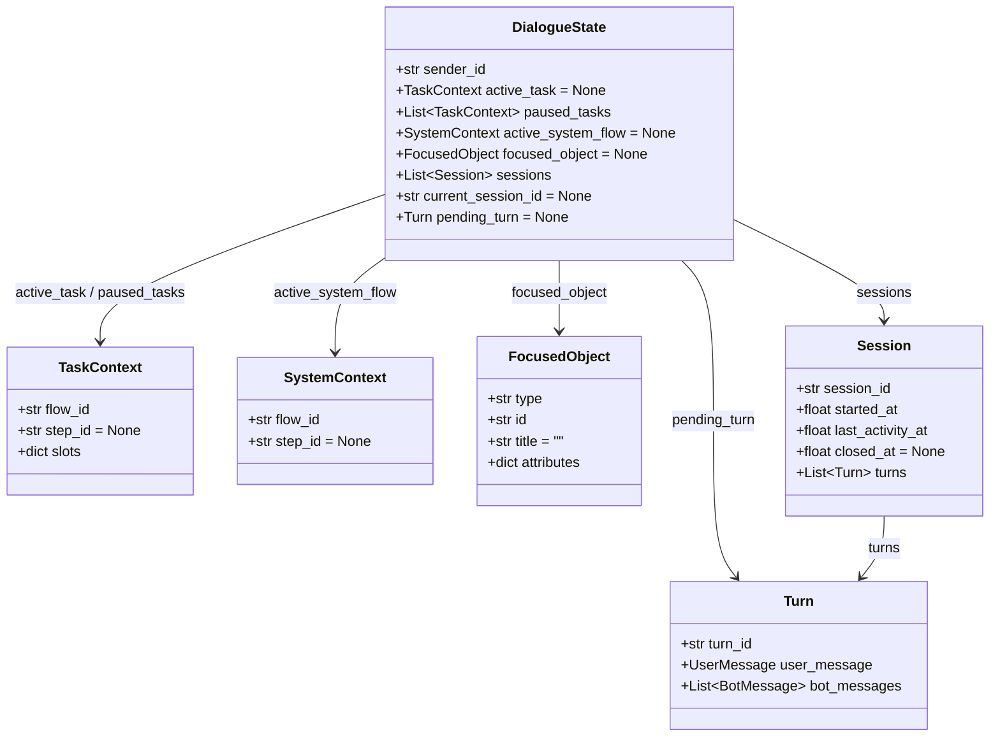
```mermaid
classDiagram
    class DialogueState {
        +str sender_id
        +TaskContext active_task = None
        +List~TaskContext~ paused_tasks
        +SystemContext active_system_flow = None
        +FocusedObject focused_object = None
        +List~Session~ sessions
        +str current_session_id = None
        +Turn pending_turn = None
    }
    class TaskContext {
        +str flow_id
        +str step_id = None
        +dict slots
    }
    class SystemContext {
        +str flow_id
        +str step_id = None
    }
    class FocusedObject {
        +str type
        +str id
        +str title = ""
        +dict attributes
    }
    class Session {
        +str session_id
        +float started_at
        +float last_activity_at
        +float closed_at = None
        +List~Turn~ turns
    }
    class Turn {
        +str turn_id
        +UserMessage user_message
        +List~BotMessage~ bot_messages
    }

    DialogueState --> TaskContext : active_task / paused_tasks
    DialogueState --> SystemContext : active_system_flow
    DialogueState --> FocusedObject : focused_object
    DialogueState --> Session : sessions
    DialogueState --> Turn : pending_turn
    Session --> Turn : turns
```

#### 3.10.2 完整的代码

```python
# atguigu/domain/state.py

import time
import uuid
from typing import Dict, Any

from pydantic import BaseModel

from atguigu.domain.contexts import TaskContext, SystemContext
from atguigu.domain.messages import FocusedObject, UserMessage, BotMessage

class Turn(BaseModel):
    """
    本轮对话的对象
    """
    turn_id: str    # 轮次唯一标识，使用 UUID
    user_message: UserMessage   # 这一轮用户说的那一句话
    bot_messages: list[BotMessage]  # 这一轮系统给出的所有回复

class Session(BaseModel):
    """
    会话信息
    """
    session_id: str  # 会话唯一标识，使用 UUID
    started_at: float  # 会话开始的时间戳
    last_activity_at: float  # 最后一次活动的时间戳，用来判断超时
    closed_at: float | None = None  # 会话关闭时间，未关闭时为 `None`
    turns: list[Turn] = []  # 这个会话里的所有轮次

class DialogueState(BaseModel):
    sender_id: str  # 用户id
    active_task: TaskContext | None = None  # 当前执行的业务任务
    paused_tasks: list[TaskContext] = []  # 当期暂停的业务任务（多个）
    active_system_task: SystemContext | None = None  # 当前执行的系统流程
    focused_object: FocusedObject | None = None
    sessions: list[Session] = [] # 当前用户的所有都存储起来
    current_session_id: str | None = None  # 当前用户的session的sessionID
    pending_turn: Turn | None = None  # turn会话的暂存区（变量：内存中缓冲区）

    # --------------任务相关--------------------------
    def start_active_task(self, active_task: TaskContext):
        """
        把传进来的 TaskContext 设为活跃任务。
        调用时机：当 TurnPlanner 判断用户发起了一个新业务任务时。
        :param active_task:
        :return:
        """
        self.active_task = active_task

    def end_active_task(self):
        """
        结束业务任务
        调用时机：当业务任务流程跑到 end 步骤时。
        :return:
        """
        self.active_task = None

    def cancel_active_task(self):
        """
        取消业务任务
        把活跃任务和当前系统过场都清空
        调用时机：用户主动说"算了不退了"这类取消意图时。
        :return:
        """
        self.active_task = None
        self.active_system_task = None

    def interrupted_active_task(self):
        """
        中断活跃任务
        把当前活跃任务 移到挂起列表，再清空活跃任务。
        调用时机：用户在任务 A 中途切到任务 B 时。
        :return:
        """
        self.paused_tasks.append(self.active_task)
        self.active_task = None

    def resumed_active_task(self, flow_id: str | None):
        """
        恢复业务任务:流程ID
        按 flow_id 在挂起列表里找一个任务，恢复为活跃任务，并从挂起列表里移除。
        调用时机：用户说"继续刚才的退款"这类意图时。

        注意：任务被恢复时，step_id 和 slots 都还在，所以可以从挂起前的位置接着跑，不用从头来。
        :return:
        """
        # 1. 恢复最近的任务
        if not flow_id:
            task = self.paused_tasks.pop()
            self.active_task = task
            return

        # 2. 精确恢复某一暂停的业务任务
        for task in self.paused_tasks:
            if task.flow_id == flow_id:
                self.active_task = task
                self.paused_tasks.remove(task)
                return

        # 3. 兜底
        task = self.paused_tasks.pop()
        self.active_task = task

    def start_active_system_task(self, active_system_task: SystemContext):
        """
        开启系统流程
        调用时机：每当系统要插播过场白（任务开始、打断、取消、恢复、收集槽位）时。
        :param active_system_task:
        :return:
        """
        self.active_system_task = active_system_task

    def end_active_system_task(self):
        """
        结束系统流程
        :return:
        """
        self.active_system_task = None

    def current_active_task(self):
        """
        返回当前正在执行的任务（系统流程、业务任务）
        先获取系统流程 如果获取不到 获取业务任务
        - 如果有系统流程，先返回系统流程
        - 否则返回业务任务

        为什么系统流程优先？
        因为系统流程往往是要插播一句过场白，必须先说完，然后才能让位给业务任务继续。
        :return:
        """
        return self.active_system_task or self.active_task

    # --------------槽位相关--------------------------
    def set_slots(self, slots: Dict[str, Any]):
        """
        设置槽位
        :param slots:
        :return:
        """
        self.active_task.slots.update(slots)

    def remove_slot(self, slot_name: str):
        """
        移除槽位
        :param slot_name: 移除的槽位名
        :return:
        """
        self.active_task.slots.pop(slot_name)

    # -------------- session相关 --------------------------
    def current_session(self) -> Session | None:
        """
        获取当前会话对象
        根据 current_session_id 在 sessions 里找出当前会话。
        :return:
        """
        for session in self.sessions:
            if session.session_id == self.current_session_id:
                return session

        return None

    def start_session(self):
        """
        开启新会话
        创建一个新的 Session，加进 sessions 列表，并把它设为当前会话。
        :return:
        """
        if self.current_session() is None:
            now = time.time()
            session_id = str(uuid.uuid4())
            session = Session(
                session_id=session_id,
                started_at=now,
                last_activity_at=now
            )
            self.sessions.append(session)
            self.current_session_id = session_id

    def close_current_session(self):
        """
        关闭当前会话
        给当前会话打上关闭时间戳，再把 current_session_id 置空。
        :return:
        """
        if self.current_session() is not None:
            # 1. 修改session的时间closed_at
            self.current_session().closed_at = time.time()
            # 2. 清空当前的session_id
            self.current_session_id = None

    def reset_runtime_state_for_new_session(self):
        """
        重置会话状态
        session会话超时新会话开始前的"清理工作"。
        注意：
        - 它只清运行时字段：当前任务、挂起任务、系统过场、聚焦对象
        - 它不清 sessions：历史会话需要保留
        :return:
        """
        self.active_task = None
        self.active_system_task = None
        self.paused_tasks = []
        self.focused_object = None
        self.pending_turn = None
        self.current_session_id = None

    # --------------turn相关--------------------------
    def begin_turn(self, message: UserMessage):
        """
        开始一个turn
        收到用户消息后，把它装进一个新的 turn 对象
        先放到 pending_turn，而不是直接进 session。
        :param message:
        :return:
        """
        if self.current_session():
            self.pending_turn = Turn(
                turn_id=str(uuid.uuid4()),
                user_message=message,
                bot_messages=[]
            )

    def commit_turn(self):
        """
        提交一个turn
        本轮处理完成（机器人回复也填好了）后
        把 pending_turn 追加到当前会话的 turns 里，再把 pending_turn 清空。
        :return:
        """
        if self.current_session():
            self.current_session().turns.append(self.pending_turn)
            self.pending_turn = None

    # --------------FocusedObject相关--------------------------
    def set_focused_object(self, focused_object: FocusedObject):
        """
        设置聚焦对象
        调用时机：
        用户发的不是文本而是一条对象消息时,例如前端点了订单卡片
        需要把这个对象设为当前关注的对象。
        :param focused_object:
        """
        self.focused_object = focused_object
```

