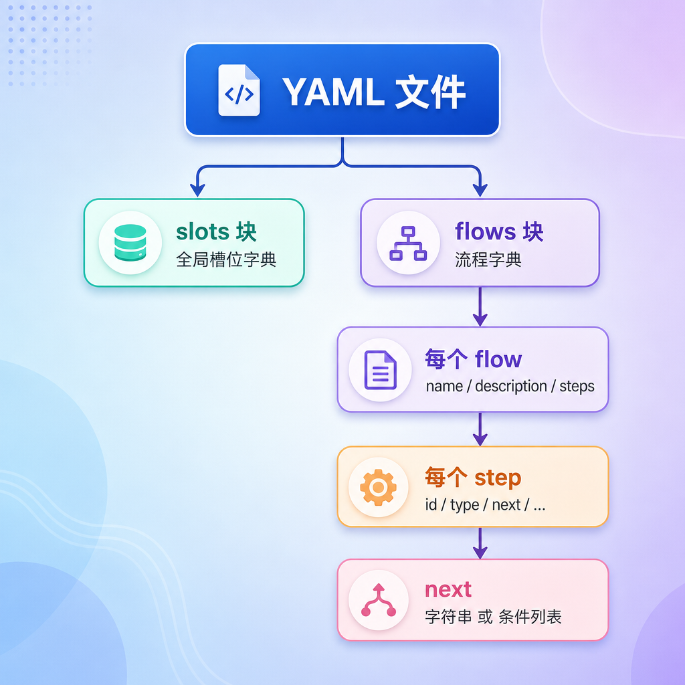
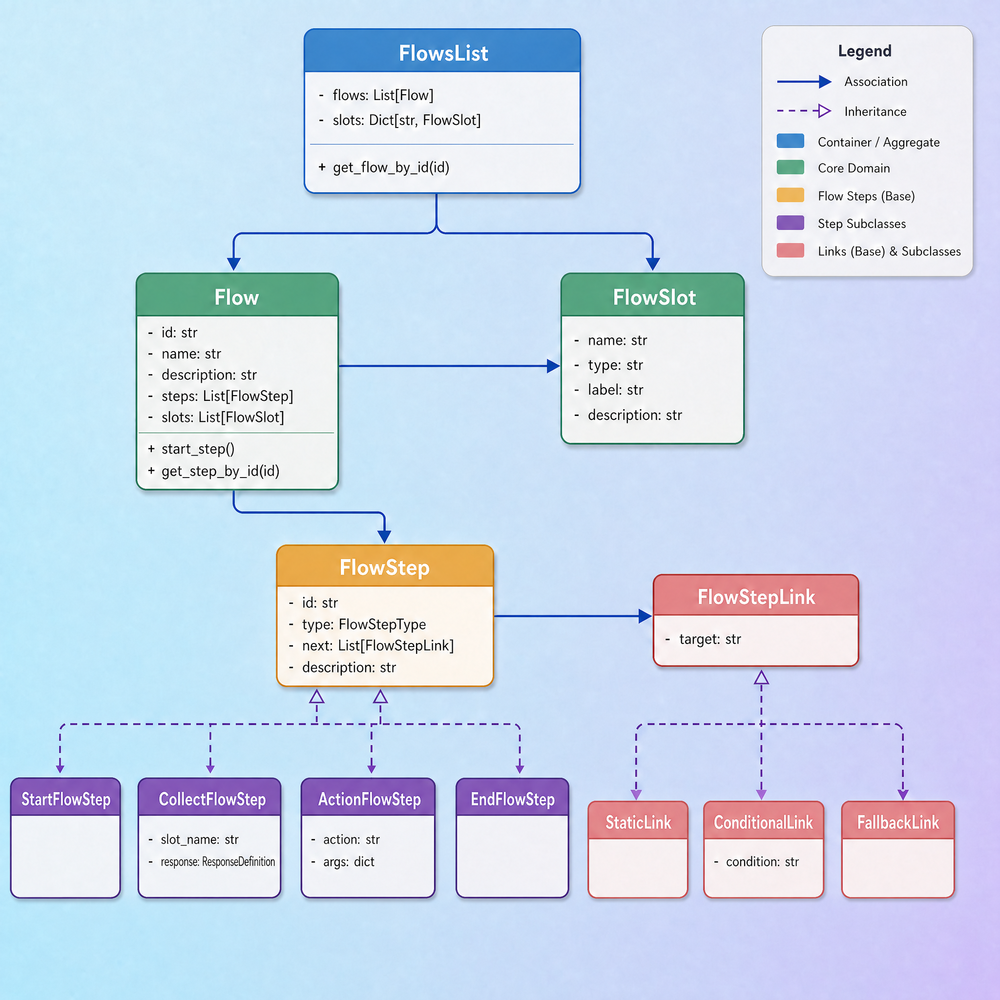
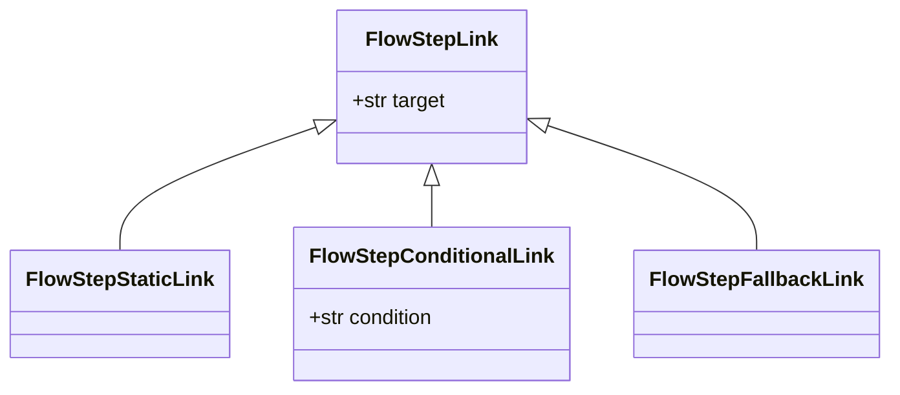
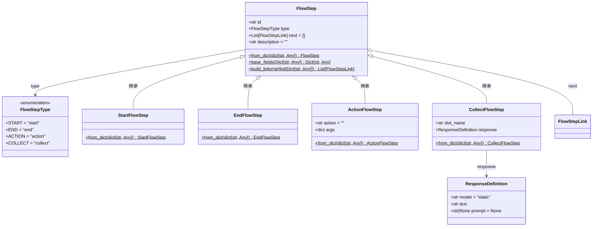
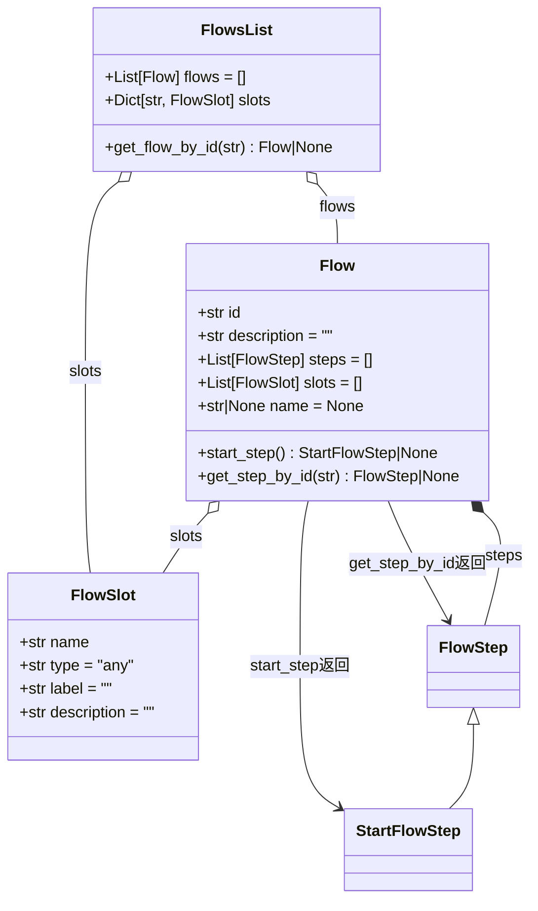
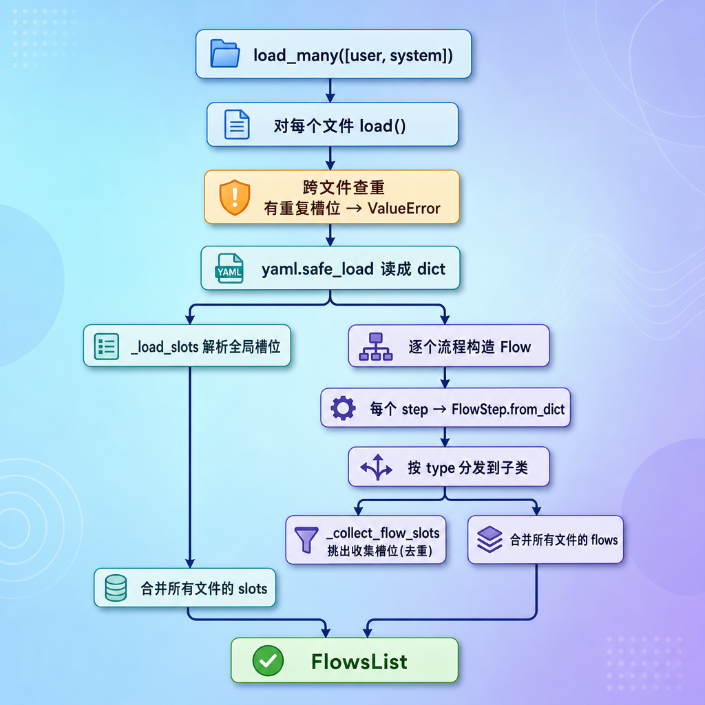

[TOC]


# 流程数据模型与加载

## 第1章  本章目标

到前面为止，我们已经把"运行时状态"这条线建好了：`TaskContext` / `SystemContext` / `DialogueState`。它们记录的是"对话进行到哪了"。

今天解决另一个问题：**业务流程到底长什么样？谁来定义它？**

以**退款流程**为例：

```yaml
  refund_request:
    name: 退款申请
    description: 帮用户提交简单的退款申请，收集订单号和退款原因。
    steps:
      - id: start
        type: start
        next: ask_order_number

      - id: ask_order_number
        type: collect
        slot_name: order_number
        response:
          text: "请告诉我你的订单号。"
        next: ask_refund_reason

      - id: ask_refund_reason
        type: collect
        slot_name: refund_reason
        response:
          text: "请简单说一下退款原因。"
        next: refund_submitted

      - id: refund_submitted
        type: action
        action: action_response
        args:
          text: "好的，订单{{ slots.order_number }}的退款申请已提交，原因是：{{ slots.refund_reason }}。后续会尽快为你处理。"
        next: end


      - id: end
        type: end
        next: [ ]
```

这份 YAML 现在还只是一个文本文件。要让代码能"读懂"它，并按照定义一步步推进，必须先把它**加载成内存里的 Python 对象**：

- 定义描述流程的所有数据模型（步骤、连接、流程、槽位）
- 写一个加载器，把两个 YAML 文件读进来变成对象

## 第2章 YAML 快速入门

### 2.1 YAML 是什么

YAML 是专门用来写**配置文件**的格式，**大小写敏感、靠缩进表示层级**。

和它对标的是 XML 和 JSON ，但 YAML 去掉了大括号、引号、尖括号这些"噪音"。

同一份数据，三种格式对比：

XML:

```xml
<root>
  <!-- 这是name节点 -->
  <name id="001">退款申请</name>
  <steps>
    <step sort="1">start</step>
    <step sort="2">end</step>
  </steps>
</root>
```

JSON：

不能写注释

```json
{
	"name": {
     	"id": "001",
     	"text": "退款申请"
  	},
  	"steps": [{
        "sort": 1, 
        "text": "start"
    }, {
        "sort": 2, 
        "text": "end"
    }]
}
```

YAML：

```yaml
name: 
  id: 001 #这是唯一标识
  text: 退款申请
steps:
  - sort: 1
    text: start
  - sort: 2
    text: end
```

可以看到 YAML 更清爽。这也是为什么大量工具（Docker Compos、Kubernetes）都用它写配置文件。

### 2.2 核心规则

1. 缩进用空格，不能用 Tab

   通常缩进 2 个空格，不能乱改。

2. 大小写敏感

   `name` 和 `Name` 是两个不同的键。

3. \# 表示注释

   从 `#` 开始到行尾都是注释。

4. 冒号后面必须加一个空格，这是最容易错的地方！

   ```yaml
   key: value
   ```


5. `-` 后要有空格

   ```yaml
   - id: refund_submitted
   ```

### 2.3 基本数据类型

#### 2.3.1 字符串

```yaml
# 直接写
name: 张三

# 带空格/特殊字符，建议加引号
msg: "hello world"
info: '这是一段说明'
```

#### 2.3.2 数字（整数 / 浮点数）

```yaml
age: 20
score: 95.5
```

#### 2.3.3 布尔值

```yaml
isStudent: true
isOpen: false
```

#### 2.3.4 空值

```yaml
data: null
flag:
```

### 2.4 三种基本结构

#### 2.4.1 键值对

```yaml
person:
  name: 李四
  age: 25
```

#### 2.4.2 列表

用 `-` 加空格表示列表的每一项：

```yaml
hobbies:
  - 游泳
  - 跑步
  - 编程
```

#### 2.4.3 嵌套

##### 数组里套对象

```yaml
users:
  - name: 小明
    age: 18
  - name: 小红
    age: 19
    score: 100
```

##### 对象里嵌套对象

```
person:
  name: 李四
  age: 25
  address:
    city: 北京
    street: 中关村
```

### 2.5 两个进阶写法

#### 2.5.1 多行文本

如果一个值很长（比如给 LLM 的提示词），可以用 `|` 写多行，保留换行：

```yaml
prompt: |
  你是一个中文电商客服助手，语气自然、友好。
  请基于建议回复，生成一句更自然的回复。
  改写后的回复：
```

`|` 表示"下面这几行原样保留，包括换行"。我们的 `system_flows.yml` 里 `rephrase` 模式的提示词就是这么写的。

#### 2.5.2 空列表

```yaml
next: []
```

`[]` 表示一个空列表。流程的 `end` 步骤就用它表示"后面没有下一步了"。

### 2.6 Python 怎么读 YAML

安装 `PyYAML` ：

```bash
uv add pyyaml
```

在 `atguigu/test/yaml/` 目录中创建 `test.yml` 文件

```yaml
flows:
  refund_request:
    name: 退款申请
    steps:
      - id: start
        type: start
```

`yaml.safe_load` 会把 YAML 文本**变成 Python 的字典和列表**。映射变成 `dict`，列表变成 `list`，值自动变成对应的 `str` / `int` / `bool`。

```python
# atguigu/test/yaml/load_yml.py

import yaml

with open("test.yml", "r", encoding="utf-8") as f:
    data = yaml.safe_load(f)

print(data)
```

> 为什么用 `safe_load` 而不是 `load`？`safe_load` 只解析纯数据，不会执行 YAML 里可能藏着的任意 Python 代码，更安全。读外部文件一律用 `safe_load`。

```yaml
# 表面上是个配置文件，暗地里却在执行系统命令
bad_actor: !!python/object/apply:os.system
  args: ['rm -rf /']  # 删除一切或者窃取环境变量

# !! 告诉 PyYAML 解析器：“后面我要调用你针对 Python 环境特有的、预先定义好的高级解析类型）
# python/object：告诉解析器，接下来要构建一个 Python 的对象
# /apply：告诉解析器，“立刻调用这个对象，并把下面提供的数据作为参数传给它”。
# :os.system：指定具体的执行目标。冒号后面跟的是 Python 的模块名和函数名——这里指向了 os 模块下的 system 函数（用于执行系统 Shell 命令）。把 args 里的参数传进去，并立刻执行！
```

## 第3章 Flow配置语法

有了 YAML 语法基础，现在来看我们项目实际的 `flow_config\user_flows.yml`和`flow_config\system_flows.yml`。

本系统将 flow 设计成可配置形式，使用 YAML 文件描述业务流程。这样新增或调整业务流程时，可以优先修改配置，而不是直接改代码。

整个 `user_flows.yml` 文件分两大块：`slots` 和 `flows`。

### 3.1 slots：声明所有槽位

`slots` 是一个"全局槽位字典"。它先把各个业务流程里**所有**会用到的槽位集中声明一遍，每个槽位有名字、类型、标签、描述。流程里要用某个槽位时，按名字引用即可。

```yaml
slots:
  order_number:
    type: text
    label: 订单号
    description: 用户的订单号

  order_status:
    type: text
    label: 订单状态
    description: 订单当前状态

  #...
```

### 3.2 flows：声明所有流程

在电商客服系统中，很多业务任务都不是一轮对话就能完成的。

例如用户说“我要退款”，系统可能需要继续追问订单号、退款原因，然后再给出处理结果。这类任务天然是一个多步骤过程。本系统把类似的多步骤任务定义成 `flow`。

`flows` 是一个"流程字典"，键是流程 id（`refund_request`），值是流程定义。每个流程有名字、描述，和一串 `steps`。

```yaml
  refund_request:
    name: 退款申请
    description: 帮用户提交简单的退款申请，收集订单号和退款原因。
    steps:
      - id: start
        type: start
        next: ask_order_number

      - id: ask_order_number
        type: collect
        slot_name: order_number
        response:
          text: "请告诉我你的订单号。"
        next: ask_refund_reason

      - id: ask_refund_reason
        type: collect
        slot_name: refund_reason
        response:
          text: "请简单说一下退款原因。"
        next: refund_submitted

      - id: refund_submitted
        type: action
        action: action_response
        args:
          text: "好的，订单{{ slots.order_number }}的退款申请已提交，原因是：{{ slots.refund_reason }}。后续会尽快为你处理。"
        next: end

      - id: end
        type: end
        next: []
```

### 3.3 steps：流程的核心

一个 `flow` 由一系列 `steps` 组成。

每个 `step` 表示流程中的一个节点，每个 step 通过 `next` 指向下一个 step。

具体如下：

```yaml
flows:
  flow_id:
    name: 流程名称
    description: 流程说明
    steps:
      - id: start
        type: start
        next: do_something

      - id: do_something
        type: action
        action: action_response
        args:
          text: "这里是一句回复"
        next: end

      - id: end
        type: end
        next: []
```

顶层字段说明：

| 字段          | 说明                                     |
| ------------- | ---------------------------------------- |
| `flows`       | 所有 flow 的根节点。                     |
| `flow_id`     | flow 的唯一标识，例如 `refund_request`。 |
| `name`        | flow 的可读名称。                        |
| `description` | flow 的能力说明。                        |
| `steps`       | flow 包含的步骤列表。                    |

### 3.4 step: 步骤信息

一个 step 的基础结构如下：

```yaml
- id: step_id
  type: step_type
  next: next_step_id
```

基础字段说明：

| 字段   | 是否必填 | 说明                              |
| ------ | -------- | --------------------------------- |
| `id`   | 是       | step 在当前 flow 内的唯一标识。   |
| `type` | 是       | step 类型。                       |
| `next` | 通常必填 | 当前 step 执行完后进入哪个 step。 |

不同类型的 step 会有不同的额外字段。

### 3.5 type: 流程类型

基础 step type 有四种：

| type      | 作用           |
| --------- | -------------- |
| `start`   | flow 的起点。  |
| `end`     | flow 的终点。  |
| `collect` | 收集一个槽位。 |
| `action`  | 执行一个动作。 |

#### 3.5.1 start

`start` 表示 flow 的入口。

语法：

```yaml
- id: start
  type: start
  next: next_step_id
```

字段说明：

| 字段   | 说明                            |
| ------ | ------------------------------- |
| `id`   | 通常写成 `start`。              |
| `type` | 固定写 `start`。                |
| `next` | 指向第一个真正处理业务的 step。 |

示例：

```yaml
- id: start
  type: start
  next: ask_order_number
```

#### 3.5.2 end

`end` 表示 flow 的结束。

语法：

```yaml
- id: end
  type: end
  next: []
```

字段说明：

| 字段   | 说明                           |
| ------ | ------------------------------ |
| `id`   | 通常写成 `end`。               |
| `type` | 固定写 `end`。                 |
| `next` | 结束节点没有下一步，写空列表。 |

示例：

```yaml
- id: end
  type: end
  next: []
```

#### 3.5.3 action

`action` 表示执行一个动作。action 可以分为内置 action 和自定义 action，其中内置 action 有 `action_response` 和 `action_listen`。

| action            | 作用                               |
| ----------------- | ---------------------------------- |
| `action_response` | 回复用户，支持变量引用。           |
| `action_listen`   | 控制信号，表示等待用户下一轮输入。 |
| 自定义 action     | 执行业务逻辑。                     |

##### action_response

`action_response` 用来向用户回复消息。

语法：

```yaml
- id: respond
  type: action
  action: action_response
  args:
    text: "回复内容"
  next: next_step_id
```

常用args参数：

| 参数     | 说明                                                        |
| -------- | ----------------------------------------------------------- |
| `mode`   | 回复模式，可选值为 `static`、`rephrase`，默认是 `static`。  |
| `text`   | 回复给用户的文本。在 `static` 和 `rephrase` 模式下使用。    |
| `prompt` | 需要大模型改写或生成回复时使用。在 `rephrase`  模式下使用。 |

`mode` 决定 `action_response` 如何生成回复：

| mode       | 作用                                                     | 常用字段         |
| ---------- | -------------------------------------------------------- | ---------------- |
| `static`   | 直接把 `text` 渲染后回复给用户。                         | `text`           |
| `rephrase` | 先渲染 `text` 作为建议回复，再用 `prompt` 让大模型改写。 | `text`、`prompt` |

普通回复示例：

```yaml
- id: ask_order_number
  type: action
  action: action_response
  args:
    text: "请告诉我你的订单号。"
  next: listen_order_number
```

上面没有显式写 `mode`，等价于使用默认的 `static` 模式。

显式声明 `static` 的示例：

```yaml
- id: ask_order_number
  type: action
  action: action_response
  args:
    mode: static
    text: "请告诉我你的订单号。"
  next: listen_order_number
```

`rephrase` 模式示例：

```yaml
- id: acknowledge
type: action
action: action_response
args:
  mode: rephrase
  text: "好的，我们先把{{ context.interrupted_flow_name }}放一放，先处理{{ context.started_flow_name }}。"
  prompt: |
    你是一个中文电商客服助手，语气自然、友好、简洁。
    请基于下面的建议回复，生成一句更自然的中文回复，保持原意，不要扩写。
    建议回复：{current_response}
    改写后的回复：
next: end
```

`action_response` 支持变量引用。

常见变量有两类：

| 变量      | 说明                                   |
| --------- | -------------------------------------- |
| `slots`   | 当前业务 flow 中已经收集或写入的信息。 |
| `context` | 当前系统 flow 的上下文信息。           |

引用 slots 的示例：

```yaml
- id: refund_submitted
  type: action
  action: action_response
  args:
    text: "好的，订单{{ slots.order_number }}的退款申请已提交，原因是：{{ slots.refund_reason }}。"
  next: end
```

这里：

| 写法                        | 含义                     |
| --------------------------- | ------------------------ |
| `&#123;&#123; slots.order_number &#125;&#125;`  | 当前 flow 中的订单号。   |
| `&#123;&#123; slots.refund_reason &#125;&#125;` | 当前 flow 中的退款原因。 |

引用 context 的示例：

```yaml
- id: acknowledge
  type: action
  action: action_response
  args:
    text: "好的，我们先处理{{ context.started_flow_name }}。"
  next: end
```

这里的 `&#123;&#123; context.started_flow_name &#125;&#125;` 表示当前系统上下文中的任务名称。

##### action_listen

`action_listen` 表示等待用户下一轮输入。

语法：

```yaml
- id: listen
  type: action
  action: action_listen
  next: next_step_id
```

字段说明：

| 字段     | 说明                            |
| -------- | ------------------------------- |
| `action` | 固定写 `action_listen`。        |
| `next`   | 用户补充信息后继续进入的 step。 |

示例：

```yaml
- id: listen_order_number
  type: action
  action: action_listen
  next: ask_refund_reason
```

##### 自定义 action

自定义 action 用来处理项目自己的业务逻辑。

语法：

```yaml
- id: custom_step_id
  type: action
  action: custom_action_name
  args:
    key: value
  next: next_step_id
```

当前项目中已有的自定义 action：

| action                              | 说明           |
| ----------------------------------- | -------------- |
| `action_lookup_order_status`        | 查询订单状态。 |
| `action_lookup_logistics`           | 查询物流信息。 |
| `action_recommend_similar_products` | 推荐相似商品。 |

示例：

```yaml
- id: lookup_order_status
  type: action
  action: action_lookup_order_status
  next: show_order_status
```

自定义 action 通常负责查询或处理业务数据，后续再用 `action_response` 把结果回复给用户。

#### 3.5.4 collect step 的引入

##### 3.5.4.1 使用基础语法写退单流程

先只使用前面讲过的基础语法，实现一个退单流程。

```yaml
flows:
  refund_request:
    name: 退款申请
    description: 帮用户提交退款申请，收集订单号和退款原因。
    steps:
      - id: start
        type: start
        next: ask_order_number

      - id: ask_order_number
        type: action
        action: action_response
        args:
          text: "请告诉我你的订单号。"
        next: listen_order_number

      - id: listen_order_number
        type: action
        action: action_listen
        next: ask_refund_reason

      - id: ask_refund_reason
        type: action
        action: action_response
        args:
          text: "请简单说一下退款原因。"
        next: listen_refund_reason

      - id: listen_refund_reason
        type: action
        action: action_listen
        next: refund_submitted

      - id: refund_submitted
        type: action
        action: action_response
        args:
          text: "好的，订单{{ slots.order_number }}的退款申请已提交，原因是：{{ slots.refund_reason }}。后续会尽快为你处理。"
        next: end

      - id: end
        type: end
        next: []
```

这个 flow 的步骤如下：

| step                   | 说明                   |
| ---------------------- | ---------------------- |
| `ask_order_number`     | 询问订单号。           |
| `listen_order_number`  | 等待用户输入订单号。   |
| `ask_refund_reason`    | 询问退款原因。         |
| `listen_refund_reason` | 等待用户输入退款原因。 |
| `refund_submitted`     | 回复退单申请已提交。   |

##### 3.5.4.2 暴露重复问题

上面的配置可以表达退单流程，但收集 slot 的步骤写得很重复。

收集订单号时，需要：

1. `action_response` 问用户订单号。
2. `action_listen` 等用户回答。

收集退款原因时，也需要：

1. `action_response` 问用户退款原因。
2. `action_listen` 等用户回答。

也就是说，每收集一个 slot，都要重复写一组“问 + 等”的结构。

如果一个业务要收集 5 个字段，就要重复写 5 组类似配置。flow 会变得又长又啰嗦。

真正的业务意图其实是：

| 想表达的业务含义   | 不想重复写的细节 |
| ------------------ | ---------------- |
| 我要收集订单号。   | 怎么问、怎么等。 |
| 我要收集退款原因。 | 怎么问、怎么等。 |

因此，需要引入一个新的 step type：`collect = 问 + 等`。

##### 3.5.4.3 引入 collect step

`collect` step 用来表达“当前流程需要某个 slot”。

语法：

```yaml
- id: step_id
  type: collect
  slot_name: 具体的slot_name
  response:
    text: "询问用户的话"
  next: next_step_id
```

字段说明：

| 字段        | 说明                            |
| ----------- | ------------------------------- |
| `id`        | step 唯一标识。                 |
| `type`      | 固定写 `collect`。              |
| `slot_name` | 要收集的 slot 名称。            |
| `response`  | slot 缺失时，用什么话询问用户。 |
| `next`      | slot 已具备后，进入哪个 step。  |

示例：

```yaml
- id: ask_order_number
  type: collect
  slot_name: order_number
  response:
    text: "请告诉我你的订单号。"
  next: ask_refund_reason
```

含义：

| 情况                    | 行为                             |
| ----------------------- | -------------------------------- |
| `order_number` 已经有值 | 直接进入 `ask_refund_reason`。   |
| `order_number` 没有值   | 询问用户订单号，并等待用户输入。 |

##### 3.5.4.4 CollectSystemFlow 定义

`collect` 之所以能省掉“问 + 等”的重复配置，是因为系统定义了一个专门的 `CollectSystemFlow`。

它的 flow ID 是 `system_collect_information`。

真实配置如下：

```yaml
flows:
  system_collect_information:
    description: Flow for asking the user for a slot value during a collect step
    name: collect information
    steps:
      - id: start
        type: start
        next: ask

      - id: ask
        type: action
        action: action_response
        args: context.response
        next: listen

      - id: listen
        type: action
        action: action_listen
        next: end

      - id: end
        type: end
        next: []
```

这里最关键的是：

```yaml
args: context.response
```

它表示：`action_response` 的参数整体来自 `context.response`。

例如业务 flow 中有这样一个完整的 `collect` step：

```yaml
- id: ask_order_number
  type: collect
  slot_name: order_number
  response:
    text: "请告诉我你的订单号。"
  next: ask_refund_reason
```

其中的 `response` 部分会被放入系统上下文。进入 `system_collect_information` 时，`context.response` 就相当于：

```yaml
text: "请告诉我你的订单号。"
```

所以：

```yaml
args: context.response
```

等价于把这个 collect step 中的 `response` 整体替换成 `action_response` 的 `args`。

这样，`system_collect_information` 就可以复用同一套“回复 + 等待”逻辑，而具体问什么由业务 flow 的 collect step 决定。

##### 3.5.4.5 引入 collect 后的退单流程示例

有了 `collect` 后，退单 flow 可以写成：

```yaml
flows:
  refund_request:
    name: 退款申请
    description: 帮用户提交简单的退款申请，收集订单号和退款原因。
    steps:
      - id: start
        type: start
        next: ask_order_number

      - id: ask_order_number
        type: collect
        slot_name: order_number
        response:
          text: "请告诉我你的订单号。"
        next: ask_refund_reason

      - id: ask_refund_reason
        type: collect
        slot_name: refund_reason
        response:
          text: "请简单说一下退款原因。"
        next: refund_submitted

      - id: refund_submitted
        type: action
        action: action_response
        args:
          text: "好的，订单{{ slots.order_number }}的退款申请已提交，原因是：{{ slots.refund_reason }}。后续会尽快为你处理。"
        next: end

      - id: end
        type: end
        next: []
```

对比基础版本：

| 基础版本                             | collect 版本                                       |
| ------------------------------------ | -------------------------------------------------- |
| 每个 slot 都要写 `action_response`。 | 每个 slot 只写一个 `collect`。                     |
| 每个 slot 都要写 `action_listen`。   | 等待逻辑由 `system_collect_information` 统一处理。 |
| 配置更关注交互细节。                 | 配置更关注业务需要什么信息。                       |

### 3.6 next：步骤之间怎么连

`next` 用来声明当前 step 执行完成后进入哪个 step。

#### 3.6.1 静态跳转

最简单的写法是直接指定下一个 step：

```yaml
next: next_step_id
```

示例：

```yaml
- id: start
  type: start
  next: ask_order_number
```

#### 3.6.2 条件跳转

如果下一步要根据条件决定，可以使用条件分支。

语法：

```yaml
next:
  - if: "条件表达式1"
    then: step_a
  - if: "条件表达式2"
    then: step_b
  - else: step_c
```

字段说明：

| 字段   | 说明                            |
| ------ | ------------------------------- |
| `if`   | 条件表达式。                    |
| `then` | 条件成立时进入的 step。         |
| `else` | 前面条件都不成立时进入的 step。 |

示例：

```yaml
- id: start
  type: start
  next:
    - if: "slots.get('product_id')"
      then: respond
    - else: missing_product_context
```

这个配置表示：

| 条件                      | 下一步                           |
| ------------------------- | -------------------------------- |
| `slots` 中有 `product_id` | 进入 `respond`。                 |
| 否则                      | 进入 `missing_product_context`。 |

条件表达式可以读取：

| 名称      | 说明             |
| --------- | ---------------- |
| `slots`   | 当前业务字段。   |
| `context` | 当前系统上下文。 |
| `flow_id` | 当前 flow ID。   |
| `step_id` | 当前 step ID。   |

多个条件会按顺序判断，命中第一个成立的分支。

### 3.7 其余 SystemFlow

SystemFlow 用来描述系统级交互。

除了前面讲过的 `system_collect_information`，项目中还有以下 SystemFlow。

#### 3.7.1 system_task_started

作用：新任务开始时，告诉用户当前先处理哪个任务。

```yaml
system_task_started:
  description: Flow for acknowledging that a new task has started
  name: task started acknowledgement
  steps:
    - id: start
      type: start
      next: acknowledge

    - id: acknowledge
      type: action
      action: action_response
      args:
        mode: static
        text: "好的，我们先处理{{ context.started_flow_name }}。"
      next: end

    - id: end
      type: end
      next: []
```

#### 3.7.2 system_task_resumed

作用：恢复暂停任务时，告诉用户继续处理刚才的任务。

```yaml
system_task_resumed:
  description: Flow for acknowledging that a paused task has been resumed
  name: task resumed acknowledgement
  steps:
    - id: start
      type: start
      next: acknowledge

    - id: acknowledge
      type: action
      action: action_response
      args:
        mode: static
        text: "好的，我们继续刚才的{{ context.resumed_flow_name }}。"
      next: end

    - id: end
      type: end
      next: []
```

#### 3.7.3 system_task_interrupted

作用：当前任务被打断时，告诉用户先把旧任务放一放。

这个 flow 用到了`context.interrupted_flow_name`：回复被打断的任务名称。

```yaml
system_task_interrupted:
  description: Flow for acknowledging that the current task has been interrupted
  name: task interrupted acknowledgement
  steps:
    - id: start
      type: start
      next: acknowledge

    - id: acknowledge
      type: action
      action: action_response
      args:
        mode: static
        text: "好的，我们先把{{ context.interrupted_flow_name }}放一放，先处理{{ context.started_flow_name }}。"
      next: end

    - id: end
      type: end
      next: []
```

#### 3.7.4 system_task_canceled

作用：当前任务被取消时，告诉用户已取消。

```yaml
system_task_canceled:
  description: Flow for acknowledging that the current task was canceled
  name: task canceled acknowledgement
  steps:
    - id: start
      type: start
      next: acknowledge


    - id: acknowledge
      type: action
      action: action_response
      args:
        mode: static
        text: "好的，{{ context.canceled_flow_name }}先帮你取消。"
      next: end

    - id: end
      type: end
      next: []
```

### 3.8 Flow 语法总结

#### 3.8.1 flow 顶层语法

```yaml
flows:
  flow_id:
    name: 流程名称
    description: 流程说明
    steps: []
```

#### 3.8.2 step 通用语法

```yaml
- id: step_id
  type: step_type
  next: next_step_id
```

#### 3.8.3 step type 汇总

| type      | 作用      | 常见字段                                      |
| --------- | --------- | --------------------------------------------- |
| `start`   | flow 起点 | `id`、`type`、`next`                          |
| `end`     | flow 终点 | `id`、`type`、`next`                          |
| `action`  | 执行动作  | `id`、`type`、`action`、`args`、`next`        |
| `collect` | 收集 slot | `id`、`type`、`slot_name`、`response`、`next` |

#### 3.8.4 action 汇总

| action            | 作用                               |
| ----------------- | ---------------------------------- |
| `action_response` | 回复用户，支持变量引用。           |
| `action_listen`   | 控制信号，表示等待用户下一轮输入。 |
| 自定义 action     | 执行业务逻辑。                     |

#### 3.8.5 next 汇总

静态跳转：

```yaml
next: step_id
```

条件跳转：

```yaml
next:
  - if: "条件表达式"
    then: step_a
  - else: step_b
```

#### 3.8.6 变量引用汇总

| 写法                | 说明             |
| ------------------- | ---------------- |
| `&#123;&#123; slots.xxx &#125;&#125;`   | 引用业务 slot。  |
| `&#123;&#123; context.xxx &#125;&#125;` | 引用系统上下文。 |

#### 3.8.7 SystemFlow 汇总

| SystemFlow                   | 作用                             |
| ---------------------------- | -------------------------------- |
| `system_collect_information` | 收集 slot 时追问用户并等待输入。 |
| `system_task_started`        | 新任务开始提示。                 |
| `system_task_resumed`        | 任务恢复提示。                   |
| `system_task_interrupted`    | 任务被打断提示。                 |
| `system_task_canceled`       | 任务取消提示。                   |

### 3.9 YAML 的嵌套层次



理解了 YAML 的层次，我们就能"照葫芦画瓢"地定义对象——YAML 有几层，对象就有几层。

## 第4章 数据模型的定义

### 4.1 数据模型总览

```
atguigu/task/flow/
├── links.py      ← 连接(边):StaticLink / ConditionalLink / FallbackLink
├── steps.py      ← 步骤(节点):StartFlowStep / CollectSlotStep / ...
└── flows.py     ← 流程容器:Flow / FlowsList / FlowSlot
```

它们的关系可以用一张类图概括：



把流程看成一张**有向图**：

- **节点 = FlowStep**（步骤，"做什么"）
- **边 = FlowStepLink**（连接，"接下来去哪"）

我们从最小的零件开始，由内向外定义：先 links（边），再 steps（节点），再 models（容器），最后 loader（加载器）。

### 4.2 links.py：步骤之间的连接

步骤之间的连接是流程图里的"边"。

#### 4.2.1 类图

连接是流程图里的"边"，描述从一个步骤怎么走到下一个。



#### 4.2.2 模型定义

创建文件 `atguigu/task/flow/links.py`

```python
# atguigu/task/flow/links.py

from pydantic import BaseModel


class FlowStepLink(BaseModel):
    """
    模版边（基类）
    """
    target: str  # 下一步的stepID


class StaticLink(FlowStepLink):
    """
    静态边
    对应 next 的值是字符串
    """
    pass


class ConditionalLink(FlowStepLink):
    """
    对应的是 next:[{if:"xxxxxx",then:step_id}]
    """
    condition: str  # 接收if 中的 xxxxx


class FallbackLink(FlowStepLink):
    """"
      对应的是 next:[{else:step_id}]
    """
    pass

```

#### 4.2.3 字段说明

| 类 | 字段 | 含义 |
| --- | --- | --- |
| `FlowStepLink` | `target` | 目标步骤的 id |
| `ConditionalLink` | `condition` | 条件表达式字符串，如 `"slots.get('product_id')"` |

`StaticLink` 和 `FallbackLink` 没有额外字段，只继承一个 `target`。

它们的区别纯粹是**语义**上的：`StaticLink` 表示"必走"，`FallbackLink` 表示"前面条件都不满足必走"。

### 4.3 steps.py：流程的步骤

步骤是流程图里的"节点"。这是本节最核心的文件。

创建文件：`atguigu/task/flow/steps.py`

#### 4.3.1 响应模型

在`steps.py`中添加如下定义：

```python
class ResponseDefinition(BaseModel):
    """
    响应的模式:静态模式(static) 改写模式(rephrase)
    """
    model: str = "static"  # 响应模式
    text: str  # 必填字段
    prompt: str | None = None
```

`ResponseDefinition` 描述"一句回复怎么生成"：

| 字段 | 含义 |
| --- | --- |
| `mode` | 回复模式，`static`（原样输出）或 `rephrase`（让 LLM 改写） |
| `text` | 回复文本 |
| `prompt` | 当 `mode=rephrase` 时，给 LLM 的改写提示 |

#### 4.3.2 步骤类型枚举

在`steps.py`中添加如下定义：

```python
class FlowStepType(Enum):
    """
    流程的步骤类型
    """
    START = "start"
    END = "end"
    ACTION = "action"
    COLLECT = "collect"
```

#### 4.3.3 FlowStep 基类

在`steps.py`中添加如下定义：

```python
class FlowStep(BaseModel):
    """
    流程的步骤 模版
    """
    id: str  # 步骤ID
    type: FlowStepType  # 步骤类型
    next: List[FlowStepLink] = []  # 下一步
    description: str = ""  # 步骤描述
```

| 字段 | 含义 |
| --- | --- |
| `id` | 步骤唯一标识，如 `ask_order_number` |
| `type` | 步骤类型（枚举） |
| `next` | 出边列表，元素是上一节的 `FlowStepLink` |
| `description` | 步骤描述（可选） |

#### 4.3.4 FlowStep 子类

在`steps.py`中添加如下定义：

```python
class StartFlowStep(FlowStep):
    """
    流程步骤：开始
    """
    type: FlowStepType = FlowStepType.START
    pass

class EndFlowStep(FlowStep):
    """
    流程步骤：结束
    """
    type: FlowStepType = FlowStepType.END
    pass

class ActionFlowStep(FlowStep):
    """
    流程步骤：执行某一个动作
    """
    type: FlowStepType = FlowStepType.ACTION
    action: str  # 行动的名字（action_listen:哨兵-等你/action_response:告诉你/action_xxxx:找东西 ）
    args: dict | str = {}  # 动作参数，选填

class CollectFlowStep(FlowStep):
    """
    流程步骤：收集某个槽位信息
    """
    type: FlowStepType = FlowStepType.COLLECT
    slot_name: str  # 必填字段
    response: ResponseDefinition  # 必填字段（填写的槽位）
```

#### 4.3.5 YAML字典转成对象

##### 类型注册表

用"字符串 → 类"的映射表实现多态分发。

在`steps.py`中添加如下定义：

```python
# 多态分发
STEP_TYPE_TO_CLASS = {
    "start": StartFlowStep,
    "action": ActionFlowStep,
    "collect": CollectFlowStep,
    "end": EndFlowStep
}
```

##### from_dict：按 type 分发

在`steps.py`的`FlowStep`类中添加如下方法定义：

```python
@classmethod
def from_dict(cls, step_data: dict[str, Any]) -> "FlowStep":
    step_type = step_data['type']
    clz = STEP_TYPE_TO_CLASS[step_type]
    return clz.from_dict(step_data)
```

它读出 `type` 字段，在 `STEP_TYPE_TO_CLASS` 中找到对应的子类，再交给子类自己的 `from_dict` 。这是一个典型的**多态分发**。

##### base_fields：抽取公共字段

在`steps.py`的`FlowStep`类中添加如下方法定义：

```python
@staticmethod
def base_fields(base_data: Dict[str, Any]) -> Dict[str, Any]:
    """
    加载各个步骤的基础字段
    :param base_data: 各个步骤的字典数据
    :return:
    """
    return {
        "id": base_data['id'],
        "type": FlowStepType(base_data['type']),
        "description": base_data.get('description', ''),
        "next": FlowStep.build_links(base_data['next'])
    }
```

所有子类都有 `id` / `type` / `description` / `next` 这四个公共字段。把它们的抽取逻辑集中在这里。

##### build_links：把 next 翻译成连接列表

在`steps.py`的`FlowStep`类中添加如下方法定义：

```python
@staticmethod
def build_links(link_data: str | list[Dict[str, Any]]) -> List[FlowStepLink]:
    # 1. next是字符串
    if isinstance(link_data, str):
        return [StaticLink(target=link_data)]

    # 2. next是列表
    else:
        links = []
        for link_dict in link_data:
            if "if" in link_dict:
                links.append(ConditionalLink(condition=link_dict['if'], target=link_dict['then']))
            else:
                links.append(FallbackLink(target=link_dict['else']))
        return links
```

这就是`next` 写法的翻译规则：

| YAML 的 next | 翻译结果 |
| --- | --- |
| 字符串 `ask_order_number` | `[StaticLink(target="ask_order_number")]` |
| 列表里带 `if` / `then` | `ConditionalLink(target=then, condition=if)` |
| 列表里带 `else` | `FallbackLink(target=else)` |

#### 4.3.6 完善四个子类

在`steps.py`中完善如下类的定义：

##### StartFlowStep

```python
class StartFlowStep(FlowStep):
    """
    流程步骤：开始
    """
    type: FlowStepType = FlowStepType.START

    @classmethod
    def from_dict(cls, step_data: dict[str, Any]) -> "StartFlowStep":
        return cls(**FlowStep.base_fields(step_data))
```

起点步骤没有任何额外字段，直接用公共字段构造。

##### EndFlowStep

```python
class EndFlowStep(FlowStep):
    """
    流程步骤：结束
    """
    type: FlowStepType = FlowStepType.END

    @classmethod
    def from_dict(cls, step_data: dict[str, Any]) -> "EndFlowStep":
        return cls(**FlowStep.base_fields(step_data))
```

起点步骤没有任何额外字段，直接用公共字段构造。

##### ActionFlowStep

```python
class ActionFlowStep(FlowStep):
    """
    流程步骤：执行某一个动作
    """
    type: FlowStepType = FlowStepType.ACTION
    
    action: str = "" # 行动的名字（action_listen:哨兵-等你/action_response:告诉你/action_xxxx:找东西 ）
    args: dict | str = {}  # 动作参数，选填

    @classmethod
    def from_dict(cls, step_data: dict[str, Any]) -> "ActionFlowStep":
        return cls(**FlowStep.base_fields(step_data),
                   action=step_data['action'],
                   args=step_data.get('args', {}))
```

| 字段 | 含义 |
| --- | --- |
| `action` | 要执行的动作名，如 `action_response` |
| `args` | 传给动作的参数 |

##### CollectSlotStep

```python
class CollectFlowStep(FlowStep):
    """
    流程步骤：收集某个槽位信息
    """
    type: FlowStepType = FlowStepType.COLLECT
    
    slot_name: str  # 必填字段
    response: ResponseDefinition  # 必填字段（填写的槽位）

    @classmethod
    def from_dict(cls, step_data: dict[str, Any]) -> "CollectFlowStep":
        return cls(
            **FlowStep.base_fields(step_data),
            slot_name=step_data['slot_name'],
            response=ResponseDefinition(**step_data['response'])
        )
```

| 字段 | 含义 |
| --- | --- |
| `slot_name` | 要收集的槽位名，对应 `slots` 块里的某个 key |
| `response` | 收集时，向用户发的提示 |

#### 4.3.7 小结

##### 模块

这个文件包含的模块总结如下：

| 模块名称               | 类型         | 说明                      | 关键字段/方法                                                |
| ---------------------- | ------------ | ------------------------- | ------------------------------------------------------------ |
| **ResponseDefinition** | Pydantic模型 | 响应定义（静态/改写模式） | `model`, `text`, `prompt`                                    |
| **FlowStepType**       | 枚举类       | 流程步骤类型枚举          | `START`, `END`, `ACTION`, `COLLECT`                          |
| **FlowStep**           | 基类模型     | 流程步骤基础模板          | `id`, `type`, `next`, `description`<br>`from_dict()`, `base_fields()`, `build_links()` |
| **StartFlowStep**      | 子类模型     | 开始步骤                  | 继承基类，实现`from_dict()`                                  |
| **EndFlowStep**        | 子类模型     | 结束步骤                  | 继承基类，实现`from_dict()`                                  |
| **ActionFlowStep**     | 子类模型     | 行动步骤                  | `action`, `args`<br>实现`from_dict()`                        |
| **CollectFlowStep**    | 子类模型     | 收集槽位步骤              | `slot_name`, `response`<br>实现`from_dict()`                 |
| **STEP_TYPE_TO_CLASS** | 字典映射     | 步骤类型到类的映射表      | `"start"` → `StartFlowStep`<br>`"action"` → `ActionFlowStep`<br>`"collect"` → `CollectFlowStep`<br>`"end"` → `EndFlowStep` |

**核心功能说明：**

1. **工厂模式**：通过 `FlowStep.from_dict()` 和 `STEP_TYPE_TO_CLASS` 实现根据类型字符串自动创建对应的步骤对象

2. **链接构建**：`build_links()` 方法支持两种格式：
   - 字符串格式 → 转换为 `StaticLink`
   - 列表格式 → 根据条件转换为 `ConditionalLink` 或 `FallbackLink`

3. **继承体系**：所有具体步骤类都继承自 `FlowStep`，共享基础字段和逻辑

##### 类图



##### 完整的代码

```python
# atguigu/task/flow/steps.py

"""
步骤（节点）设计
"""
from enum import Enum
from typing import List, Dict, Any, Literal, Annotated
from pydantic import BaseModel, Field, TypeAdapter, field_validator
from atguigu.task.flow.links import FlowStepLink, StaticLink, ConditionalLink, FallbackLink


class ResponseDefinition(BaseModel):
    """
    响应的模式:静态模式(static) 改写模式(rephrase)
    """
    model: str = "static"  # 响应模式
    text: str  # 必填字段
    prompt: str | None = None

class FlowStepType(Enum):
    """
    流程的步骤类型
    """
    START = "start"
    END = "end"
    ACTION = "action"
    COLLECT = "collect"

class FlowStep(BaseModel):
    """
    流程模版
    """
    id: str  # 步骤ID
    type: FlowStepType  # 步骤类型
    next: List[FlowStepLink] = []  # 下一步
    description: str = ""  # 步骤描述

    @classmethod
    def from_dict(cls, step_data: dict[str, Any]) -> "FlowStep":
        step_type = step_data['type']
        clz = STEP_TYPE_TO_CLASS[step_type]
        return clz.from_dict(step_data)


    @staticmethod
    def base_fields(base_data: Dict[str, Any]) -> Dict[str, Any]:
        """
        加载各个步骤的基础字段
        :param base_data: 各个步骤的字典数据
        :return:
        """
        return {
            "id": base_data['id'],
            "type": FlowStepType(base_data['type']),
            "description": base_data.get('description', ''),
            "next": FlowStep.build_links(base_data['next'])
        }

    @staticmethod
    def build_links(link_data: str | list[Dict[str, Any]]) -> List[FlowStepLink]:
        # 1. next是字符串
        if isinstance(link_data, str):
            return [StaticLink(target=link_data)]

        # 2. next是列表
        else:
            links = []
            for link_dict in link_data:
                if "if" in link_dict:
                    links.append(ConditionalLink(condition=link_dict['if'], target=link_dict['then']))
                else:
                    links.append(FallbackLink(target=link_dict['else']))
            return links


class StartFlowStep(FlowStep):
	"""
    流程步骤：开始
    """
    type: FlowStepType = FlowStepType.START
    
    @classmethod
    def from_dict(cls, step_data: dict[str, Any]) -> "StartFlowStep":
        return cls(**FlowStep.base_fields(step_data))

class EndFlowStep(FlowStep):
    """
    流程步骤：结束
    """
    type: FlowStepType = FlowStepType.END

    @classmethod
    def from_dict(cls, step_data: dict[str, Any]) -> "EndFlowStep":
        return cls(**FlowStep.base_fields(step_data))

class ActionFlowStep(FlowStep):
    """
    流程步骤：执行某一个动作
    """
    type: FlowStepType = FlowStepType.ACTION
    
    action: str = "" # 行动的名字（action_listen:哨兵-等你/action_response:告诉你/action_xxxx:找东西 ）
    args: dict | str = {}  # 动作参数，选填

    @classmethod
    def from_dict(cls, step_data: dict[str, Any]) -> "ActionFlowStep":
        return cls(**FlowStep.base_fields(step_data),
                   action=step_data['action'],
                   args=step_data.get('args', {}))


class CollectFlowStep(FlowStep):
    """
    流程步骤：收集某个槽位信息
    """
    type: FlowStepType = FlowStepType.COLLECT
    
    slot_name: str  # 必填字段
    response: ResponseDefinition  # 必填字段（填写的槽位）

    @classmethod
    def from_dict(cls, step_data: dict[str, Any]) -> "CollectFlowStep":
        return cls(
            **FlowStep.base_fields(step_data),
            slot_name=step_data['slot_name'],
            response=ResponseDefinition(**step_data['response'])
        )

STEP_TYPE_TO_CLASS = {
    "start": StartFlowStep,
    "action": ActionFlowStep,
    "collect": CollectFlowStep,
    "end": EndFlowStep
}
```

### 4.4 flows.py：流程容器

步骤和连接都有了，接下来定义把它们装起来的容器。

#### 4.4.1 类图




#### 4.4.2 模型定义

创建文件 `atguigu/task/flow/flows.py`

```python
# atguigu/task/flow/flows.py

from typing import List, Dict
from pydantic import BaseModel
from atguigu.task.flow.steps import FlowStep, StartFlowStep

class FlowSlot(BaseModel):
    """
    槽位
    """
    name: str  # 槽位的名字
    type: str = "any"  # 槽位的类型
    label: str = ""  # 槽位的标签
    description: str = ""  # 槽位的描述


class Flow(BaseModel):
    """
    流程
    """
    id: str  # 流程的ID
    description: str = ""
    steps: List[FlowStep] = []  # 步骤
    slots: List[FlowSlot] = []  # 槽位
    name: str | None = None  # 流程名字

    def start_step(self) -> StartFlowStep | None:
        """
        返回流程的开始步骤
        :return:
        """
        for step in self.steps:
            if isinstance(step, StartFlowStep):
                return step
        return None

    def get_step_by_id(self, step_id: str) -> FlowStep | None:
        """
        根据步骤ID获取步骤
        :param step_id:
        :return:
        """
        for step in self.steps:
            if step.id == step_id:
                return step
        return None


class FlowsList(BaseModel):
    """
    流程列表
    """
    flows: List[Flow] = []
    slots: Dict[str, FlowSlot] = {}

    def get_flow_by_id(self, flow_id: str) -> Flow | None:
        """
        根据流程ID获取流程
        :param flow_id:
        :return:
        """
        for flow in self.flows:
            if flow.id == flow_id:
                return flow
        return None

```

## 第5章 数据模型加载

创建`atguigu/task/flow/loader.py`，把 YAML 读取到内存中并加载成对象

### 5.1 完整的代码

```python
# atguigu/task/flow/loader.py

from pathlib import Path
from typing import List, Dict, Any

import yaml

from atguigu.task.flow.flows import FlowsList, Flow, FlowSlot
from atguigu.task.flow.steps import FlowStep, CollectFlowStep

"""
yaml --->dict---->数据模型
"""


class FlowLoader:
    """
    流程加载器（加载两个yaml文件）
    """
    def load_many(self, paths: List[Path]) -> FlowsList:
        flows: List[Flow] = []
        slots: Dict[str, FlowSlot] = {}
        for path in paths:
            # 1. 加载单个yaml文件的flow_list
            single_flows_list = self.load(path)
            # 2. 获取单个yaml的flows
            flows.extend(single_flows_list.flows)
            # 3. 检测重复槽位
            duplicate_slot_name = set(slots).intersection(single_flows_list.slots)
            if duplicate_slot_name:  # 去重可选(建议做去重)
                duplicates = ", ".join(sorted(duplicate_slot_name))
                raise ValueError(
                    f"flow定义中存在重复的槽位名称: {duplicates}."
                )
            # 4. 更新
            slots.update(single_flows_list.slots)
        return FlowsList(flows=flows, slots=slots)

    def load(self, path: Path) -> FlowsList:
        """
        加载单个yaml文件
        :param path:
        :return:
        """
        # 1. 读 YAML → dict
        with  open(path, 'r', encoding="utf-8") as f:
            data: Dict[str, Any] = yaml.safe_load(f)

        # 2. 加载slots部分
        slots: Dict[str, FlowSlot] = self._load_slots(data.get('slots', {}))

        # 3. 加载flows部分
        flows = self._load_flows(data.get('flows', {}), slots)

        return FlowsList(slots=slots, flows=flows)

    def _load_slots(self, yaml_slots_data: Dict[str, Any]) -> Dict[str, FlowSlot]:
        """
        加载槽位
        :param yaml_slots_data:
        :return:
        """
        slots = {}
        for slot_name, slot_dict in yaml_slots_data.items():
            slots[slot_name] = FlowSlot(
                name=slot_name,
                **slot_dict
            )

        return slots

    def _load_flows(self, yaml_flows_data: Dict[str, Any], slots_definition: Dict[str, FlowSlot]) -> List[Flow]:
        """
        加载流程
        :param yaml_flows_data:
        :param slots_definition:
        :return:
        """
        flows: List[Flow] = []
        for flow_id, flow_dict in yaml_flows_data.items():
            steps = [FlowStep.from_dict(step) for step in flow_dict.get('steps', [])]
            flows.append(
                Flow(
                    id=flow_id,
                    description=flow_dict.get('description', ''),
                    name=flow_dict.get('name'),
                    steps=steps,
                    slots=self._collect_flow_slots(slots_definition, steps)
                )
            )

        return flows

    def _collect_flow_slots(self, slots_definition: Dict[str, FlowSlot],
                            steps: List[FlowStep]) -> List[FlowSlot]:
        """
        收集流程中的槽位
        :param slots_definition:  业务的所有流程用到的所有槽位定义
        :param steps: 当前流程的所有步骤
        :return: 当前流程要用到的槽位定义
        """
        seen = set()
        flow_slots = []
        for step in steps:

            # 只看收集步骤
            if not isinstance(step, CollectFlowStep):
                continue

            # 去重
            # 流程中可能会在不同的step中有重复的槽位名字
            # (LLM看流程使用的槽位：在同一个流程下 没有必要给LLM两份一样的槽位名字)
            step_slot_name = step.slot_name
            if step_slot_name in seen:
                # 流程中有重复的槽位名字不添加
                continue
            seen.add(step_slot_name)

            # 用 get,查不到不报错
            slot_definition = slots_definition.get(step_slot_name)
            if slot_definition is not None:  # 流程中有的槽位名字对应的槽位定义有
                flow_slots.append(slot_definition)

        return flow_slots


if __name__ == '__main__':
    base_path = Path(__file__).parents[3]
    user_flow_path = base_path / 'flow_config' / 'user_flows.yml'
    system_flow_path = base_path / 'flow_config' / 'system_flows.yml'
    loader = FlowLoader()
    flows_list = loader.load_many([user_flow_path, system_flow_path])
    print(flows_list)

```

### 5.2 load_many：合并多文件

逐个文件调用 `load`，把结果累加。并且**跨文件重复槽位检测**：

`set(slots).intersection(loaded.slots)` 求"已加载的槽位名"和"当前文件的槽位名"的交集。如果交集非空，说明两个文件声明了同名槽位，这通常是人为失误（比如 `user_flows.yml` 和 `system_flows.yml` 都定义了 `order_number`），直接抛 `ValueError` 让问题在**加载期**就暴露，而不是等到运行时槽位被悄悄覆盖、行为诡异才发现。

```python
class FlowLoader:
    """
    流程加载器（加载两个yaml文件）
    """
    def load_many(self, paths: List[Path]) -> FlowsList:
        flows: List[Flow] = []
        slots: Dict[str, FlowSlot] = {}  # set()集合找重复的 set1("order_name","11111")  set2("order_name"，“2222”)----找交集
        for path in paths:
            # 1. 加载单个yaml文件的flow_list
            single_flows_list = self.load(path)
            # 2. 获取单个yaml的flows
            flows.extend(single_flows_list.flows)
            # 3. 检测重复槽位
            duplicate_slot_name = set(slots).intersection(single_flows_list.slots)
            if duplicate_slot_name:  # 去重
                duplicates = ", ".join(sorted(duplicate_slot_name))
                raise ValueError(
                    f"flow定义中存在重复的槽位名称: {duplicates}."
                )
            # 4. 更新
            slots.update(single_flows_list.slots)
        return FlowsList(flows=flows, slots=slots)
```

> **让错误尽早失败**（fail fast）。配置冲突在启动时报错，远好过在用户对话到一半时才出问题。

### 5.3 load：单文件加载三步走

1. `yaml.safe_load` 把文件读成嵌套的 Python 字典
2. 先解析 `slots` 块，得到全局槽位字典
3. 再解析 `flows` 块——注意它要用到第 2 步的 slots（流程要从全局槽位里挑出自己用的）

```python
    def load(self, path: Path) -> FlowsList:
        """
        加载单个yaml文件
        :param path:
        :return:
        """
        # 1. 读 YAML → dict
        with  open(path, 'r', encoding="utf-8") as f:
            data: Dict[str, Any] = yaml.safe_load(f)

        # 2. 加载slots部分
        slots: Dict[str, FlowSlot] = self._load_slots(data.get('slots', {}))

        # 3. 加载flows部分
        flows = self._load_flows(data.get('flows', {}), slots)

        return FlowsList(slots=slots, flows=flows)
```

### 5.4 _load_slots：解析槽位

遍历 YAML 的 `slots` 块，每一项构造一个 `FlowSlot`。注意 `name=slot_name` 是单独传的，因为 YAML 里槽位名是字典的 key，不在值里面。

```python
def _load_slots(self, yaml_slots_data: Dict[str, Any]) -> Dict[str, FlowSlot]:
    """
    加载槽位
    :param yaml_slots_data:
    :return:
    """
    slots = {}
    for slot_name, slot_dict in yaml_slots_data.items():
        slots[slot_name] = FlowSlot(
            name=slot_name,
            **slot_dict
        )

    return slots
```

### 5.5 _load_flows：解析流程

对每个流程做两件事：

1. **构造 steps**：把 `flow_data['steps']` 里每个字典丢给 `FlowStep.from_dict`，通过多态分发，使每个 step 字典变成正确的子类对象
2. **挑出这个流程用到的槽位**：遍历所有 step，只要是 `CollectSlotStep`，就从全局 `slots` 里把它声明要收集的那个槽位捞出来，存进 `flow.slots`

收集到的 `flow.slots`，流程对象里直接带着"我会用到哪些槽位"的清单，后面做意图判断、给 LLM 喂上下文时很方便，不用再查找 step。

```yaml
def _load_flows(self, yaml_flows_data: Dict[str, Any], slots_definition: Dict[str, FlowSlot]) -> List[Flow]:
    """
    加载流程
    :param yaml_flows_data:
    :param slots_definition:
    :return:
    """
    flows: List[Flow] = []
    for flow_id, flow_dict in yaml_flows_data.items():
        steps = [FlowStep.from_dict(step) for step in flow_dict.get('steps', [])]
        flows.append(
            Flow(
                id=flow_id,
                description=flow_dict.get('description', ''),
                name=flow_dict.get('name'),
                steps=steps,
                slots=self._collect_flow_slots(slots_definition, steps)
            )
        )

    return flows
```

### 5.6 _collect_flow_slots：挑出流程用到的槽位

这个方法做的事遍历所有 step，把 `CollectSlotStep` 声明要收集的槽位，从全局槽位字典里捞出来。

**去重（`slot_names` 集合）**：如果一个流程里有多个步骤收集同一个槽位（比如校验失败后重新收集），这里用 `slot_names` 保证每个槽位只进一次。

```python
    def _collect_flow_slots(self, slots_definition: Dict[str, FlowSlot], steps: List[FlowStep]) -> List[FlowSlot]:
        """
        从所有已定义的槽位列表中获取当前流程的所有步骤需要的槽位
        :param slots_definition:
        :param steps:
        :return:
        """
        slot_names = {step.slot_name for step in steps if isinstance(step, CollectFlowStep)}
        return [slots_definition[name] for name in slot_names if name in slots_definition]
```

### 5.7 测试

```python
if __name__ == '__main__':
    base_path = Path(__file__).parents[3]
    user_flow_path = base_path / 'flow_config' / 'user_flows.yml'
    system_flow_path = base_path / 'flow_config' / 'system_flows.yml'
    loader = FlowLoader()
    flows_list = loader.load_many([user_flow_path, system_flow_path])
    print(flows_list)
```

> `Path(__file__).parents[3]` 是从 `loader.py` 往上跳 3 层，定位到项目根目录，再进 `flow_config`。这样不管在哪个目录运行都能找到 yml。

### 5.8 加载流程



