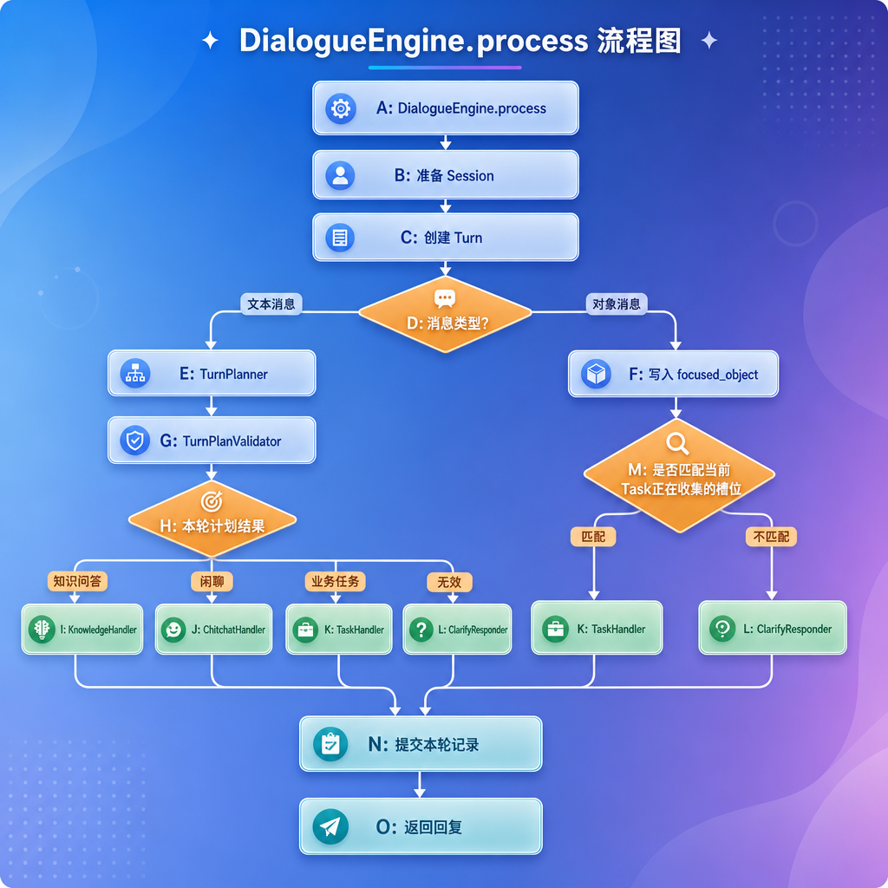
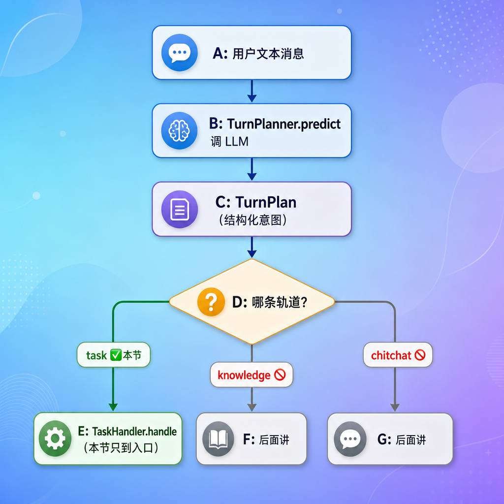
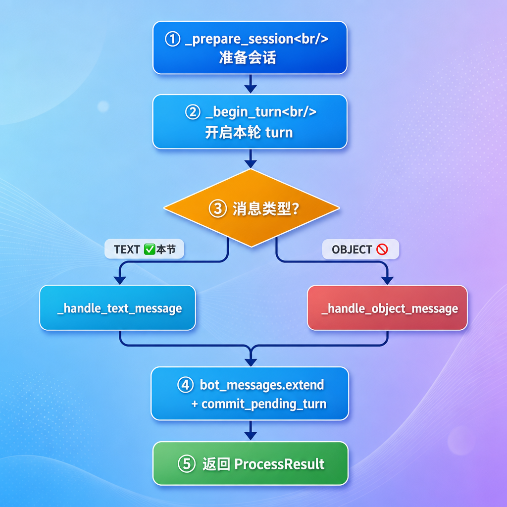
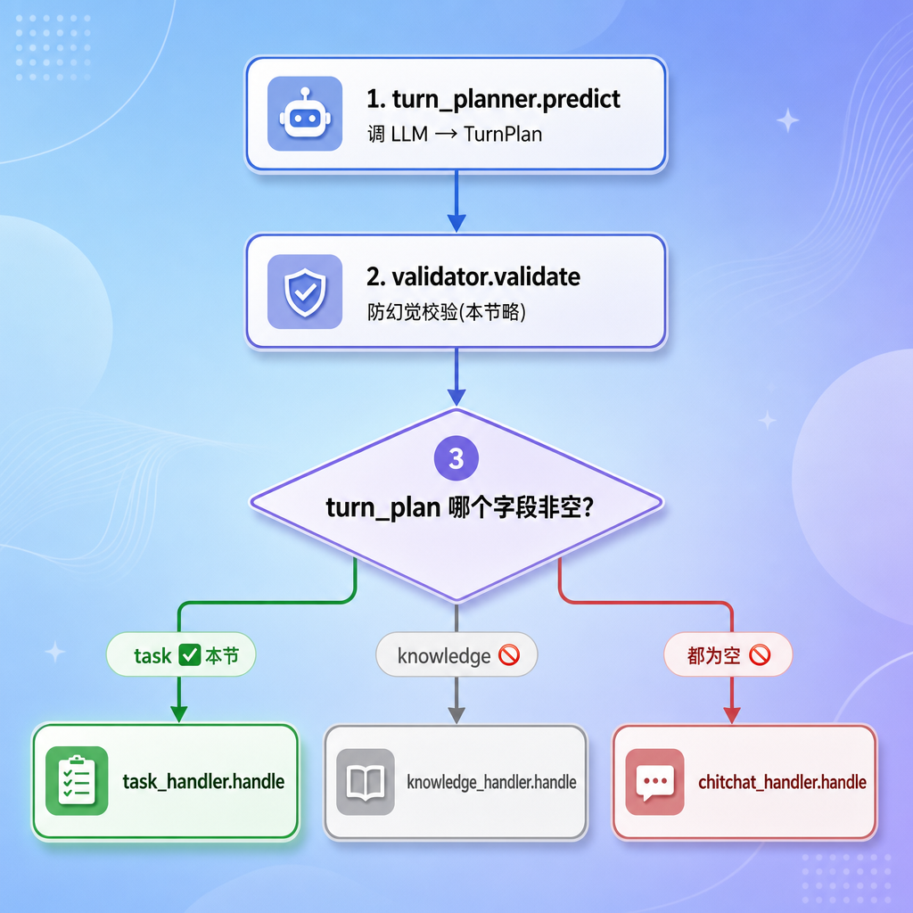
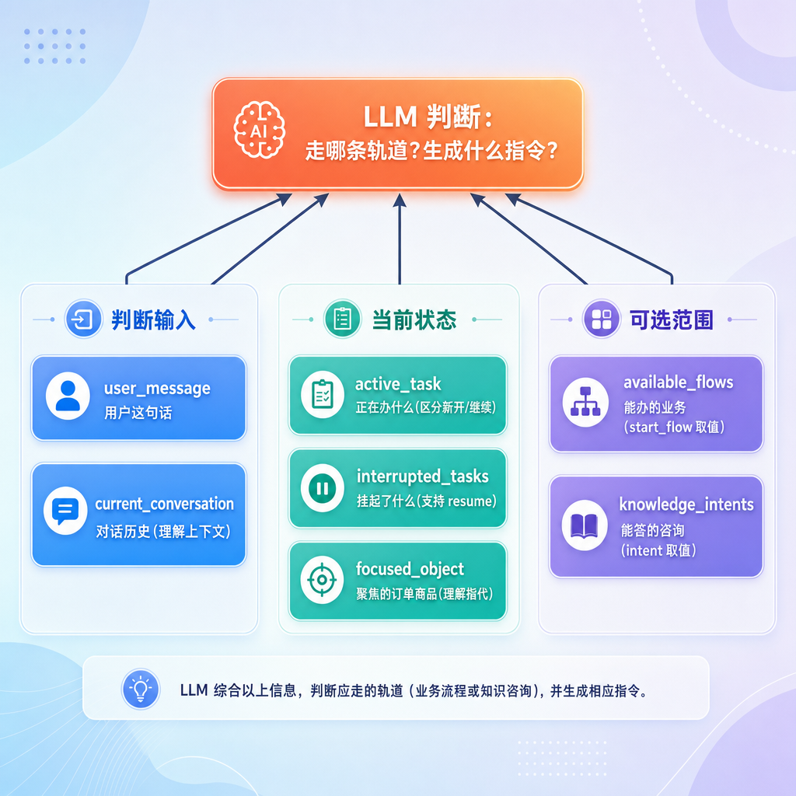
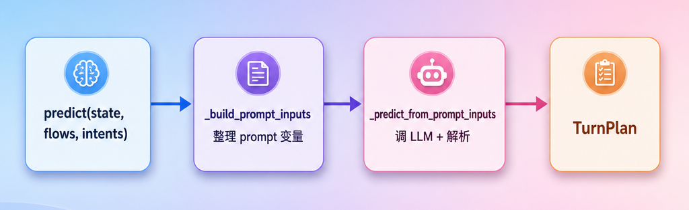
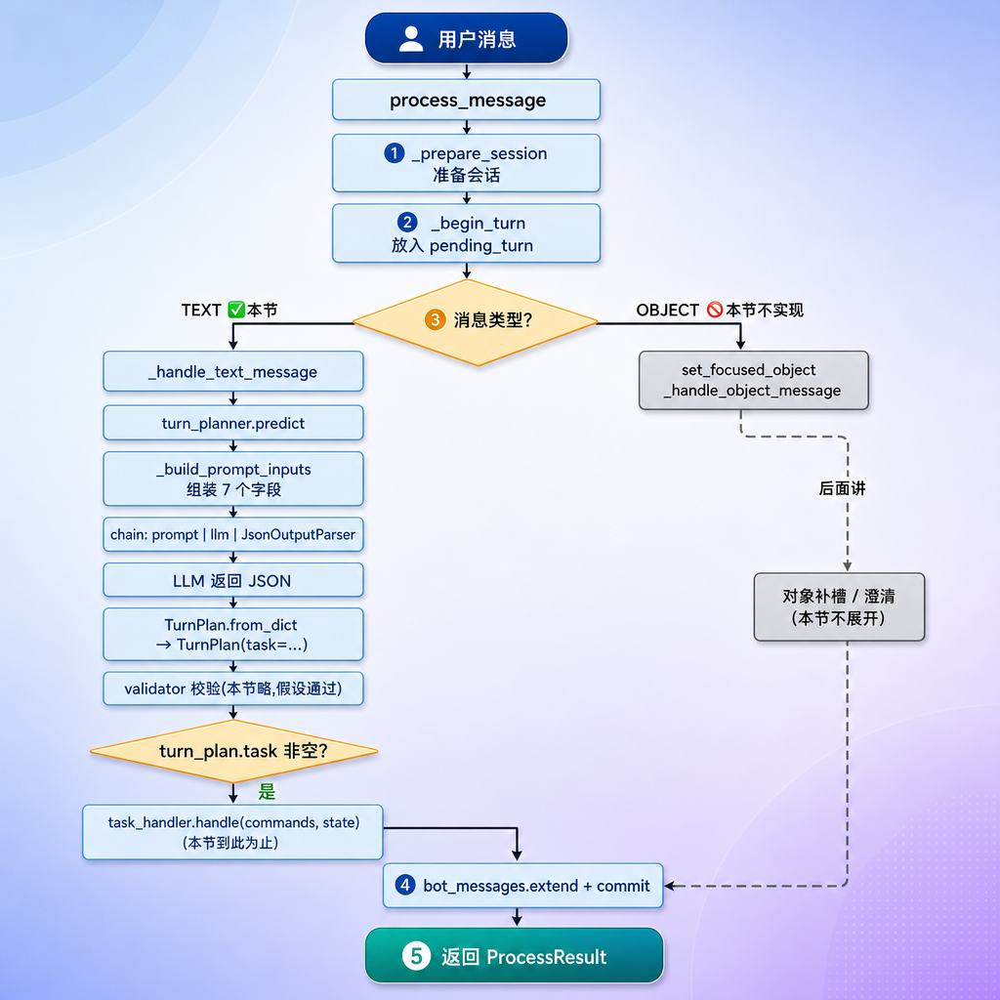

[TOC]


# DialogueEngine 与 TurnPlanner的LLM调用

## 第1章 任务目标 

上一节我们把三层架构搭建好了，会话引擎使用了一个**占位实现**。这一节就来把这个占位换成真正的引擎实现，并完成其中最核心的一段：**用 LLM 判断用户意图、为"办业务"这条轨道生成结构化指令**。

### 1.1 引擎要做的三件事

`DialogueEngine.process_message` 是整个对话系统的"大脑入口"。它要做三件事：

1. **理解**：用户这句话到底想干嘛？办业务（查订单、退款）、咨询信息（问政策、问商品），还是闲聊？（调用LLM）
2. **决策**：根据理解的结果，决定走哪条处理轨道，并生成对应的"行动指令"（定义行动指令）
3. **执行**：把指令交给对应的处理器去执行，拿到回复

这一节聚焦前两件事里和**「办业务」轨道**相关的部分。

### 1.2 对话处理流程

`DialogueEngine` 是一轮消息处理的调度中心。

它接收用户消息和 `DialogueState`，判断本轮走哪条处理路径，并返回机器人回复。



涉及组件如下：

| 组件                | 简要作用                             |
| ------------------- | ------------------------------------ |
| `DialogueState`     | 保存会话、任务、聚焦对象和历史记录。 |
| `Turn`              | 保存本轮用户输入和机器人输出。       |
| `TurnPlanner`       | 根据文本消息和状态生成本轮计划。     |
| `TurnPlanValidator` | 检查本轮计划是否可靠、是否可执行。   |
| `ClarifyResponder`  | 在计划不清晰时生成追问。             |
| `TaskHandler`       | 处理业务任务。                       |
| `KnowledgeHandler`  | 处理知识问答。                       |
| `ChitchatHandler`   | 处理闲聊。                           |

### 1.3 本节内容

这一节是引擎的"全局框架 + 一条轨道的入口"，**不是引擎的全部**。



| 内容 | 本节 |
| --- | --- |
| `process_message` 整体框架（会话准备、开启turn、收尾） | ✅ 实现 |
| 文本消息 → 调 LLM 生成 `TurnPlan` | ✅ 实现 |
| `TurnPlanner` 全局框架 + prompt 构建 | ✅ 详细实现 |
| `Command` / `TurnPlan` 数据模型设计 | ✅ 实现 |
| task 轨道：把 LLM 结果交给 `TaskHandler` | ✅ 实现**调用入口** |
| 对象消息（OBJECT）的处理 | ⛔ 后面讲 |
| 防幻觉校验（`TurnPlanValidator`） | ⛔ 后面讲 |
| knowledge / chitchat 两条轨道 | ⛔ 后面讲 |
| `TaskHandler` 内部（命令处理 + 流程推进） | ⛔ 后面讲 |

也就是说：我们这一节让"用户发一句『我要退款』→ LLM 输出 `start_flow` 指令 → 进入 task 轨道入口"这条链路通起来，但 task 轨道**内部**怎么推进流程，留到下一节。

## 第2章 消息处理全局框架

先看引擎的入口方法 `process_message`，建立整体骨架，再逐段深入。

### 2.1 引擎的依赖

```python
class DialogueEngine:

    def __init__(
            self,
            turn_planner: TurnPlanner,
            task_handler: TaskHandler
            # knowledge_handler: KnowledgeHandler,
            # chitchat_handler: ChitchatHandler,
            # clarify_responder: ClarifyResponder,
            # turn_plan_validator: TurnPlanValidator
    ) -> None:
        self.turn_planner = turn_planner
        self.task_handler = task_handler
        # self.knowledge_handler = knowledge_handler
        # self.chitchat_handler = chitchat_handler
        # self.clarify_responder = clarify_responder
        # self.turn_plan_validator = turn_plan_validator
```

引擎自己**不干活**，它持有一堆"专员"，自己只负责调度：

| 依赖 | 职责 | 本节是否展开 |
| --- | --- | --- |
| `turn_planner` | 调 LLM，把用户意图变成 `TurnPlan` | ✅ 本节重点 |
| `task_handler` | 执行 task 轨道（命令处理 + 流程推进） | 仅调用入口 |
| `knowledge_handler` | 执行 knowledge 轨道 | ⛔ |
| `chitchat_handler` | 执行 chitchat 轨道 | ⛔ |
| `clarify_responder` | 校验失败时生成澄清回复 | ⛔ |
| `turn_plan_validator` | 防幻觉校验 | ⛔ |

### 2.2  消息处理主流程

整个方法分成五个步骤：



代码实现：修改`atguigu/engine/dialogue_engine.py`的`process_message`方法

```python
async def process_message(
    self, 
    dialogue_state: DialogueState,
    user_message: UserMessage) -> ProcessResult:

    # 1. 准备会话
    self._prepare_session(dialogue_state)

    # 2. 开启本轮turn
    self._begin_turn(dialogue_state, user_message)

    # 3. 按消息类型分流
    if user_message.type is MessageType.TEXT:
        messages = await self._handle_text_message(dialogue_state)
    else:
        # 对象消息(本节不实现,后面讲)
        # TODO
        pass

    # 4. 把本轮回复写入turn
    dialogue_state.pending_turn.bot_messages.extend(messages)
    # 提交:turn 进入 session 历史
    dialogue_state.commit_pending_turn()

    # 5. 组装返回结果
    return ProcessResult(
        sender_id=user_message.sender_id,
        message_id=user_message.message_id,
        messages=messages,
    )
```

### 2.3 第一步 准备会话

在`atguigu/engine/dialogue_engine.py`中添加方法：

```python
def _prepare_session(self, dialogue_state: DialogueState) -> None:
    """
    准备会话
    :param dialogue_state:
    :return:
    """

    # 1. 获取当前会话
    session = dialogue_state.current_session()

    # 2. 如果当前会话不存在，则创建一个会话
    if session is None:
        dialogue_state.start_session()
        return

    # 3. 判断会话是否超时
    now = time.time()
    if now - session.last_activity_at > 60 * 60: # 1小时
        # 关闭会话
        dialogue_state.close_current_session()
        # 重置运行时状态
        dialogue_state.reset_runtime_state_for_new_session()
        # 创建会话
        dialogue_state.start_session()
    else:
        # 更新会话（会话续期）
        session.last_activity_at = now
```

这一步决定"这条消息属于哪一段会话"，三种情况：

| 情况 | 处理 |
| --- | --- |
| 当前没有会话（新用户/首次对话） | 直接开一个新会话 |
| 有会话，但距上次活动超过 60 分钟 | 关掉旧会话，重置运行时状态，开新会话 |
| 有会话，且没超时 | 复用，更新最后活动时间 |

第二种情况的"重置运行时状态"很关键：超过一小时没说话，再回来时不该还停在一小时前的半截业务任务的流程里，所以把 active_task、paused_tasks、focused_object 都清掉，相当于"重新开始"。（这套方法在 state 那一节都讲过，这里是它们的使用现场。）

### 2.4 第二步：开启本轮对话

在`atguigu/engine/dialogue_engine.py`中添加方法：

```python
def _begin_turn(self, dialogue_state: DialogueState, user_message: UserMessage) -> None:
    """
    开始一个turn
    :param dialogue_state:
    :param user_message:
    :return:
    """
    dialogue_state.begin_turn(user_message)
```

调 `state.begin_turn`，把用户消息装进一个新的 `pending_turn`。回顾 state 那一节讲的"两步提交"：现在先 `begin`，等本轮处理完、回复也填好了，再 `commit`。中途出错就丢掉 pending_turn，不污染历史。

### 2.5 第三步分流：消息类别分流

本节只实现 if 分支

```python
# 3. 按消息类型分流
if user_message.type is MessageType.TEXT:
    messages = await self._handle_text_message(dialogue_state)
else:
    # 对象消息(本节不实现,后面讲)
    # TODO
    pass
```

#### 2.5.1 文本消息的处理

在`atguigu/engine/dialogue_engine.py`中添加方法：

```python
async def _handle_text_message(self, dialogue_state: DialogueState) -> list[BotMessage]:

    # 1. 调 LLM 生成本轮计划（确定任务轨道）
    turn_plan: TurnPlan = await self.turn_planner.predict(dialogue_state, self.task_handler.flows)

    # 2. 防幻觉校验(本节不实现,后面讲)
    # TODO

    # 3. 按轨道分发
    if turn_plan.task is not None:
        return await self.task_handler.handle(
            commands=turn_plan.task.commands,
            state=dialogue_state,
        )
    elif turn_plan.knowledge is not None:
        # TODO(本节不实现,后面讲)
        return None
    else:
        # TODO(本节不实现,后面讲)
        return None
```

创建文件 `atguigu/task/handler.py`

```python
# atguigu/task/handler.py

from atguigu.domain.messages import BotMessage
from atguigu.domain.state import DialogueState
from atguigu.task.command.models import Command
from atguigu.task.flow.flows import FlowsList


class TaskHandler:

    def __init__(self, flows:FlowsList):
        self.flows = flows

    async def handle(self, commands: list[Command], state: DialogueState) -> list[BotMessage]:
        return [BotMessage(text="任务已经处理")]
```

这是引擎的"决策中枢"，三步：



本节我们把注意力放在**第 1 步（怎么调 LLM 生成 TurnPlan）**和**第 3 步的 task 分支（怎么把结果交给 TaskHandler）**。第 2 步校验、knowledge/chitchat 分支，暂不展开。

#### 2.5.2 "伪装校验已通过"

你可能会问：校验都没实现，第 3 步直接用 `turn_plan.task` 安全吗？

短期是安全的——只要 LLM 表现正常、输出合法的 task 计划，第 3 步就能正常走。校验（`TurnPlanValidator`）解决的是 LLM **出幻觉**时的兜底（比如编了一个不存在的 flow）。我们这一节先让"正常路径"通起来，把"异常路径"的防护留到讲校验那一节补。这也符合一贯的开发节奏：**先打通主干，再加固边界**。

### 2.6 第四五两步：收尾

```python
# 4. 把本轮回复写入turn
dialogue_state.pending_turn.bot_messages.extend(messages)
# 提交:turn 进入 session 历史
dialogue_state.commit_pending_turn()

# 5. 组装返回结果
return ProcessResult(
    sender_id=user_message.sender_id,
    message_id=user_message.message_id,
    messages=messages,
)
```

不管走的是文本还是对象、task 还是其它轨道，最后都汇到这里：把生成的回复填进 pending_turn，commit 落到会话历史，再包装成 `ProcessResult` 返回给 Service。

### 2.7 依赖注入

修改 `atguigu/api/routers/dependencies.py` 文件的 `get_engine()` 方法

```python
async def get_engine():
    base_path = Path(__file__).parents[3]
    user_flow_path = base_path / "flow_config" / "user_flows.yml"
    system_flow_path = base_path / "flow_config" / "system_flows.yml"

    loader = FlowLoader()
    flow_list = loader.load_many([user_flow_path, system_flow_path])

    return DialogueEngine(turn_planner = TurnPlanner(), task_handler = TaskHandler(flows=flow_list))
```

## 第3章 Command  和 TurnPlan

### 3.1 概念

`TurnPlanner` 负责根据用户当前输入和对话状态，生成本轮对话计划 `TurnPlan`。

在看 `TurnPlanner` 怎么调 LLM 之前，必须先搞清楚它的**产出物**长什么样——也就是 `TurnPlan` 和 `Command` 这两组数据模型。LLM 的输出会被解析成它们。

### 3.2 JSON

LLM 输出的 `TurnPlan` 可以是一个 JSON 对象，顶层固定包含三个字段：

```json
{
  "task": null,
  "knowledge": null,
  "chitchat": null
}
```

如果用户是在办理业务，填写 `task`：

```json
{
  "task": {
    "commands": [{"command": "start_flow", "flow": "refund_request"}]
  },
  "knowledge": null,
  "chitchat": null
}
```

如果用户是在咨询知识，填写 `knowledge`：

```json
{
  "task": null,
  "knowledge": {
    "intents": ["refund_policy"]
  },
  "chitchat": null
}
```

如果用户是在闲聊，填写 `chitchat`：

```json
{
  "task": null,
  "knowledge": null,
  "chitchat": {}
}
```

如果用户一句话同时表达多个意图，LLM 也可以同时填写多个轨道：

```json
{
  "task": {
    "commands": [
      {"command": "start_flow", "flow": "refund_request"}
    ]
  },
  "knowledge": {
    "intents": ["refund_policy"]
  },
  "chitchat": null
}
```

> 注意：当然多意图 `TurnPlan` 最后会被 `TurnPlanValidator` 认定为当前引擎不能直接执行，然后引导**用户澄清**先处理哪一个。

### 3.3 Command

`task` 轨道的核心是 `commands`。它是 LLM 对"用户想办的业务任务"的**结构化**表达。

先想一个问题:**用户在办业务的过程中,到底会做哪些动作?**

把前面几节出现过的对话场景回顾一遍,会发现用户的动作其实就那么几类:

```
用户:我要退款                    ← 动作:开启一个新业务
用户:订单号是 A001               ← 动作:为当前业务提供一项信息
用户:算了不退了                  ← 动作:放弃当前业务
用户:继续刚才的物流查询          ← 动作:重新拾起之前搁置的业务
```

这四类动作,恰好覆盖了一个任务从"开始"到"结束"会经历的所有用户操作:发起、补充信息、中途放弃、回头继续。我们要做的,就是把用户这些**自然语言动作**,翻译成系统能执行的**结构化指令**——这就是 `Command`。

可以这样理解 `Command`:它是办理业务的"原子指令",一句用户的话,会被 LLM 拆解成一条或多条这样的指令。比如"我要退款,订单号 A001"这一句,就可能被拆成两条：开启退款流程 + 填写订单号。

#### 3.3.1 四种 Command

启动任务：

```json
{"command": "start_flow", "flow": "refund_request"}
```

填写信息(写入槽位)：

```json
{"command": "set_slots", "slots": {"order_number": "10001"}}
```

取消任务：

```json
{"command": "cancel_flow"}
```

恢复任务：

```json
{"command": "resume_flow", "flow": "refund_request"}
```

#### 3.3.2 Command 模型

创建文件 `atguigu/task/command/models.py`:

实现方案：多态分发

```python
# atguigu/task/command/models.py

from typing import Any

from pydantic import BaseModel


class Command(BaseModel):
    command: str

    @classmethod
    def from_dict(cls, data: dict[str, Any]) -> "Command":
        clz = COMMAND_NAME_TO_CLASS[data["command"]]
        return clz(**data)

class StartFlowCommand(Command):
    flow: str

class SetSlotsCommand(Command):
    slots: dict[str, Any]

class CancelFlowCommand(Command):
    pass


class ResumeFlowCommand(Command):
    flow: str | None = None


COMMAND_NAME_TO_CLASS = {
    "start_flow": StartFlowCommand,
    "set_slots": SetSlotsCommand,
    "cancel_flow": CancelFlowCommand,
    "resume_flow": ResumeFlowCommand,
}


if __name__ == '__main__':
    command = {"command": "set_slots", "slots": {"order_number": "10001"}}
    print(Command.from_dict(command))
```

四种命令,正好对应刚才分析的四类用户动作:

| 命令                | 含义               | 用户说法举例     |
| ------------------- | ------------------ | ---------------- |
| `StartFlowCommand`  | 开启一个新流程     | "我要退款"       |
| `SetSlotsCommand`   | 填写一个或多个槽位 | "订单号是 A001"  |
| `CancelFlowCommand` | 取消当前流程       | "算了不退了"     |
| `ResumeFlowCommand` | 恢复之前挂起的流程 | "继续刚才的退款" |

注意每个子类**携带的参数**也对应着动作的需要:

- 开流程要说清"开哪个",所以 `StartFlowCommand` 带 `flow`
- 填槽位要说清"填什么",所以 `SetSlotsCommand` 带 `slots`
- 取消就是取消当前的,不需要额外信息,所以 `CancelFlowCommand` 是空的
- 恢复要说清"恢复哪个挂起的",所以 `ResumeFlowCommand` 带 `flow`

### 3.4 TurnPlan

#### 3.4.1 三个轨道的 TurnPlan

`task` / `knowledge` / `chitchat` 三个字段告诉我们**走哪条轨道**

```json
"task":      { "commands": [...] }    // 办业务:要执行一串命令
"knowledge": { "intents": [...] }     // 咨询:要命中一个或多个知识意图
"chitchat":  {}                       // 闲聊:什么参数都不需要
```

- 办业务最复杂——用户可能"开流程"、可能"填槽位"、可能"取消",所以要装一串 `commands`
- 咨询次之——只需要知道用户问的是哪类信息,装一个 `intents` 列表
- 闲聊最简单——不需要任何参数,空对象即可

所以这三个字段不能用同一种类型,得各自定义一个数据模型来承载各自的信息。

创建文件 `atguigu/plan/models.py`:

```python
# atguigu/plan/models.py
from atguigu.task.command.models import Command
from pydantic import BaseModel


class TaskTurnPlan(BaseModel):
    commands: list[Command] = [] # 命令

    @classmethod
    def from_dict(cls, data: dict) -> "TaskTurnPlan":
        return cls(commands=[Command.from_dict(command) for command in data["commands"]])

class KnowledgeTurnPlan(BaseModel):
    intents: list[str] = [] # 意图

    @classmethod
    def from_dict(cls, data: dict) -> "KnowledgeTurnPlan":
        return cls(intents=data["intents"])

class ChitchatTurnPlan(BaseModel):
    pass
```

| 轨道模型            | 装什么                          | 对应 JSON             |
| ------------------- | ------------------------------- | --------------------- |
| `TaskTurnPlan`      | 一个 `Command` 列表（本节重点） | `{"commands": [...]}` |
| `KnowledgeTurnPlan` | 一个意图字符串列表              | `{"intents": [...]}`  |
| `ChitchatTurnPlan`  | 空（闲聊不需要参数）            | `{}`                  |

#### 3.4.2 TurnPlan 模型

`TurnPlan` 就是 LLM 这一轮的"决策结果"，三个字段对应三条轨道，**每个要么是对应的计划对象、要么是 `None`**：

在文件 `atguigu/plan/models.py` 中添加：

```python
# atguigu/plan/models.py

class TurnPlan(BaseModel):
    """
    本轮对话的规划结果
    """
    task: TaskTurnPlan | None = None # 业务任务的轨道
    knowledge: KnowledgeTurnPlan | None = None  # 信息咨询业务轨道
    chitchat: ChitchatTurnPlan | None = None  # 闲聊业务轨道

    @classmethod
    def from_dict(cls, data: dict) -> "TurnPlan":
        return cls(
            task=TaskTurnPlan.from_dict(data["task"]) if data.get("task") is not None else None,
            knowledge=KnowledgeTurnPlan.from_dict(data["knowledge"]) if data.get("knowledge") is not None else None,
            
            # 注意此处直接创建ChitchatTurnPlan对象即可，不需要做反序列化
            chitchat=ChitchatTurnPlan() if data.get("chitchat") is not None else None,
        )
```

| 字段 | 非空表示 |
| --- | --- |
| `task` | 用户在办业务，里面装一串 `commands` |
| `knowledge` | 用户在咨询信息，里面装 `intents` |
| `chitchat` | 用户在闲聊 |

正常情况下只有一个字段非空。如果 LLM 觉得用户同时表达了多个意图，可能填多个——那就是校验那一节要处理的"多轨道"情况。

### 3.5 从 LLM 输出到对象

假设用户说"我要退款"，LLM 应该输出：

```json
{
  "task": {
    "commands": [
      {"command": "start_flow", "flow": "refund_request"}
    ]
  },
  "knowledge": null,
  "chitchat": null
}
```

经过 `TurnPlan.from_dict`，变成：

```python
TurnPlan(
    task=TaskTurnPlan(commands=[
        StartFlowCommand(command="start_flow", flow="refund_request")
    ]),
    knowledge=None,
    chitchat=None,
)
```

引擎拿到这个 `TurnPlan`，看到 `task` 非空，就把 `commands` 交给 `TaskHandler`。

再看一个用户在流程中途提供信息的例子。用户说"订单号是 A001"：

```json
{
  "task": {
    "commands": [
      {"command": "set_slots", "slots": {"order_number": "A001"}}
    ]
  },
  "knowledge": null,
  "chitchat": null
}
```

经过 `TurnPlan.from_dict`，变成：

```python
TurnPlan(
    task=TaskTurnPlan(commands=[
        SetSlotsCommand(command="set_slots", slots={"order_number": "A001"})
    ]),
    knowledge=None,
    chitchat=None,
)
```

对应以上示例的测试用例，在文件 `atguigu/plan/models.py` 中添加：

```python
# atguigu/plan/models.py

if __name__ == '__main__':


    json_str1 = """
    {
      "task": {
        "commands": [
          {"command": "start_flow", "flow": "refund_request"}
        ]
      },
      "knowledge": null,
      "chitchat": null
    }
    """

    # 转成dict
    turn_plan1 = TurnPlan.from_dict(json.loads(json_str1))
    print(turn_plan1)

    json_str2 = """
    {
      "task": {
        "commands": [
          {"command": "set_slots", "slots": {"order_number": "A001"}}
        ]
      },
      "knowledge": null,
      "chitchat": null
    }
    """
    # 转成dict
    turn_plan2 = TurnPlan.from_dict(json.loads(json_str2))
    print(turn_plan2)
```

## 第4章 提示词

### 4.1 Jinja2 模板引擎介绍

#### 4.1.1 定义

**Jinja2 是 Python 生态最主流、高性能的模板引擎**，用来把「静态模板文件 + Python 数据」拼接生成动态文本（HTML、配置文件、JSON、脚本等）。

由 Flask 框架配套开发。

#### 4.1.2 核心作用：分离数据与页面

后端 Python 只负责查数据、处理逻辑；

模板只写页面结构、展示内容；

Jinja2 自动把数据填充进模板占位符，输出完整文本。

#### 4.1.3 三大基础语法

##### 变量

 输出数据

```jinja
# 这是注释吗？不是
你好，{{ username }}
数字：{{ age }}
转大写：{{ name|upper }}  {# | 过滤器，加工变量 #}
```

##### % 逻辑代码 %

循环、判断、继承（块语句）

```jinja

    成年人

    未成年



    <li>{{ item }}</li>

```

##### 注释

模板内注释，渲染后不会输出

#### 4.1.4 核心优势

1. **安全防 XSS**：默认自动转义 HTML 特殊字符，避免注入攻击
2. **高性能**：模板首次编译为 Python 字节码并缓存，重复渲染极快
3. 复用能力强
   - 模板继承 ``：统一网页头部底部，不用重复写
   - 宏 `macro`：模板内封装可复用片段，类似函数
   - `include`：引入公共片段（导航、页脚）
4. **高度扩展**：自定义过滤器、全局函数、沙箱隔离（安全渲染第三方模板）
5. **不限文件格式**：不只做网页，还能生成 yaml、shell、sql、Dockerfile 配置

#### 4.1.5 常见使用场景

1. **Web 开发**：Flask 内置模板引擎；FastAPI、Sanic 常用配套
2. **自动化运维**：Ansible 配置模板、K8s yaml 动态渲染
3. **AI / 工具脚本**：动态生成提示词 Prompt、报表文本、邮件内容
4. **代码生成器**：批量生成 CRUD 页面、接口代码

#### 4.1.6 使用示例

##### 安装

```bash
uv add jinja2
```

##### 案例1 读取并渲染内存模板

创建文件 `atguigu/test/jinja2/simple_template.py`：

```python
# atguigu/test/jinjia2/simple_template.py

from jinja2 import Template

# 模板文本
tpl = Template("用户：{{ name }}，积分：{{ score }}")
# 传入数据渲染
result = tpl.render(name="小明", score=99)
print(result)
# 输出：用户：小明，积分：99
```

##### 案例2 读取并渲染文件模板

创建模板文件 `atguigu/test/jinjia2/template.jinja2`：

```jinja
{# atguigu/test/jinjia2/template.jinjia2 #}
{# 系统角色 #}
你是一名专业AI助手，基于提供的参考资料回答用户问题，禁止编造内容。


### 参考资料

{{ loop.index }}. {{ item.content | trim | truncate(800) }}




### 历史对话

用户：{{ msg.content }}
助手：{{ msg.content }}




用户现在的问题：{{ question }}
输出要求：以简洁markdown格式回答
```

创建python解析文件 `atguigu/test/jinjia2/load_template_file.py`：

```python
# atguigu/test/jinjia2/load_template_file.py

from jinja2 import Environment, FileSystemLoader
import os

# 1. 获取当前脚本所在目录
current_dir = os.path.dirname(os.path.abspath(__file__))

# 2. 创建 Jinja2 环境，设置模板搜索路径为当前目录
env = Environment(loader=FileSystemLoader(current_dir))

# 3. 加载模板文件
tpl = env.get_template('template.jinjia2')
print(type(tpl))

# 4. 准备渲染数据
data = {
    "question": "Jinja2和f-string有什么区别？",
    "docs": [
        {"content": "Jinja2是专业第三方模板引擎，支持循环、判断、外部文件"},
        {"content": "f-string是Python原生字符串格式化，仅适合简单文本"}
    ],
    "history": [
        {"role": "user", "content": "什么是Prompt模板？"},
        {"role": "assistant", "content": "用来动态生成发给大模型指令的文本工具"}
    ]
}

# 5. 渲染完整prompt字符串
full_prompt = tpl.render(**data)

# 打印最终生成的提示词
print(full_prompt)

```

##### 案例3 读取当前项目的提示词模板

创建文件 `atguigu/prompts/loader.py`

```python
# atguigu/prompts/loader.py

"""
jinja2:模版引擎（计算逻辑和表现分开）
"""

from pathlib import Path


def load_prompt(prompt_file_name: str) -> str:
    """
    根据任务类型的提示词文件名字 读取对应文件的内容
    :param prompt_file_name:
    :return:
    """
    prompt_file_path = Path(__file__).resolve().parents[0] / "jinja2" / f"{prompt_file_name}.jinja2"

    return prompt_file_path.read_text(encoding="utf-8")

if __name__ == '__main__':
    print(load_prompt("turn_plan"))
```

### 4.2 HistoryBuilder

`HistoryBuilder`的作用：把消息对象渲染成文本

渲染规则也很直观：

- 文本消息：直接取 `text`，比如 `"我要退款"`
- 对象消息：渲染成一段描述，比如 `[订单对象 id=A20240315001, title=小米手机]`——因为 LLM 看不懂 Python 对象，必须把对象的关键信息摊成它能读的文字

创建文件：`atguigu/prompts/history_builder.py`:

```python
# atguigu/prompts/history_builder.py

import json
from typing import Dict, Any

from atguigu.domain.state import Turn
from atguigu.domain.messages import UserMessage, BotMessage, FocusedObject, MessageType


class HistoryBuilder:
    """
    1. 将用户消息的UserMessage对象序列化为字符串
    "USER: 我准备查询订单信息"
    2. 将历史对话的Q(UserMessage)A(BotMessage)对象序列化为字符串：
    "USER: 我想查询物流信息\n BOT: 好的，先提供订单编号"
    """

    @staticmethod
    def build(turns: list[Turn]) -> str:
        """
        将多轮对话列表转换成字符串形式
        :param turns:
        :return:
        """

        msgs: list[str] = []
        for turn in turns:
            # 1. 处理用户消息
            user_message = turn.user_message
            user_message_str = HistoryBuilder._render_user_message(user_message)
            msgs.append(f"USER:{user_message_str}")
            # 2. 处理机器人消息
            for bot_msg in turn.bot_messages:
                bot_msg_str = HistoryBuilder._render_bot_message(bot_msg)
                msgs.append(f"BOT:{bot_msg_str}")

        return "\n".join(msgs)

    @staticmethod
    def _render_user_message(user_message: UserMessage):

        if user_message.type is MessageType.TEXT:
            return HistoryBuilder._render_text_msg(user_message.text)
        else:
            return HistoryBuilder._render_obj_msg(user_message.object)
    @staticmethod
    def render_user_message(user_message: UserMessage):
        HistoryBuilder._render_user_message(user_message)

    @staticmethod
    def _render_bot_message(bot_msg: BotMessage):

        if bot_msg.text:
            return HistoryBuilder._render_text_msg(bot_msg.text)
        else:
            return HistoryBuilder._render_obj_msg(bot_msg.object)

    @staticmethod
    def _render_text_msg(text):
        return text.strip()

    @staticmethod
    def _render_obj_msg(object_msg: FocusedObject):

        label = "订单对象" if object_msg.type == "order" else "商品对象"
        id = object_msg.id
        title = object_msg.title
        attributes: Dict[str, Any] = object_msg.attributes
        # attributes_str = ",".join([f"{key}:{value}" for key, value in attributes.items()])
        # 字典转字符串
        attributes_str = json.dumps(attributes, ensure_ascii=False)
        return f"[label={label}, id={id}, title={title}, attributes={attributes_str}]"


if __name__ == '__main__':

    """
    测试 HistoryBuilder 的 build 方法
    """

    def test_build_single_text_turn():
        """测试单轮纯文本对话"""
        # 创建用户消息
        user_msg = UserMessage(
            sender_id="user_001",
            message_id="msg_001",
            type=MessageType.TEXT,
            text="我想查询订单状态"
        )

        # 创建机器人回复
        bot_msg1 = BotMessage(text="好的，我们先处理订单状态查询")
        bot_msg2 = BotMessage(text="请告诉我你的订单号。")

        # 创建轮次
        turn = Turn(
            turn_id="turn_001",
            user_message=user_msg,
            bot_messages=[bot_msg1, bot_msg2]
        )

        # 构建历史对话
        result = HistoryBuilder.build([turn])
        print(f"结果:\n{result}")


    def test_build_with_object_message():

        """测试包含对象类型的消息"""

        # 用户点击了一个订单对象
        focused_obj = FocusedObject(
            id="order_12345",
            type="order",
            title="iPhone 15 Pro Max",
            attributes={"price": "9999", "status": "已发货"}
        )

        # 创建用户消息
        user_msg = UserMessage(
            sender_id="user_001",
            message_id="msg_001",
            type=MessageType.OBJECT,
            object=focused_obj
        )

        # 创建机器人回复
        bot_msg = BotMessage(text="我看到您点击了这个订单，请问需要什么帮助？")

        # 创建轮次
        turn = Turn(
            turn_id="turn_001",
            user_message=user_msg,
            bot_messages=[bot_msg]
        )

        # 构建历史对话
        result = HistoryBuilder.build([turn])
        print(f"结果:\n{result}")

    # 运行所有测试
    test_build_single_text_turn()
    test_build_with_object_message()
```

### 4.3 提示词分析



| 字段                   | 类别     | 不传的后果                                 |
| ---------------------- | -------- | ------------------------------------------ |
| `user_message`         | 判断输入 | 无从判断                                   |
| `current_conversation` | 判断输入 | 看不懂依赖上下文的短句（"算了"、报个号码） |
| `active_task`          | 当前状态 | 分不清"回答当前流程"还是"开新业务"         |
| `interrupted_tasks`    | 当前状态 | 没法正确生成 `resume_flow`                 |
| `focused_object`       | 当前状态 | 理解不了"这个""它"等指代                   |
| `available_flows`      | 可选范围 | 瞎编 flow id                               |
| `knowledge_intents`    | 可选范围 | 瞎编 intent id                             |

一句话总结：**前两个让 LLM "看懂用户说什么"，中间三个让 LLM "知道现在是什么处境"，后两个给 LLM "划定能选什么"**。三组信息凑齐，LLM 才能做出又准又合法的判断。

## 第5章 TurnPlanner 

`TurnPlanner` 的职责：把当前对话状态喂给 LLM，让 LLM 输出一个 `TurnPlan`。

### 5.1 入口 

创建文件 `atguigu/plan/turn_planner.py`

```python
# atguigu/plan/turn_planner.py

class TurnPlanner:
    """
    意图分析器
    作用：根据自然语言 调用LLM 分析轨道类型
    """

    async def predict(self, state: DialogueState, flows: FlowsList) -> TurnPlan:
        """

        :param state:
        :return: 返回值是什么?(分析:定义数据模型)
        """

        # 1. 构建提示词
        inputs_prompt = self._build_prompt_inputs(state, flows)

        # 2. 调用LLM模型
        turn_plan = await  self._predict_from_prompt_inputs(inputs_prompt)

        return turn_plan
```

`predict` 接收两样东西：

| 入参 | 是什么 |
| --- | --- |
| `state` | 当前对话状态（含历史、活跃任务、聚焦对象等） |
| `flows` | 系统支持的所有流程（告诉 LLM 有哪些业务可办） |

它只做两件事：

1. `_build_prompt_inputs`：把这三样东西**整理成给 LLM 的提示词变量**
2. `_predict_from_prompt_inputs`：拿提示词变量**调 用LLM**，把输出解析成 `TurnPlan`



### 5.2 提示词的实现

`_build_prompt_inputs` 把信息从 `state` / `flows`里取出来，序列化成提示词变量：

```python
# atguigu/plan/turn_planner.py

def _build_prompt_inputs(self, state: DialogueState, flows_list: FlowsList) -> Dict[str, Any]:
    """
    构建提示词输入参数
    :param state:
    :param flows_list:
    :return:
    """
    # 1. 用户消息
    user_msg = HistoryBuilder.render_user_message(state.pending_turn.user_message)

    # 2. 历史对话(当前session的turns:后10轮：最近的10轮) 。历史对话取多少 取哪些：动态策略
    current_conversation = HistoryBuilder.build(state.current_session().turns[-10:])

    # 3. 当前激活任务(业务任务)
    active_task_json = json.dumps(
        state.active_task.model_dump(mode="json"),ensure_ascii=False
    ) if state.active_task is not None else None

    # 4. 中断任务
    interrupted_tasks_json = json.dumps(
        [paused_task.model_dump(mode="json") for paused_task in state.paused_tasks],
        ensure_ascii=False
    )

    # 5. 页面点击卡片获取的信息
    focused_object_json = json.dumps(state.focused_object.model_dump(mode="json")) if state.focused_object is not None else None

    # 6. 流程清单
    # flows_dict = {
    #     "flows":[{k: v for k, v in flow.model_dump(mode="json").items() if k != "steps"} for flow in flow_list.flows]
    # }
    flows_data = []
    for flow in flow_list.flows:
        flow_dict = flow.model_dump(mode="json")
        flow_dict.pop("steps", None)  # 直接删掉 steps，第二个参数 None 表示没有也不报错
        flows_data.append(flow_dict)
    flows_dict = {"flows": flows_data}
    available_flows_json = json.dumps(flows_dict, ensure_ascii= False)

    return {
        "user_message": user_msg,
        "current_conversation": current_conversation,
        "active_task_json": active_task_json,
        "interrupted_tasks_json": interrupted_tasks_json,
        "focused_object_json": focused_object_json,
        "available_flows_json": available_flows_json,
        "knowledge_intents_json": "" # TODO
    }
```

它返回一个字典，一共 **7 个字段**，每个都会被填进 prompt 模板的某个 `{{ }}` 占位符。

这些字段返回后，会交给  `_predict_from_prompt_inputs`：填进 jinja2 模板、调 LLM、解析成 `TurnPlan`。

### 5.3 调用 LLM

```python
# atguigu/plan/turn_planner.py

async def _predict_from_prompt_inputs(self, inputs_prompt: Dict[str, Any]) -> TurnPlan:
        """
        1. 加载提示词模板
        2. 格式化模版
        3. 调用模型
        :param inputs_prompt:
        :return:
        """

        prompt_template_text = load_prompt("turn_plan")

        prompt_template = PromptTemplate.from_template(template=prompt_template_text, template_format="jinja2")

        # LangChain 的链式写法
        chain = prompt_template | llm | JsonOutputParser()

        llm_response_dict: Dict[str, Any] = await chain.ainvoke(inputs_prompt)

        return TurnPlan.from_dict(llm_response_dict)

```

这里用了 LangChain 的链式写法，三个环节串成一条流水线：

```text
prompt(模板) | llm(大模型) | JsonOutputParser(解析成字典)
```

| 环节 | 做什么 |
| --- | --- |
| `prompt` | 把 `prompt_inputs` 里的变量填进 jinja2 模板，渲染成最终提示词 |
| `llm` | 把渲染好的提示词发给大模型，拿到文本回复 |
| `JsonOutputParser` | 把模型返回的 JSON 文本解析成 Python 字典 |

最后 `TurnPlan.from_dict(llm_output)` 把字典变成 `TurnPlan` 对象。

- `load_prompt("turn_plan")`：从 prompt 目录读取 `turn_plan.jinja2` 模板文本
- `template_format="jinja2"`：告诉 LangChain 用 jinja2 语法渲染（模板里用 `{{ }}` 取变量）
- `await chain.ainvoke(...)`：异步调用，因为 LLM 请求是高延迟 I/O，必须 async

## 第6章 小结

### 6.1 把整条链路串起来

完整走一遍"用户说『我要退款』"的链路（文本 + task 轨道）：



这条链路现在打通了从"用户文本"到"task 轨道入口"的全过程：

- 用户说"我要退款"
- 引擎准备会话、开 turn
- TurnPlanner 把 7个字段组装成 prompt，调 LLM
- LLM 返回 `{"task": {"commands": [{"command": "start_flow", "flow": "refund_request"}]}}`
- 解析成 `TurnPlan`，看到 task 非空
- 把 commands 交给 `TaskHandler.handle`（内部留到下一节）

### 6.2 这一节实现了什么

| 文件 | 内容 |
| --- | --- |
| `engine/dialogue_engine.py` | `process_message` 框架 + `_prepare_session` / `_begin_turn` / `_handle_text_message`（task 分支） |
| `plan/models.py` | `TurnPlan` / `TaskTurnPlan` / `KnowledgeTurnPlan` / `ChitchatTurnPlan` |
| `task/command/models.py` | `Command` 四子类 + `COMMAND_NAME_TO_CLASS` |
| `plan/turn_planner.py` | `TurnPlanner.predict` / `_build_prompt_inputs` / `_predict_from_prompt_inputs` |
| `prompts/jinja2/turn_plan.jinja2` | 提示词模板 |

### 6.3 几个好的设计

1. **引擎只调度、不干活**：引擎持有一堆"专员"，自己只决定走哪条轨道、把活派给谁。
2. **多态反序列化的老套路**：`Command.from_dict` 用 `COMMAND_NAME_TO_CLASS` 映射表分发。
3. **给 LLM 的 7个字段各有所司**：判断输入（user_message / history）+ 当前状态（active_task / interrupted_tasks / focused_object）+ 可选范围（available_flows / knowledge_intents）。给 LLM 看什么，直接决定它判断得准不准、合不合法。
4. **available_flows 去掉 steps**：LLM 只需"业务说明书"，不需要流程内部步骤，省 token 又防干扰。
5. **先打通主干，再加固边界**：本节先让正常路径跑通，校验（防幻觉）和对象消息留到后面。
