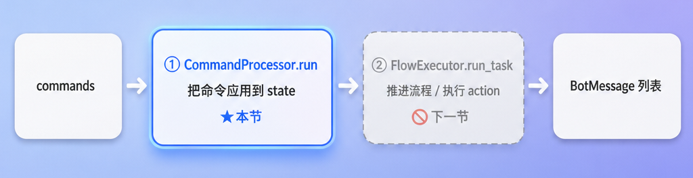
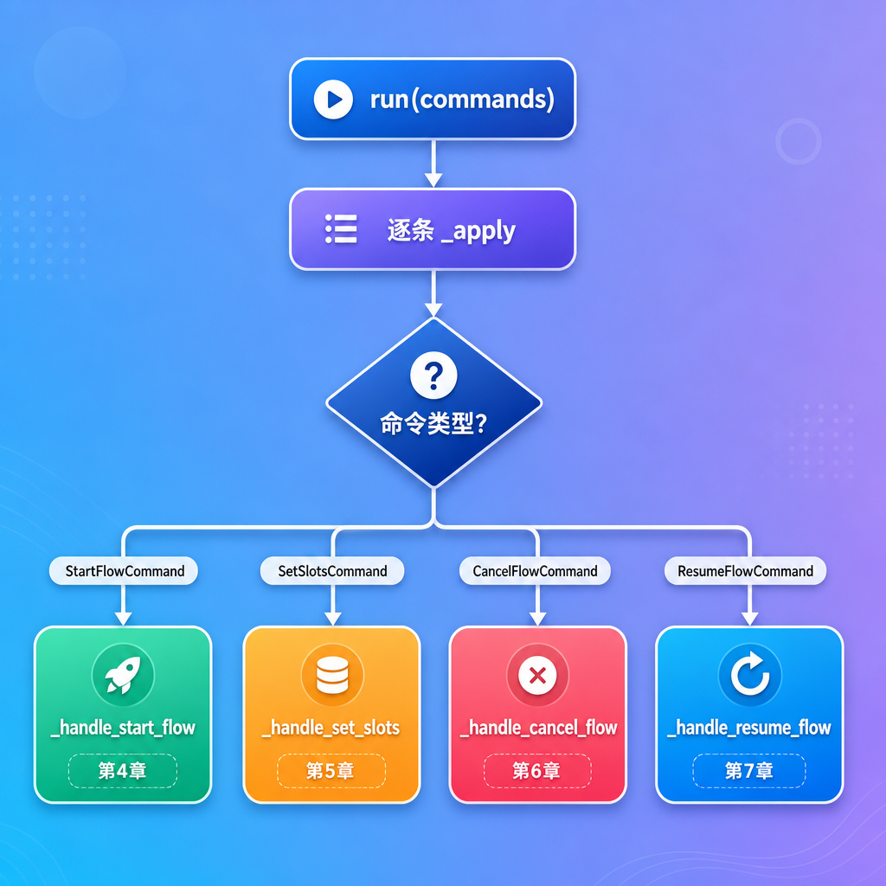
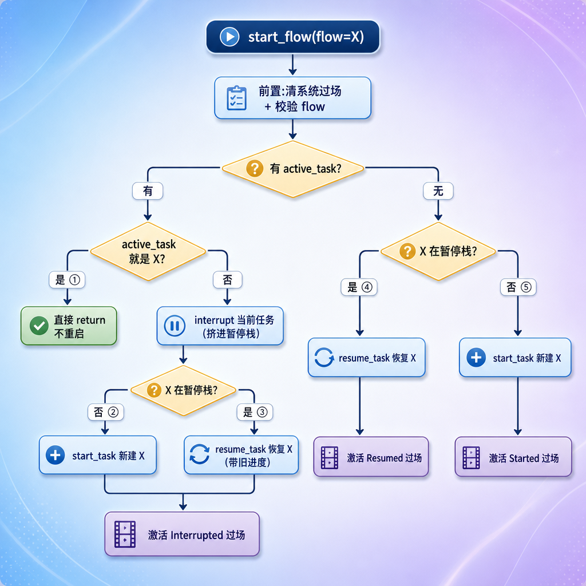
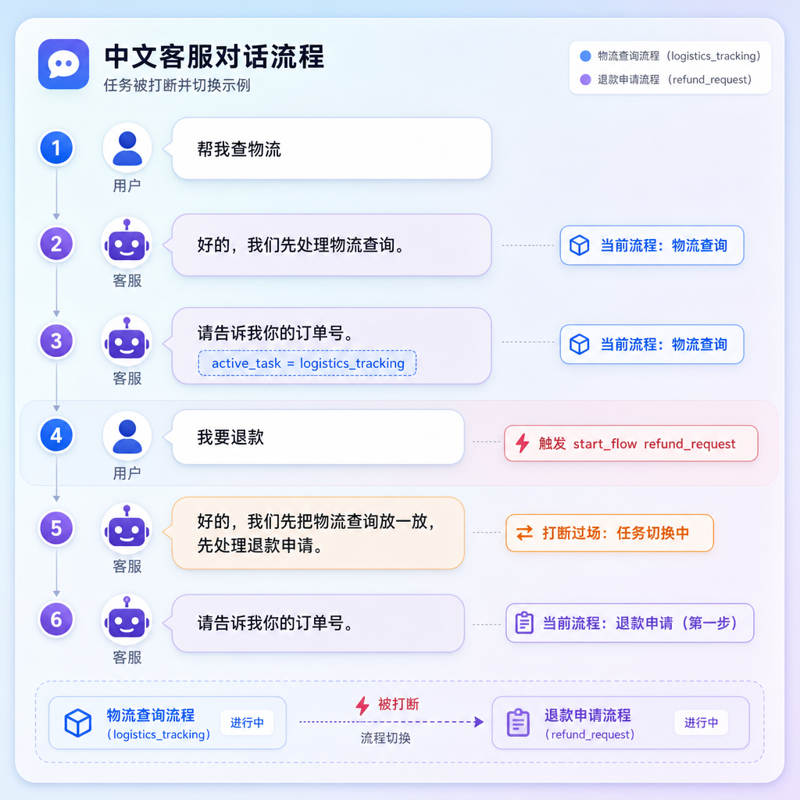
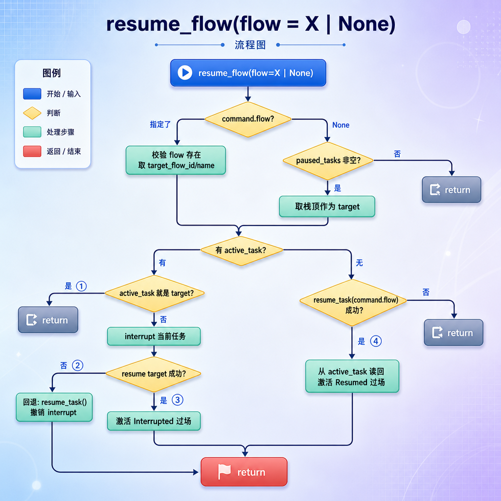

[TOC]

# 	TaskHandler 与 CommandProcessor

## 第1章 任务目标 

前面几节我们已经让引擎能：把用户的话交给 LLM 理解、产出一串 `Command`、校验合法、再把这串 `Command` 交给 `TaskHandler`。但 `TaskHandler` 内部一直是个黑盒。

这一节就打开这个黑盒的**前半部分**：`CommandProcessor`。它负责把一条条 `Command` **真正应用到 `DialogueState`** 上，也就是让对话状态按用户的意图发生变化。

### 1.1 TaskHandler 的两个阶段

`TaskHandler` 处理一轮 task 分两步：



| 阶段 | 职责 | 本节 |
| --- | --- | --- |
| ① CommandProcessor | 改状态：建任务、填槽、取消、恢复、挂起 | ✅ 详细实现 |
| ② Action、FlowExecutor | 读状态、按 YAML 推进流程、执行 action、生成回复 | ⛔ 后面两节 |

这一节专注阶段 ①。**理解 CommandProcessor 的关键，是理解每种命令在不同的对话处境下，会让 `DialogueState` 发生什么变化**——尤其是任务的"开始、打断、恢复、取消"这套生命周期。

### 1.2 反复用到的 YAML 流程

这一节所有场景都基于 `user_flows.yml` 里的三个流程，先记住它们：

| flow_id | name | 第一步要收集 |
| --- | --- | --- |
| `order_status_query` | 订单状态查询 | 订单号 |
| `logistics_tracking` | 物流查询 | 订单号 |
| `refund_request` | 退款申请 | 订单号 → 退款原因 |

## 第2章 TaskHandler：两阶段的协调者

先看 `TaskHandler` 本身，它很薄，只是把两个阶段串起来。

`atguigu/task/handler.py`

```python
# atguigu/task/handler.py

from atguigu.domain.messages import BotMessage
from atguigu.domain.state import DialogueState
from atguigu.task.command.models import Command
from atguigu.task.flow.flows import FlowsList


class TaskHandler:

    def __init__(
            self,
            flows: FlowsList,
            command_processor: CommandProcessor
            # flow_executor: FlowExecutor,
            # action_runner: ActionRunner
    ):
        self.command_processor = command_processor
        self.flows = flows
        # self.flow_executor = flow_executor
        # self.action_runner = action_runner

    async def handle(self, commands: list[Command], state: DialogueState) -> list[BotMessage]:
        
        # 阶段1:把命令应用到 state（修改state状态）
        self.command_processor.run(commands, state, self.flows)

        # 阶段2:推进流程,生成回复(后面两节 TODO)
        # messages: list[BotMessage] = await self.flow_executor.run_task(state, self.flows, self.action_runner)

        return [BotMessage(text="任务已经处理")]
```

`handle` 就两行：先让 `CommandProcessor` 改状态，再让 `FlowExecutor` 推进流程得到回复。

> 注意 commands 可能是空列表（比如上一节对象消息"在流程中但槽不匹配"的场景 C，传的是 `[]`）。空列表时 CommandProcessor 什么都不做，直接进入阶段2推进流程——这正是"不打断、让流程继续"的实现方式。

## 第3章 CommandProcessor 的骨架

### 3.1 run 与 _apply

创建文件 `atguigu/task/command/processor.py` 命令处理器

```python
# atguigu/task/command/processor.py

from atguigu.domain.state import DialogueState
from atguigu.task.command.models import Command, StartFlowCommand, SetSlotsCommand, CancelFlowCommand, ResumeFlowCommand
from atguigu.task.flow.flows import FlowsList


class CommandProcessor:
    """
    命令处理器
    """
    
    def run(
            self,
            commands: list[Command],
            state: DialogueState,
            flows: FlowsList,
    ) -> None:
        """
        把命令应用到 state
        :param commands:
        :param state:
        :param flows:
        :return:
        """
        for command in commands:
            self._apply(command, state, flows)


    def _apply(
            self,
            command: Command,
            state: DialogueState,
            flows: FlowsList,
    ) -> None:
        """
        处理命令
        :param command:
        :param state:
        :param flows:
        :return:
        """
        if isinstance(command, StartFlowCommand):
            self._handle_start_flow(command, state, flows)
        elif isinstance(command, SetSlotsCommand):
            self._handle_set_slots(command, state)
        elif isinstance(command, CancelFlowCommand):
            self._handle_cancel_flow(state, flows)
        elif isinstance(command, ResumeFlowCommand):
            self._handle_resume_flow(command, state, flows)
```

骨架很简单：`run` 逐条遍历，`_apply` 按命令类型分发到四个 `_handle_*` 方法。



### 3.2 为什么是"逐条应用"

一轮里可能有多条命令。最常见的组合：用户说"我要退款，订单号 A001"，LLM 拆成两条：

```python
[
    StartFlowCommand(command="start_flow", flow="refund_request"),
    SetSlotsCommand(command="set_slots", slots={"order_number": "A001"}),
]
```

`run` 会**按顺序**应用：先 `start_flow` 创建退款任务，再 `set_slots` 把订单号填进去。顺序很重要——必须先有活跃任务，`set_slots` 才有地方填。下面四章逐个拆解这四个 `_handle_*`。

### 3.3 依赖注入

`atguigu/api/routers/dependencies.py` 文件 `get_dialogue_engine`方法中修改  `return DialogueEngine`

```python
async def get_dialogue_engine():
    
    ...其他代码
    
    return DialogueEngine(
        turn_planner = TurnPlanner(),
        task_handler = TaskHandler(flows=flow_list, command_processor=CommandProcessor()),
        knowledge_handler = KnowLedgeHandler(knowledge_intents=KNOWLEDGE_INTENTS),
        clarify_responder = ClarifyResponder(),
        turn_plan_validator = TurnPlanValidator())
```

## 第4章 开启流程（最复杂）

这是四个处理方法里**最复杂**的一个，因为"开启一个流程"在不同处境下行为完全不同。

### 4.1 _readable_flow_name：取流程显示名

把 flow_id（如 `refund_request`）转成可读的中文名（如"退款申请"）。系统过场要说"先把**退款申请**放一放"，用的就是这个名字。查不到就退而用 flow_id 本身，保证不崩。

文件 `atguigu/task/command/processor.py`：

```python
@staticmethod
def _readable_flow_name(flow_id: str, flows: FlowsList) -> str:
    flow = flows.get_flow_by_id(flow_id)
    return flow.name if flow else flow_id
```

### 4.2 激活系统过场

四个方法长得几乎一样，都是"创建一个 SystemContext"。这些 SystemContext 被激活后，会成为 `active_system_task`。阶段2`FlowExecutor` 会先处理它（让系统先说那句过场白），再继续业务流程。系统过场的文案，就来自 `system_flows.yml` 里对应流程的 action 步骤（带 `	&#123;&#123; context.started_flow_name &#125;&#125;` 这类模板变量）。

文件 `atguigu/task/command/processor.py`：

```python
@staticmethod
def _activate_started_system_flow(
        state: DialogueState,
        flows: FlowsList,
        started_flow_id: str,
        started_flow_name: str
):
    """"
    激活开始流程的过场白
    """
    flow = flows.get_flow_by_id("system_task_started")
    state.start_active_system_task(StartedSystemContext(
        # flow_id=flow.id,
        step_id=flow.start_step().id,
        started_flow_id=started_flow_id,
        started_flow_name=started_flow_name,
    ))

@staticmethod
def _activate_interrupted_system_flow(
        state: DialogueState,
        flows: FlowsList,
        interrupted_flow_id: str,
        interrupted_flow_name: str,
        started_flow_id: str,
        started_flow_name: str
):
    """"
    激活打断流程的过场白
    """

    flow = flows.get_flow_by_id("system_task_interrupted")
    state.start_active_system_task(InterruptedSystemContext(
        # flow_id=flow.id,
        step_id=flow.start_step().id,
        interrupted_flow_id=interrupted_flow_id,
        interrupted_flow_name=interrupted_flow_name,
        started_flow_id=started_flow_id,
        started_flow_name=started_flow_name
    ))

@staticmethod
def _activate_resumed_system_flow(
        state: DialogueState,
        flows: FlowsList,
        resumed_flow_id: str,
        resumed_flow_name: str
):
    """"
    激活恢复流程的过场白
    """
    flow = flows.get_flow_by_id("system_task_resumed")
    state.start_active_system_task(ResumedSystemContext(
        # flow_id=flow.id,
        step_id=flow.start_step().id,
        resumed_flow_id=resumed_flow_id,
        resumed_flow_name=resumed_flow_name
    ))

@staticmethod
def _activate_canceled_system_flow(
        state: DialogueState,
        flows: FlowsList,
        canceled_flow_id: str,
        canceled_flow_name: str
):
    """"
    激活取消流程的过场白
    """
    flow = flows.get_flow_by_id("system_task_canceled")
    state.start_active_system_task(CanceledSystemContext(
        # flow_id=flow.id,
        step_id=flow.start_step().id,
        canceled_flow_id=canceled_flow_id,
        canceled_flow_name=canceled_flow_name
    ))
```

### 4.3 代码

文件 `atguigu/task/command/processor.py`：

只包含基本步骤的最简单版本：

```python
def _handle_start_flow_v1(self, command: StartFlowCommand, state: DialogueState, flows: FlowsList) -> None:
    """
    开启业务任务-基础版
    :param command:
    :param state:
    :param flows:
    :return:
    """

    # 1. 激活业务任务
    target_flow = flows.get_flow_by_id(command.flow)
    start_step = target_flow.start_step()
    state.start_active_task(TaskContext(flow_id=command.flow, step_id=start_step.id))

    # 2. 激活系统流程："开始"过场
    self._activate_started_system_flow(
        state, flows, command.flow, self._readable_flow_name(command.flow, flows),
    )
```

完整版本：

```python
def _handle_start_flow(self, command: StartFlowCommand, state: DialogueState, flows: FlowsList) -> None:
    """
    开启业务任务
    :param command:
    :param state:
    :param flows:
    :return:
    """

    # 清除当前系统流程
    state.end_active_system_task()

    # 防御:不允许直接启动 system_ 开头的内部流程
    if command.flow.startswith("system_"):
        raise ValueError(f"不能直接启动系统流程：'{command.flow}'")

    # 校验:流程必须存在
    target_flow = flows.get_flow_by_id(command.flow)
    if target_flow is None:
        raise ValueError(f"未知流程：'{command.flow}'.")

    # 校验:流程必须有起点
    start_step = target_flow.start_step()
    if start_step is None:
        raise ValueError(f"流程 '{command.flow}' 没有开始步骤")

    active_task = state.active_task

    # ===== 情况一:当前有活跃任务 =====
    if active_task is not None:

        # ① 同一个流程：不重复启动
        if active_task.flow_id == command.flow:
            return

        # 不是同一个流程：把当前任务放进暂停栈
        state.interrupted_active_task()

        # ③ 试着从暂停栈恢复要开的流程
        resumed = state.resumed_active_task(command.flow)
        if not resumed:
            # ② 要开的流程不在暂停栈 → 新建
            state.start_active_task(TaskContext(flow_id=command.flow, step_id=start_step.id))

        # 激活"打断"过场
        interrupted_flow_id = active_task.flow_id
        interrupted_flow_name = self._readable_flow_name(active_task.flow_id, flows)
        started_flow_id = command.flow
        started_flow_name = self._readable_flow_name(command.flow, flows)
        self._activate_interrupted_system_flow(
            state, flows, interrupted_flow_id, interrupted_flow_name,
            started_flow_id, started_flow_name)

        return

    # ===== 情况二:当前没有活跃任务 =====
    # ④ 试着恢复同名任务
    resumed = state.resumed_active_task(command.flow)
    if resumed:
        # 要开的流程在暂停栈 → 激活"恢复"过场
        self._activate_resumed_system_flow(
            state, flows, command.flow, self._readable_flow_name(command.flow, flows)
        )
        return

    # ⑤ 要开的流程从没做过 → 新建
    state.start_active_task(TaskContext(flow_id=command.flow, step_id=start_step.id))
    self._activate_started_system_flow(
        state, flows, command.flow, self._readable_flow_name(command.flow, flows)
    )
```

代码很长，但骨架是清晰的：**先做三道前置检查，再按"有没有活跃任务"分两大情况，每种情况内部再按"要开的流程在不在暂停栈"分支**。下面拆开讲。

### 4.4 开启流程全景

把五个分支汇成一张图：



#### 4.4.1 场景1 当前有活跃任务

用户正在办一件事，又要开另一件。

##### 场景 A

正在查物流，突然要退款（全新的退款），代码走分支 ②



##### 场景 B

A 任务中要切到 B，而 B 之前被挂起过，代码走分支 ③

```
【B任务】
用户：我要退款
AI：请告我你的订单号
用户：DJ001
AI：请告诉我你的退款原因
【切到A任务】              ---> 将 B任务放在paused_tasks 列表中（挂起B任务）
用户：帮我查一下物流
AI：请告我你的订单号
【切回B任务】              ---> 需要还原B任务
用户：我要退款
```

##### 场景 C

重复start 同一个流程，已经在办退款了，直接 return，什么都不做，走分支 ①

```text
用户：我要退款
AI：请告我你的订单号
用户：DJ001
AI：请告诉我你的退款原因
用户：我要退款                --->  正在处理退款，又要求开启退款流程
```

#### 4.4.2 场景2 当前没有活跃任务

没有正在做的事，用户开一个流程，相对简单——只看要开的流程在不在暂停栈。

##### 场景 D

什么都没做，开一个全新流程，代码走分支 ⑤

```text
(active_task = None, paused_tasks = [])
用户:我要退款                  ← start_flow refund_request
客服:好的,我们先处理退款申请。   ← Started 过场
客服:请告诉我你的订单号。
```

##### 场景 E

什么都没做，但要开的流程之前做过一半，走分支 ④

```text
【B任务】
用户：我要退款
AI：请告我你的订单号
用户：DJ001
AI：请告诉我你的退款原因
【切到A任务】              ---> 将 B任务放在paused_tasks 列表中（挂起B任务）
用户：帮我查一下物流
AI：请告我你的订单号
用户：DJ001
AI：你的订单DJ001物流状态是"运输中"    ---> A任务已结束，没有active_task
【切回B任务】              ---> 还原B任务
用户：我要退款
AI：好的,我们继续刚才的退款申请。  ← Resumed 过场(注意是"继续"不是"开始")
AI：请简单说一下退款原因。   ← 接着之前进度
```

## 第5章 填写槽位（最简单）

### 5.1 代码

文件 `atguigu/task/command/processor.py` 中添加如下方法：

```python
def _handle_set_slots(self, command: SetSlotsCommand, state: DialogueState):
    if state.active_task:
        state.set_slots(command.slots)
```

四个处理方法里最简单的一个：**有活跃任务才填，否则什么都不做**。

### 5.2 场景：填订单号

#### 场景 A

流程问订单号，用户回答

```text
用户:我要退款
客服:请告诉我你的订单号。        ← 退款流程停在收集 order_number
用户:A001                       ← set_slots {order_number: A001}
客服:请简单说一下退款原因。       ← 订单号填好,流程推进到下一步
```

#### 场景 B

一次填多个槽：如果用户说"订单 A001，因为尺码不对"，LLM 可能一次给多个槽：

```python
用户:我要退款
客服:请告诉我你的订单号。        ← 退款流程停在收集 order_number
用户:订单 A001，因为尺码不对     ← set_slots {order_number: A001, refund_reason: 尺码不合适}
```

`state.set_slots` 用 `dict.update`，多个键一次合并进去。退款需要的两个槽一次填齐，流程就能直接跑到提交。

#### 场景 C

点击订单卡片填槽：用户点订单卡片、且当前流程正缺 order_number 时，引擎会构造一个 `SetSlotsCommand` 。它最终会调用这个 `_handle_set_slots`。

```python
用户:我要退款
客服:请告诉我你的订单号。        ← 退款流程停在收集 order_number
用户: [点击订单卡片]            ← set_slots {order_number: A001}
客服:请简单说一下退款原因。      ← 订单号填好,流程推进到下一步
```

## 第6章 取消流程

### 6.1 代码

三步：

- 记下当前任务是哪个
-  `cancel_active_task()` 清空它
- 激活"取消"过场，让系统说"好的，xx 已为你取消"。

文件 `atguigu/task/command/processor.py`：

```python
def _handle_cancel_flow(self, state: DialogueState, flows: FlowsList):

    # 获取当前流程
    active_task = state.active_task

    # 取消当前流程
    state.cancel_active_task()

    # 激活系统流程：“取消”过场
    canceled_flow_id = active_task.flow_id,
    canceled_flow_name = self._readable_flow_name(canceled_flow_id, flows)
    self._activate_canceled_system_flow(
        state, flows, canceled_flow_id, canceled_flow_name
    )
```

### 6.2 场景：取消退款

办退款途中放弃

```text
用户:我要退款
客服:请告诉我你的订单号。       ← active_task = refund_request
用户:算了不退了                ← cancel_flow
客服:好的,退款申请先帮你取消。   ← Canceled 过场
```

## 第7章 恢复挂起的流程

### 7.1 完整代码

文件 `atguigu/task/command/processor.py`：

```python
def _handle_resume_flow(self, command: ResumeFlowCommand, state: DialogueState, flows: FlowsList):

    # ===================阶段1：找到要恢复的流程===================
    if command.flow is not None:
        # 指名恢复:用户明确说了恢复哪个
        target_flow = flows.get_flow_by_id(command.flow)
        if target_flow is None:
            raise ValueError(f"未知流程 {command.flow}")

        # 确定要恢复的任务
        target_flow_id = command.flow
        target_flow_name = target_flow.name
    else:
        # 不指名恢复:用户只说"继续刚才的" → 取暂停栈栈顶(最近挂起的)
        if not state.paused_tasks:
            return

        # 确定要恢复的任务
        top_paused = state.paused_tasks[-1]
        target_flow_id = top_paused.flow_id
        target_flow_name = self._readable_flow_name(target_flow_id, flows)

    # ===================阶段2：恢复流程===================

    # 获取激活的任务
    active_task = state.active_task

    # 有激活任务
    if active_task is not None:

        # 分支1：有活跃任务，并且活跃任务就是要恢复的任务
        if active_task.flow_id == target_flow_id:
            return

        # 获取要被打断的任务的基本信息
        interrupted_flow_id = active_task.flow_id
        interrupted_flow_name = self._readable_flow_name(interrupted_flow_id, flows)

        # 将当前任务放在paused列表中
        state.interrupted_active_task()

        # 分支2：恢复目标任务失败
        if not state.resumed_active_task(target_flow_id):
            # 当恢复失败的时候，做回退（撤销interrupt）
            state.resumed_active_task()
            return

        # 分支3：激活interrupted过场
        self._activate_interrupted_system_flow(
            state, flows,
            interrupted_flow_id, interrupted_flow_name,
            target_flow_id, target_flow_name
        )

    # 没有激活任务
    else:

        # 如果恢复失败则退出（例如，用户指定了一个没有挂起的任务）
        if not state.resumed_active_task(target_flow_id):
            return

        # 分支4：激活恢复任务的系统过场
        self._activate_resumed_system_flow(
            state, flows,
            target_flow_id, target_flow_name
        )

```

### 7.2 恢复与挂起全景



四个分支对应的"用户处境 → 系统反应"：

| 分支 | 用户处境                             | 系统过场                        |
| ---- | ------------------------------------ | ------------------------------- |
| ①    | 要恢复的就是当前正办的               | 无（不重复）                    |
| ②    | 要恢复的不在暂停栈                   | 无（回退，静默）                |
| ③    | 办 A 时要回到挂起的 B                | Interrupted（先放下 A，处理 B） |
| ④    | 没事做，回到挂起的任务（指名或栈顶） | Resumed（继续刚才的 X）         |

#### 7.2.1 场景1：当前有活跃任务

确定了恢复目标后，如果当前正办着别的事，要先打断它，再恢复目标。

**场景 7.2.1A：办 A 时，要回去办挂起的 B（指名）**

```text
(paused_tasks = [refund_request], active_task = logistics_tracking)
用户:先不查物流了,继续刚才的退款    ← resume_flow(flow="refund_request")
客服:好的,先把物流查询放一放,先处理退款申请。
客服:请简单说一下退款原因。        ← 退款带着旧进度回来
```

**场景 7.2.1B：恢复失败的回退（防御）**

如果要恢复的流程不在暂停栈里（比如 LLM 判断错、或栈里根本没有它）：

```python
state.interrupted_active_task()	 # 已经把当前任务挤进了暂停栈
if not state.resumed_active_task(target_flow_id):	# 但目标不在暂停栈,恢复失败
    state.resumed_active_task()  # 回退:把刚挤进去的任务再恢复回来
    return
```

这里有个精妙的**回退**：前一步已经 `interrupted_active_task()` 把当前任务挤进了暂停栈，如果接着恢复目标失败，不能让当前任务就这么被挂起——所以调用无参的 `state.resumed_active_task()`（恢复最近挂起的，也就是刚被挤进去的那个），把状态还原，当作什么都没发生。

> 这是"操作要么全做、要么回滚"的典型：先动了 state，发现做不下去，就把动过的撤回来。

#### 7.2.2 场景2：当前没有活跃任务

没有正在办的事，直接恢复目标即可，不涉及打断。

**场景 7.2.2.A：没事做，回到挂起的退款（指名）**

```text
(active_task = None, paused_tasks = [refund_request])
用户:继续刚才的退款            ← resume_flow(flow="refund_request")
客服:好的,我们继续刚才的退款申请。  ← Resumed 过场
客服:请简单说一下退款原因。
```

**场景 7.2.2.B：没事做，"继续刚才的"（不指名）**

```text
(active_task = None, paused_tasks = [order_status_query, logistics_tracking])
用户:继续刚才的              ← resume_flow(flow=None)
客服:好的,我们继续刚才的物流查询。  ← 恢复栈顶 logistics_tracking
```

## 第8章 串起来：一个完整的多命令例子

把四种命令放到一个连续对话里，看 CommandProcessor 怎么一步步改 state。

```text
[1] 用户:我要查订单状态
[2] 用户:先帮我查物流
[3] 用户:A001
[4] 用户:算了,还是看订单状态吧
```

**[1] "我要查订单状态"** → `start_flow(order_status_query)`

- 无 active_task，暂停栈空 → 新建 + Started 过场

```python
active_task  = order_status_query(step=ask_order_number)
paused_tasks = []
```

**[2] "先帮我查物流"** → `start_flow(logistics_tracking)`

- 有 active_task（订单状态），目标不同，物流不在暂停栈 → 打断+新建 + Interrupted 过场

```python
active_task  = logistics_tracking(step=ask_order_number)
paused_tasks = [order_status_query]
```

**[3] "A001"** → `set_slots({order_number: A001})`

- 有 active_task（物流）→ 填进去

```python
active_task  = logistics_tracking(slots={order_number: A001})
paused_tasks = [order_status_query]
```

**[4] "算了，还是看订单状态吧"** → 这里 LLM 可能产出 `resume_flow(order_status_query)`

- 有 active_task（物流），目标是订单状态（在暂停栈）→ 打断物流+恢复订单状态 + Interrupted 过场

```python
active_task  = order_status_query   ← 从暂停栈恢复
paused_tasks = [logistics_tracking] ← 物流反过来被挂起
```

可以看到，四条命令一路改下来，`active_task` 和 `paused_tasks` 像一个栈一样此起彼伏。这正是这套设计要支撑的"多任务穿插"能力。

## 第9章 小结

### 9.1 这一节实现了什么

| 文件 | 内容 |
| --- | --- |
| `task/handler.py` | `TaskHandler`：两阶段协调（本节只实现阶段1调用） |
| `task/command/processor.py` | `CommandProcessor`：四种命令的处理 + 三个激活辅助 + `_readable_flow_name` |

### 9.2 四种命令处理对照

| 命令 | 核心动作 | 分支数 | 复杂度 |
| --- | --- | --- | --- |
| `_handle_start_flow` | 建/恢复任务 + 打断 | 5 | 最高 |
| `_handle_resume_flow` | 恢复挂起任务（含回退） | 4 | 高 |
| `_handle_cancel_flow` | 清空当前任务 | 1 | 低 |
| `_handle_set_slots` | 填槽位 | 1 | 最低 |

### 9.3 几个值得学习的设计

1. **命令逐条应用**：一轮可能多条命令（如 start+set_slots），按顺序改 state，顺序有意义。
2. **start_flow 的五种处境**：有无活跃任务 × 目标在不在暂停栈，决定新建/恢复/打断/不响应，并激活对应的系统过场。
3. **改状态 + 激活过场成对出现**：每次改任务状态，都顺手激活一个 SystemContext，让系统能说出贴合处境的过场白。
4. **操作可回退**：resume_flow 里"先 interrupt 再尝试 resume，失败就回退"，是"要么全做要么撤销"的典型。
5. **取消 vs 打断**：丢弃 vs 挂起，这是任务生命周期里最需要分清的一对。
6. **resume 支持指名与不指名**：`command.flow` 指名时精确恢复某个流程；为 None（"继续刚才的"）时取暂停栈栈顶（LIFO），贴合"接着最近那件事"的对话直觉。
