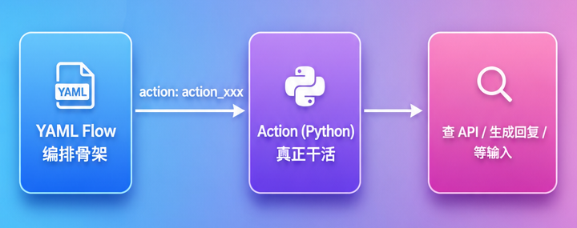
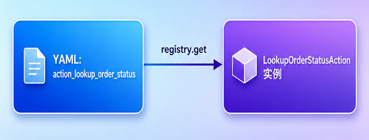
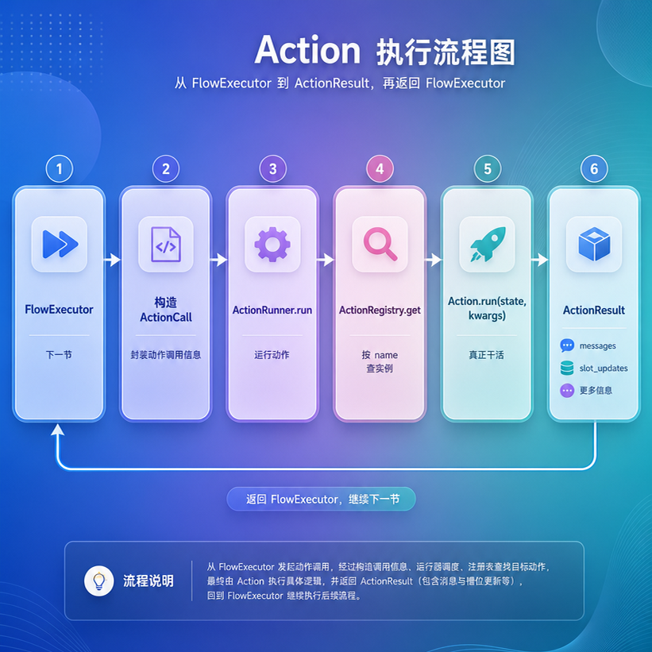
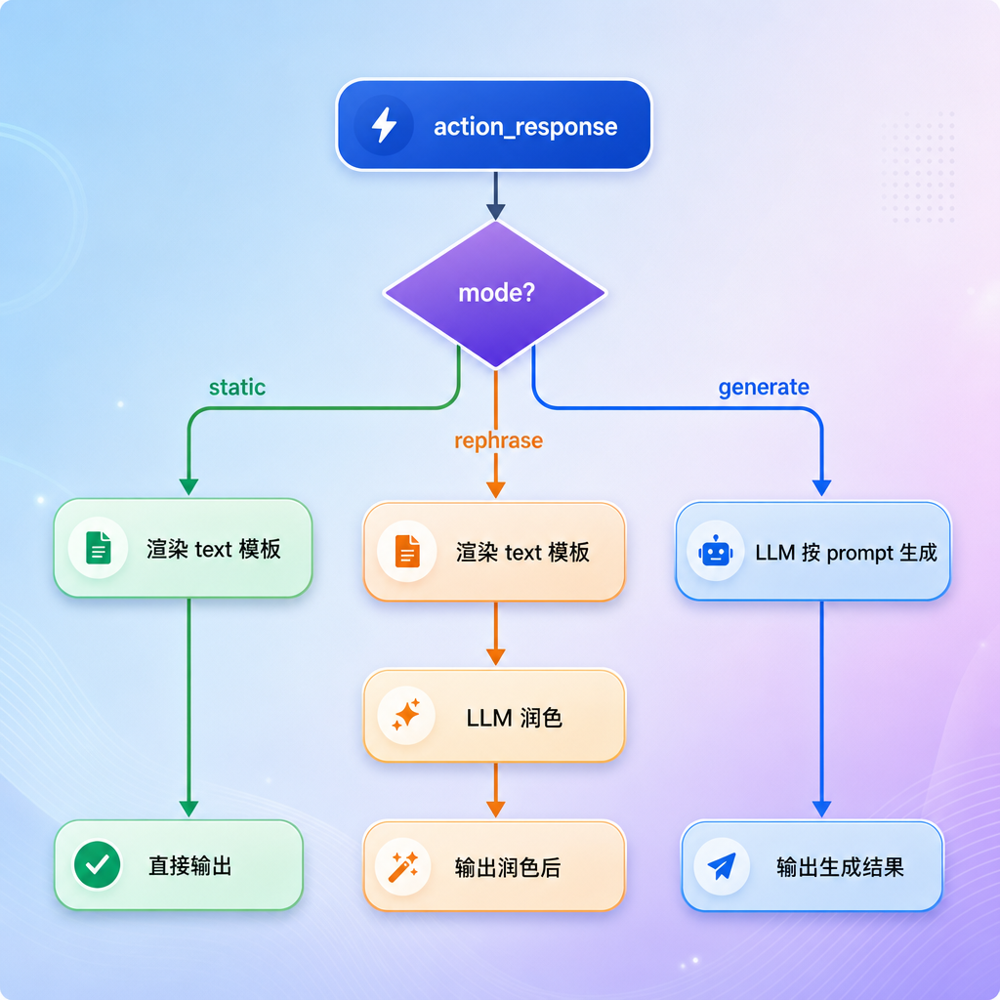
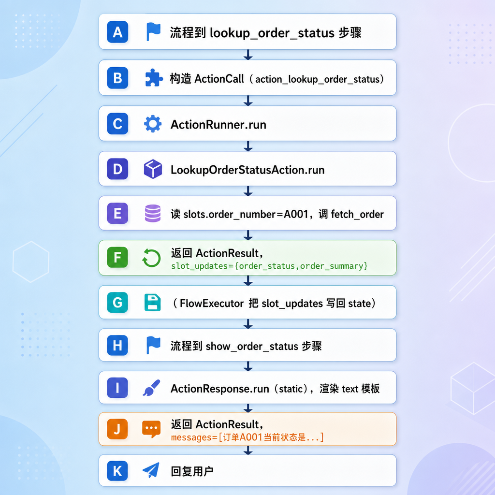

[TOC]

# Action 实现（所有动作）

---

## 第1章 任务目标

上一节 `CommandProcessor` 把对话状态改好了——任务建好、槽位填好、系统过场激活。但到目前为止，**还没有任何"干实事"的代码**：没有去查订单、没有调物流接口、没有生成回复文本。这些"实事"，就是这一节的主角——**Action**。

### 1.1 Action 在整个系统里的位置

回顾流程编排那一节，YAML 流程里有一种 `action` 步骤：

```yaml
- id: lookup_order_status
  type: action
  action: action_lookup_order_status   # ← 这里引用一个 action 名
  next: show_order_status
```

YAML 只负责"编排"——规定先做什么、后做什么。但"具体怎么查订单""怎么生成回复"这些**真正的业务实现**，YAML 写不了，得交给 Python 代码。这段 Python 代码，就是一个 `Action`。



### 1.2 本节范围

这一节把**所有 action 以及它们的支撑框架**一次性实现完。

| 内容 | 本节 |
| --- | --- |
| Action 基类、ActionResult 返回值 | ✅ |
| ActionRegistry 注册表、ActionRunner 执行器、ActionCall | ✅ |
| 内置 action： ActionResponse（机器人回复）、ActionListen（监听用户输入） | ✅ |
| 自定义 action：查订单、查物流、推荐商品 | ✅ |
| shared：调用电商接口的工具函数 | ✅ |
| builder：action 的自动注册 | ✅ |
| FlowExecutor：调用 action | ⛔ 下一节 |

### 1.3 action 全景

这一节要实现的所有 action：

| 类别 | action 名 | 干什么 |
| --- | --- | --- |
| 内置 | `action_response` | 生成一条回复（三种模式） |
| 内置 | `action_listen` | 表示"该等用户输入了" |
| 自定义 | `action_lookup_order_status` | 调订单接口查状态 |
| 自定义 | `action_lookup_logistics` | 调物流接口查进度 |
| 自定义 | `action_recommend_similar_products` | 推荐相似商品（占位） |

## 第2章 Action 框架：四个核心概念

在看具体 action 之前，先把支撑它们的四个框架概念理清楚：`Action`（基类）、`ActionResult`（返回值）、`ActionRegistry`（注册表）、`ActionRunner`（执行器）。

### 2.1 ActionResult：动作的产物

创建文件：`atguigu/task/action/base.py`

```python
# atguigu/task/action/base.py

from atguigu.domain.messages import BotMessage
from pydantic import BaseModel

class ActionResult(BaseModel):
    messages: list[BotMessage] = [] # 要发给用户的回复
    slot_updates: dict[str, Any] = {} # 要写回 state 的槽位
```

一个 action 干完活，会产出两类东西之一（或都不产出）：

| 字段           | 含义                | 哪种 action 用                          |
| -------------- | ------------------- | --------------------------------------- |
| `messages`     | 要发给用户的回复    | 生成回复类（action_response、推荐商品） |
| `slot_updates` | 要写回 state 的槽位 | 查询类（查订单、查物流）                |

### 2.2 Action：所有动作的基类

文件：`atguigu/task/action/base.py`

```python
# atguigu/task/action/base.py

from abc import ABC, abstractmethod
from typing import Any
from atguigu.domain.state import DialogueState

  
class Action(ABC):
    name: str #Action的名字

    @abstractmethod
    async def run(
            self,
            state: DialogueState,
            action_kwargs: dict[str, Any],
    ) -> ActionResult:
        pass
```

每个 action 都是 `Action` 的子类，要做两件事：

- 定一个唯一的 `name`（和 YAML 里 `action: xxx` 对上）
- 实现 `run` 方法：拿到当前 `state` 和参数 `action_kwargs`，干活，返回 `ActionResult`

`run` 是 `async` 的——因为很多 action 要调外部接口（查订单/物流），是高延迟 I/O，必须异步。

### 2.3 ActionRegistry：Action注册表

创建文件：`atguigu/task/action/registry.py`

```python
# atguigu/task/action/registry.py

from atguigu.task.action.base import Action


class ActionRegistry:
    def __init__(self) -> None:
        self._actions: dict[str, Action] = {}

    def register(self, action: Action) -> None:
        self._actions[action.name] = action

    def get(self, name: str) -> Action:
        if name not in self._actions:
            raise KeyError(f"Unknown action '{name}'.")
        return self._actions[name]
```

注册表负责把名字翻译成实例。注册表维护一张 `name -> Action 实例` 的表。它的意义是**解耦**：YAML 里写的是 action 的**名字**（字符串 `action_lookup_order_status`），而真正执行的是 Python **实例**。



这又是课程里反复出现的"字符串 → 对象"映射套路，和 `STEP_TYPE_TO_CLASS`、`COMMAND_NAME_TO_CLASS` 同源。

### 2.4 ActionRunner 与 ActionCall：动作执行器

创建文件：`atguigu/task/action/runner.py`

```python
# atguigu/task/action/runner.py

from typing import Any

from pydantic import BaseModel

from atguigu.task.action.registry import ActionRegistry
from atguigu.task.action.base import ActionResult
from atguigu.domain.state import DialogueState


class ActionCall(BaseModel):
    action_name: str
    action_kwargs: dict[str, Any] = {}

# 面向修改关闭，面向扩展开放
class ActionRunner:
    """
    通过给定的action_call，执行action
    """
    def __init__(self, registry: ActionRegistry) -> None:
        self.registry = registry

    async def run(self, action_call: ActionCall, state: DialogueState) -> ActionResult:
        # 1. 获取action的名字
        action_name = action_call.action_name

        # 2. 从Action注册中心获取名字对应的Action的实例对象
        action = self.registry.get(action_name)

        # 3. 调用具体Action的逻辑
        return await action.run(state, action_call.action_kwargs)
```

- `ActionCall`：一次动作调用请求，装着"调哪个 action（`action_name`）+ 传什么参数（`action_kwargs`）"。它由下一节的 `FlowExecutor` 构造。
- `ActionRunner.run`：拿到 `ActionCall`，从注册表查出 action 实例，调它的 `run`，返回结果。
- `ActionRunner` 自己不关心 action 内部干什么，它只做三件事：**查表 → 调用 → 返回**。

### 2.5 四个概念的协作

一句话串起来：FlowExecutor 想执行某个 action，就构造一个 `ActionCall` 交给 `ActionRunner`；`ActionRunner` 拿 name 去 `ActionRegistry` 查出 `Action` 实例，调它的 `run`，把 `ActionResult` 还回去。



## 第3章 Action

### 3.1 ActionListen

`ActionListen` 是一个"哨兵"，不干任何活，只起一个**信号标记**作用，表示"流程跑到这里，该停下来等用户输入了"。

创建文件：`atguigu/task/action/builtin/action_listen.py`

```python
# atguigu/task/action/builtin/action_listen.py
import asyncio
from typing import Any

from atguigu.domain.state import DialogueState
from atguigu.task.action.base import Action, ActionResult


class ActionListen(Action):
    """
    什么都不做，返回空的ActionResult
    """
    name = "action_listen"

    async def run(self, state: DialogueState, action_kwargs: dict[str, Any]) -> ActionResult:
        print("action_listen")
        return ActionResult()


if __name__ == '__main__':
    action =  ActionListen()
    asyncio.run(action.run(None, None))
```

回顾 `system_collect_information` 流程：

```yaml
- id: ask
  type: action
  action: action_response      # 先问"请告诉我你的订单号。"
  args: context.response
  next: listen
- id: listen
  type: action
  action: action_listen        # 然后停下来,等用户回答
  next: end
```

收集槽位时，系统先用 `action_response` 问一句，再用 `action_listen` 把流程"挂起"，等用户下一句输入。

`action_listen` 的真正作用要在下一节 `FlowExecutor` 里才看得清，下一节 `FlowExecutor` 的循环里会有这样一行判断：

```python
if action_call.action_name == "action_listen":
    break
```

也就是说，`action_listen` 是"该等用户输入了"的退出信号。流程跑到这一步，意味着系统已经把该说的都说完了，下面该让用户开口了。

### 3.2 ActionResponse

`action_response` 是最重要、也最复杂的 action，几乎所有"**对用户说话**"都靠它。它支持三种模式。

#### 3.1.1 三种模式总览

ActionResponse支持三种模式

| mode       | 用 LLM 吗 | 适用场景                              |
| ---------- | --------- | ------------------------------------- |
| `static`   | 否        | 文案已写死在 YAML，直接用             |
| `rephrase` | 是        | 有模板底稿，但想说得更自然，让LLM润色 |
| `generate` | 是        | 没有预设文案，直接让LLM从零生成       |




创建文件：`atguigu/task/action/builtin/action_response.py`

```python
# atguigu/task/action/builtin/action_response.py

from typing import Any

from jinja2 import Template
from langchain_core.output_parsers import StrOutputParser
from langchain_core.prompts import PromptTemplate

from atguigu.domain.messages import BotMessage
from atguigu.domain.state import DialogueState
from atguigu.infrastructure.llm import llm
from atguigu.prompts.history_builder import HistoryBuilder
from atguigu.task.action.base import Action, ActionResult


class ActionResponse(Action):
    name = "action_response"

    async def run(self, state: DialogueState, action_kwargs: dict[str, Any]) -> ActionResult:
        """
        响应内容
        :param state:
        :param action_kwargs:
        :return:
        """

        mode = action_kwargs.get("mode", "static")
        if mode == "static":
            text = action_kwargs['text']
            rendered_text = self._render_text(text, state)
            return ActionResult(messages=[BotMessage(text=rendered_text)])

        elif mode == "rephrase":
            text = action_kwargs['text']
            rendered_text = self._render_text(text, state)
            prompt_text = action_kwargs['prompt']
            message = await self._call_llm(prompt_text, state, rendered_text)
            return ActionResult(messages=[BotMessage(text=message)])

        else:  # generate
            prompt_text = action_kwargs['prompt']
            message = await self._call_llm(prompt_text, state)
            return ActionResult(messages=[BotMessage(text=message)])

    @staticmethod
    def _render_text(text: str, state: DialogueState) -> str:
        # 把模板里的 {{  }} 替换成真实值。
        template = Template(text)
        result = template.render(
            slots=state.active_task.slots if state.active_task else {},
            context=state.active_system_task or state.active_task,
        )
        return result

    @staticmethod
    async def _call_llm(prompt_text: str, state: DialogueState, rendered_text: str = "") -> str:
        """
        rephrase 和 generate 都走这个方法，区别在传不传 rendered_text
        :param prompt_text:
        :param state:
        :param rendered_text:
        :return:
        """
        prompt = PromptTemplate.from_template(prompt_text)
        chain = prompt | llm | StrOutputParser()

        bot_message = await chain.ainvoke({
            "history": HistoryBuilder.build(state.current_session().turns),
            "user_message": HistoryBuilder.render_user_message(state.pending_turn.user_message),
            "current_response": rendered_text,
        })
        return bot_message

if __name__ == '__main__':

    data = "好的，订单{{ order_number }}的退款申请已提交"
    template = Template(data)
    res = template.render(order_number="12345")

    # data = "好的，订单{{ slots.order_number }}的退款申请已提交"
    # template = Template(data)
    # res = template.render(slots={"order_number": "12345"})
    print(res)

```

#### 3.1.2 static 模式

最常用的模式。YAML 里写好文案模板，直接渲染：

```yaml
- id: show_order_status
  type: action
  action: action_response
  args:
    text: "订单{{ slots.order_number }}当前状态是：{{ slots.order_status }}。{{ slots.order_summary }}"
  next: end
```

模板里能访问两个变量：

| 变量      | 是什么                                   | 例子                                     |
| --------- | ---------------------------------------- | ---------------------------------------- |
| `slots`   | 当前任务收集/查到的槽位                  | `slots.order_number` → "A001"            |
| `context` | 当前上下文（系统过场优先，否则业务任务） | `context.started_flow_name` → "退款申请" |

举例：查完订单状态后，`slots` 里已经有了 `order_number="A001"`、`order_status="已发货"`、`order_summary="订单金额 ¥99。"`，渲染上面那个模板得到：

```text
订单A001当前状态是：已发货。订单金额 ¥99。
```

> 注意 `context` 变量：业务流程里它是 active_task，**系统流程**里它是 active_system_task。这就是为什么 `system_flows.yml` 里能写 `&#123;&#123; context.started_flow_name &#125;&#125;`，因为 context 指向的是 `StartedSystemContext`，带着 `started_flow_name` 字段。

#### 3.1.3 rephrase 模式

有时候 YAML 里写死的文案太生硬，想让它更自然。rephrase 模式：先渲染出底稿，再交给 LLM 润色。

`text` 是底稿（建议回复），`prompt` 是给 LLM 的润色指令。注意 prompt 里的 `{{ current_response }}`就是渲染好的底稿，LLM 在它的基础上改写。

`system_flows.yml` 的 `system_cannot_handle` 流程就用了它：

```yaml
- id: ask_rephrase
  type: action
  action: action_response
  args:
    mode: rephrase
    text: "抱歉，我这边没有完全听明白。你可以再具体说一下你想处理什么电商问题吗？"
    prompt: |
      你是一个中文电商客服助手，语气自然、友好、简洁。
      请基于下面的建议回复，生成一句更自然的中文回复，保持原意，不要扩写。
      对话上下文：
      { history }
      用户最后一句：
      用户：{ user_message }
      建议回复：{ current_response }
      改写后的回复：
```

#### 3.1.4 generate 模式

没有预设文案，完全靠 LLM 按 prompt从零 生成。`run` 里 generate 分支不读 `text`，只用 `prompt`

### 3.3 自定义 action

内置 action 是通用的（发消息、等输入），而**查订单、查物流**这类具体业务，放在 `custom/` 目录下，是自定义 action。它们的共性是：**调电商后端的 HTTP 接口，把结果写回槽位**。

#### 3.3.1 shared.py：调接口的工具函数

初始化http_client

文件： `atguigu/api/app.py` 中 添加 `http_client`的初始化和关闭代码

```python
# atguigu/api/app.py 

# 初始化session引擎和session工厂
print("启动服务器")
print("初始化数据库链接资源")
init_db_engine() # 自带连接池
# 初始化http
init_http_client()

yield

await close_db_engine()
print("释放数据库链接资源")
await close_http_client()
print("停止服务器")
```

自定义 action 都要调电商接口

创建文件：`atguigu/task/action/custom/shared.py`

```python
# atguigu/task/action/custom/shared.py

from urllib.parse import quote
from atguigu.conf.config import settings
from atguigu.infrastructure import http_client


def _base_url() -> str:
    return settings.commerce_api_base_url.rstrip("/")


def _extract_data(result: dict | None) -> dict | None:
    data = result.get("data") if isinstance(result, dict) else None
    return data if isinstance(data, dict) else None


async def fetch_order(order_id: str) -> dict | None:
    """获取订单信息"""
    try:
        # 注意此处：
        # 文件头部 from atguigu.infrastructure import http_client
        # 此处使用 http_client.http_client.get(url) 调用

        # 不要这样做：
        # 文件头部 from atguigu.infrastructure.http_client import http_client
        # 此处使用 http_client.get(url) 调用
        # 会使拿到的 http_client 是 None
        r = await http_client.http_client.get(f"{_base_url()}/orders/{quote(order_id, safe='')}")
        return _extract_data(r.json())
    except Exception:
        return None


async def fetch_logistics(order_id: str) -> dict | None:
    """获取物流信息"""
    try:
        r = await http_client.http_client.get(f"{_base_url()}/orders/{quote(order_id, safe='')}/logistics")
        return _extract_data(r.json())
    except Exception:
        return None


async def fetch_product(product_id: str) -> dict | None:
    """获取推荐商品信息"""
    try:
        r = await http_client.http_client.get(f"{_base_url()}/products/{quote(product_id, safe='')}")
        return _extract_data(r.json())
    except Exception:
        return None

if __name__ == '__main__':

    # HTTP URL 里面不能直接放中文、空格、# & : = 等字符，必须编码。
    s = "你好 python & test 2026/09/08"
    # 默认safe="/"，斜杠保留，不编码
    # safe="" 所有特殊字符全部编码
    res = quote(s, safe='')
    print(res)
    # %E4%BD%A0%E5%A5%BD%20python%20%26%20test
```

三个 fetch 函数分别调订单、物流、商品接口。几个共性设计：

| 设计 | 说明 |
| --- | --- |
| 共享 `http_client` | 模块级单例，复用连接池，不每次新建（高并发友好） |
| `quote(order_id)` | URL 编码，HTTP URL 里面不能直接放中文、空格、# & : = 等字符，必须编码 |
| `try/except` 返回 None | **优雅降级**：接口挂了不抛异常，返回 None，让上层 action 兜底 |
| `_extract_data` | 电商接口返回 `{"data": {...}}` 包了一层，统一剥出里面的 data |

#### 3.3.2 查订单状态

创建文件 `atguigu/task/action/custom/lookup_order_status.py`

```python
# atguigu/task/action/custom/lookup_order_status.py
from typing import Any

from atguigu.domain.state import DialogueState
from atguigu.task.action.base import Action, ActionResult
from atguigu.task.action.custom.shared import fetch_order


class LookupOrderStatusAction(Action):
    name = "action_lookup_order_status"

    async def run(self, state: DialogueState, action_kwargs: dict[str, Any]) -> ActionResult:

        # 调用fetch_order接口
        order_number = state.active_task.slots.get("order_number")
        data = await fetch_order(order_number)

        # 错误处理
        if data is None:
            return ActionResult(slot_updates={
                "order_status": "查询失败",
                "order_summary": "暂时无法查到该订单信息，请稍后再试。",
            })

        # 将订单数据拼成一句摘要
        amount = data.get("amount")
        items = data.get("items")

        # 处理商品标题，兼容空列表场景
        suffix = "" if len(items) == 1 else "等"
        title_part = f"商品：{items[0].get('title')}{suffix}。"

        order_summary = f"订单金额 ¥{amount}。{title_part}"

        return ActionResult(
            slot_updates={
                "order_status": data.get("status_desc") or data.get("status"),
                "order_summary": order_summary
            }
        )
```

它的逻辑很典型，是所有"查询类 action"的模板：

1. **从槽位读输入**：`state.active_task.slots.get("order_number")`——订单号是之前 collect 步骤收集来的
2. **调接口**：`fetch_order(order_number)`
4. **成功写回**：把查到的状态、摘要打包进 `slot_updates` 返回

注意它返回的是 **slot_updates 而不是 messages**——它只负责"查到数据写回槽位"，至于把这些槽位拼成话发给用户，是后面 `action_response` 的事。

回顾 `order_status_query` 流程，正好印证这个分工：

```yaml
- id: lookup_order_status
  type: action
  action: action_lookup_order_status      # ① 查数据,写进 order_status/order_summary 槽
  next: show_order_status
- id: show_order_status
  type: action
  action: action_response                 # ② 把槽位拼成话发给用户
  args:
    text: "订单{{ slots.order_number }}当前状态是：{{ slots.order_status }}。{{ slots.order_summary }}"
  next: end
```

**查（写槽）和说（读槽生成回复）分成两步** ——这是这套设计的一个典型模式。

#### 3.3.3 查物流

创建文件  `atguigu/task/action/custom/lookup_logistics.py`

```python
# atguigu/task/action/custom/lookup_logistics.py

class LookupLogisticsAction(Action):
    name = "action_lookup_logistics"

    async def run(self, state: DialogueState, action_kwargs: dict[str, Any]) -> ActionResult:
        order_number = state.active_task.slots.get("order_number")
        payload = await fetch_logistics(order_number)

        if payload is None:
            return ActionResult(slot_updates={
                "tracking_number": "未知",
                "logistics_company": "未知",
                "logistics_status": "暂时无法查到物流信息，请稍后再试。",
            })

        return ActionResult(slot_updates={
            "tracking_number": payload.get("tracking_number"),
            "logistics_company": payload.get("logistics_company"),
            "logistics_status": payload.get("status_desc") or payload.get("status"),
        })
```

和查订单几乎一样的结构，只是查的是物流、写的是物流相关的三个槽位（单号、公司、进度）。同样是"读 order_number → 调接口 → 写槽 / 失败兜底"。

它在 `logistics_tracking` 流程里也是"查 + 说"两步搭配 `action_response`。

#### 3.3.4 推荐相似商品（占位）

创建文件：`atguigu/task/action/custom/recommend_similar_products.py`

```python
# atguigu/task/action/custom/recommend_similar_products.py

from atguigu.domain.state import DialogueState
from atguigu.task.action.base import Action, ActionResult
from atguigu.task.action.custom.shared import fetch_product

class RecommendSimilarProductsAction(Action):
    name = "action_recommend_similar_products"

    async def run(self, state: DialogueState, action_kwargs: dict[str, Any]) -> ActionResult:

        product_id = state.active_task.slots.get("product_id")
        data = await fetch_product(product_id)

        if data is None:
            return ActionResult(slot_updates={
                "product_title": "暂时无法查到商品，请稍后再试。",
            })

        return ActionResult(slot_updates={
            "product_title": data.get("title")
        })
```

### 3.4 action 的注册

action 写好了，得注册进 `ActionRegistry`，然后`ActionRunner` 才能按名字找到它们。

#### 3.4.1 注册

- 内置 action：手动注册
- 自定义 action：自动发现

创建文件：`atguigu/task/action/builder.py`

```python
# atguigu/task/action/builder.py

import importlib
import inspect
import pkgutil
from atguigu.task.action.runner import ActionRunner
from atguigu.task.action.registry import ActionRegistry
from atguigu.task.action.base import Action
from atguigu.task.action.builtin.action_listen import ActionListen
from atguigu.task.action.builtin.action_response import ActionResponse


def register_builtin_actions(action_runner: ActionRunner):
    """
    注册内置的action：手动 register
    :param action_runner:
    :return:
    """
    action_listen = ActionListen()
    action_response = ActionResponse()
    action_runner.registry.register(action_listen)
    action_runner.registry.register(action_response)


def register_custom_actions(action_runner: ActionRunner):
    """
    扫描指定包，完成 Action子类的自动注册
    :param action_runner:
    :return:
    """

    package = importlib.import_module("atguigu.task.action.custom")

    for _, module_name, is_pkg in pkgutil.iter_modules(package.__path__, prefix=f"{package.__name__}."):

        # 只处理模块文件，不处理子包
        if is_pkg:
            continue
        module = importlib.import_module(module_name)
        for _, obj in inspect.getmembers(module, inspect.isclass):

            # 只要 Action 的子类，排除基类本身
            if not issubclass(obj, Action) or obj is Action:
                continue

            # 只注册"在这个模块里定义的"类，排除 import 进来的
            # 如 LookUpOrderStatusAction 被 lookup_logistics.py import 时不重复注册
            if obj.__module__ != module.__name__:
                continue
            action_runner.registry.register(obj())

def build_action_runner() -> ActionRunner:
    action_runner = ActionRunner(ActionRegistry())
    register_builtin_actions(action_runner)
    register_custom_actions(action_runner)
    return action_runner

if __name__ == '__main__':

     build_action_runner()
```

#### 3.4.2 自动发现的好处

有了自动发现，**新增一个自定义 action 时，完全不用改注册代码**——只要在 `custom/` 下新建一个文件、写个 `Action` 子类，启动时就会被自动扫到注册。这是开闭原则的又一次体现。

> 例如：想新增"查询优惠券"功能？在 `custom/lookup_coupon.py` 写一个 `class LookupCouponAction(Action)`、设 `name = "action_lookup_coupon"`、实现 `run`，然后在 YAML 里配置 `action: action_lookup_coupon` 即可。注册代码一行都不用动。

#### 3.4.3 依赖注入

文件 `atguigu/task/handler.py` 中添加 `ActionRunner` 的配置

```python
# atguigu/task/handler.py

class TaskHandler:

    def __init__(
            self,
            flows: FlowsList,
            command_processor: CommandProcessor,
            action_runner: ActionRunner):
        self.flows = flows
        self.command_processor = command_processor
        self.action_runner = action_runner
```

文件 `atguigu/api/routers/dependencies.py` 中添加 `action_runner=build_action_runner()` 的配置

```python
# atguigu/api/routers/dependencies.py

return DialogueEngine(
    turn_planner = TurnPlanner(),
    task_handler = TaskHandler(flows=flow_list, command_processor=CommandProcessor(), action_runner=build_action_runner()),
    knowledge_handler = KnowledgeHandler(knowledge_intents = KNOWLEDGE_INTENTS),
    clarify_responder = ClarifyResponder(),
    turn_plan_validator = TurnPlanValidator()
)
```

## 第4章 本节流程

虽然 FlowExecutor 还没实现，但我们可以预演一下"查订单状态"这个流程里 action 是怎么协作的（假设 FlowExecutor 已经在按流程推进）：

```text
用户:查订单状态 A001
```

流程 `order_status_query` 推进到 action 步骤时：



可以看到两类 action 的配合：

1. `action_lookup_order_status` 负责**查**——调接口、把结果写进槽位（slot_updates）
2. `action_response` 负责**说**——读槽位、渲染成回复（messages）

中间"把 slot_updates 写回 state"这一步由 FlowExecutor 做（下一节）。

## 第5章 小结

### 5.1 这一节实现了什么

| 文件 | 内容 |
| --- | --- |
| `task/action/base.py` | `Action` 基类、`ActionResult`结果类 |
| `task/action/runner.py` | 通过给定的`action_call`，执行`action` |
| `task/action/builder.py` | 内置手动注册 + 自定义自动发现 |
| `task/action/registry.py`                          | `ActionRegistry`， Action注册表                              |
| `task/action/builtin/action_response.py`           | `ActionResponse`（static/rephrase/generate 三模式）          |
| `task/action/builtin/action_listen.py`             | `ActionListen`（哨兵）                                       |
| `task/action/custom/shared.py`                     | `fetch_order` / `fetch_logistics` / `fetch_product` |
| `task/action/custom/lookup_order_status.py`        | `LookupOrderStatusAction`/ `_build_order_summary`            |
| `task/action/custom/lookup_logistics.py`           | `LookupLogisticsAction`                                      |
| `task/action/custom/recommend_similar_products.py` | `RecommendSimilarProductsAction`                             |

### 5.2 几个值得学习的设计

1. **YAML 是骨架，Action 是血肉**：YAML 编排流程，Action 实现"查 API、发消息、等输入"这些实事。
2. **Action 不直接改 state**：只返回 `ActionResult`（messages / slot_updates），由调用方统一写回。副作用集中可控、易测试。
3. **查与说分离**：查询类 action 写槽（slot_updates），回复类 action（action_response）读槽生成回复。两步搭配。
4. **ActionResponse 三模式**：static（模板）/ rephrase（润色）/ generate（生成），按"要不要 LLM、用 LLM 做什么"区分。static 最常用。
5. **优雅降级**：接口调用 try/except 返回 None，action 写降级槽位，保证流程不崩。
6. **自动发现**：custom 目录下的 action 自动扫描注册，新增 action 不用改注册代码。
7. **action_listen 是哨兵**：本身不干活，作为"该等用户输入了"的信号，下一节 FlowExecutor 靠它退出推进循环。
