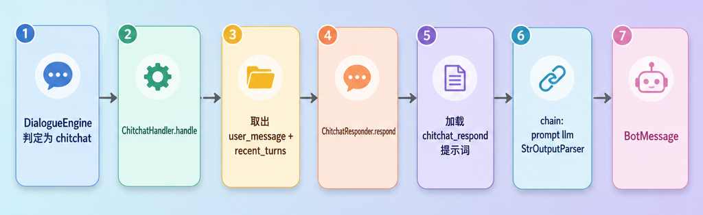
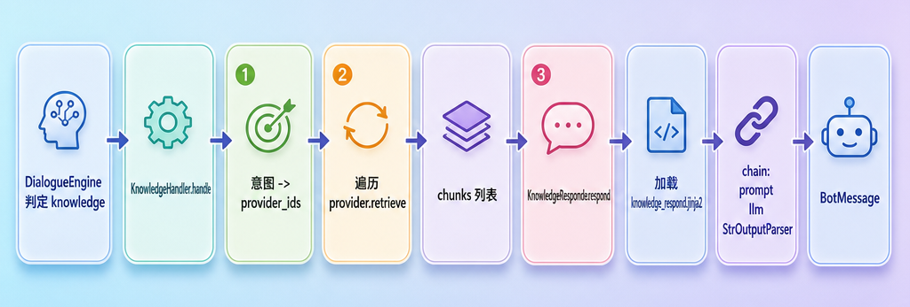

[TOC]

# 信息检索与闲聊

## 第1章 任务目标

实现 **`ChitchatHandler` 和 `KnowledgeHandler`** 这两条轨道

| 顺序 | handler | 说明 |
| --- | --- | --- |
| 第 2 章 | `ChitchatHandler` | 闲聊轨道（轻） |
| 第 3 章 | `KnowledgeHandler` | 知识轨道（重，涉及 provider 检索） |

## 第2章 ChitchatHandler

闲聊是三条轨道里最轻的一条，没有流程推进、没有知识检索、没有命令处理，就是单纯把用户的话和对话历史交给 LLM，让它自然回一句。

### 2.1 handler 实现

```python
# atguigu/chitchat/handler.py

from atguigu.domain.messages import BotMessage
from atguigu.domain.state import DialogueState
from atguigu.chitchat.responder import ChitChatResponder


class ChitChatHandler:
    def __init__(self, responder: ChitChatResponder):
        self.responder = responder

    async def handle(self, state: DialogueState) -> list[BotMessage]:
        pending_turn = state.pending_turn
        user_message = pending_turn.user_message
        recent_turns = state.current_session().turns

        return await self.responder.respond(
            user_message=user_message,
            recent_turns=recent_turns,
        )
```

handler 自己不干活，它只是把 state 里的两份原料拿出来——**当前用户消息**和**最近对话历史**——交给 `ChitchatResponder` 处理。

### 2.2 responder 实现

真正调 LLM 的是 responder。

```python
# atguigu/chitchat/responder.py

from langchain_core.prompts import PromptTemplate
from langchain_core.output_parsers import StrOutputParser
from atguigu.domain.messages import UserMessage, BotMessage
from atguigu.domain.state import Turn
from atguigu.prompts.history_builder import HistoryBuilder
from atguigu.prompts.loader import load_prompt
from atguigu.infrastructure.llm import llm

class ChitChatResponder:

    async def respond(self,
                      user_message: UserMessage,
                      recent_turns: list[Turn]):

        user_message = HistoryBuilder._render_user_message(user_message)
        history = HistoryBuilder.build(recent_turns)

        prompt_text = load_prompt("chitchat_respond")
        prompt = PromptTemplate.from_template(prompt_text, template_format="jinja2")
        chain = prompt | llm | StrOutputParser()
        response = await chain.ainvoke({
            "user_message": user_message,
            "history": history,
        })
        return [BotMessage(text=response)]
```

整个 respond 的逻辑很短：

1. 把用户消息渲染成文本（`_render_user_message` 处理对象消息时也能转成 `[订单对象 ...]` 这种描述）
2. 把会话历史拼成对话记录
3. 加载 `chitchat_respond` 提示词，组成链
4. 调 LLM，输出文本包成 `BotMessage`

### 2.3 整合和依赖注入

在文件 `atguigu/engine/dialogue_engine.py` 中的 `__init__`方法中添加 `ChitChatHandler`

```python
# atguigu/engine/dialogue_engine.py

def __init__(
        self,
        turn_planner: TurnPlanner,
        task_handler: TaskHandler,
        knowledge_handler: KnowledgeHandler,
        chitchat_handler: ChitChatHandler,
        clarify_responder: ClarifyResponder,
        turn_plan_validator: TurnPlanValidator
) -> None:
    self.turn_planner = turn_planner
    self.task_handler = task_handler
    self.knowledge_handler = knowledge_handler
    self.chitchat_handler = chitchat_handler
    self.clarify_responder = clarify_responder
    self.turn_plan_validator = turn_plan_validator
```

在在文件 `atguigu/engine/dialogue_engine.py` 中添加闲聊轨道的调用

```python
else:
    # 3.3 闲聊
    return await self.chitchat_handler.handle(state = dialogue_state)
```

在 `atguigu/api/routers/dependencies.py` 中注入 `chitchat_handler` 对象：

```python
return DialogueEngine(
    turn_planner = TurnPlanner(),
    task_handler = TaskHandler(
        flows=flow_list,
        command_processor=CommandProcessor(),
        action_runner=build_action_runner(),
        flow_executor=FlowExecutor()
    ),
    knowledge_handler = KnowledgeHandler(knowledge_intents = KNOWLEDGE_INTENTS),
    clarify_responder = ClarifyResponder(),
    turn_plan_validator = TurnPlanValidator(),
    chitchat_handler=ChitChatHandler(ChitChatResponder())
)
```

### 2.4 闲聊轨道全貌

合起来看一次闲聊请求的完整链路：



## 第3章 KnowledgeHandler

知识问答比闲聊复杂：它要先**根据意图（intents）找到知识来源（registry + providers）**，再**从这些来源检索知识**，最后结合知识生成回复（LLM + responder）**。

### 3.1 模块总览

```
atguigu/knowledge/
├── __init__.py          # 空文件，标记为 Python 包
├── intents.py           # 意图定义 → 映射到 provider
├── providers.py         # 知识提供者（API / FAQ / RAG）
├── registry.py          # provider 注册表
├── responder.py         # 用知识 + LLM 生成回复
└── handler.py           # 对外入口，编排整个 knowledge 流程
```

### 3.2 知识轨道全貌

把整个 knowledge 轨道串成一条链：



### 3.3 知识提供者

创建文件：`atguigu/knowledge/providers.py`

```python
# atguigu/knowledge/providers.py

import json, asyncio
from abc import ABC, abstractmethod
from typing import Any
from pydantic import BaseModel
from atguigu.conf.config import settings
from atguigu.domain.state import DialogueState
from atguigu.infrastructure import http_client


class KnowledgeChunk(BaseModel):
    content: str

class KnowledgeProvider(ABC):

    # 知识提者的ID
    provider_id = ""

    @abstractmethod
    async def retrieve(self, state: DialogueState) -> list[KnowledgeChunk]:
        """
        提供检索方法
        :param state:
        :return:
        """
        pass

class ProductAPIProvider(KnowledgeProvider):

    provider_id = 'api.product'

    async def retrieve(self, state: DialogueState) -> list[KnowledgeChunk]:
        product_id = state.focused_object.id
        data: dict[str, Any] = await self._get_product_info_by_id(product_id)
        text = json.dumps(data, ensure_ascii=False, indent=2)
        return [KnowledgeChunk(content=f"商品信息:\n{text}")]

    async def _get_product_info_by_id(self, product_id: str) -> dict[str, Any]:
        url = f"{settings.commerce_api_base_url}/products/{product_id}"
        # 注意此处：
        # 文件头部 from atguigu.infrastructure import http_client
        # 此处使用 http_client.http_client.get(url) 调用

        # 不要这样做：
        # 文件头部 from atguigu.infrastructure.http_client import http_client
        # 此处使用 http_client.get(url) 调用
        # 会使拿到的 http_client 是 None
        response = await http_client.http_client.get(url)
        return response.json()["data"]

class OrderAPIProvider(KnowledgeProvider):

    provider_id = 'api.order'

    async def retrieve(self, state: DialogueState) -> list[KnowledgeChunk]:
        order_number = state.focused_object.id

        order_payload, logistics_payload = await asyncio.gather(
            self._fetch_order(order_number),
            self._fetch_logistics(order_number),
        )

        return [
            KnowledgeChunk(
                content="订单与物流信息：\n"
                        + json.dumps(
                    {
                        "order_number": order_number,
                        "order": order_payload,
                        "logistics": logistics_payload,
                    },
                    ensure_ascii=False,
                    indent=2,
                )
            )
        ]

    async def _fetch_order(self, order_number) -> dict[str, Any]:
        url = f"{settings.commerce_api_base_url}/orders/{order_number}"
        response = await http_client.http_client.get(url)
        return response.json()["data"]

    async def _fetch_logistics(self, order_number) -> dict[str, Any]:
        url = f"{settings.commerce_api_base_url}/orders/{order_number}/logistics"
        response = await http_client.http_client.get(url)
        return response.json().get("data", {})

class FAQProvider(KnowledgeProvider):

    provider_id = 'faq.default'

    async def retrieve(self, state: DialogueState) -> list[KnowledgeChunk]:
        # TODO
        return [KnowledgeChunk(content="FAQ：未检索到相关问题")]

class RAGProvider(KnowledgeProvider):

    provider_id = 'rag.default'

    async def retrieve(self, state: DialogueState) -> list[KnowledgeChunk]:
        # TODO
        return [KnowledgeChunk(content="RAG：未检索到相关信息")]

```

四种 provider 按类型分两组：

**API 类 —— 查实时业务数据：**

| Provider             | provider_id   | 数据来源                                          | 特点                                                     |
| -------------------- | ------------- | ------------------------------------------------- | -------------------------------------------------------- |
| `ProductAPIProvider` | `api.product` | `GET /products/{id}`                              | 从 `state.focused_object.id` 取商品 ID                   |
| `OrderAPIProvider`   | `api.order`   | `GET /orders/{id}` + `GET /orders/{id}/logistics` | 用 `asyncio.gather` **并发**查订单和物流，省一半等待时间 |

**FAQ / RAG 类 —— 占位实现，将来接入真实库：**

| Provider      | provider_id   | 当前行为               | 将来替换方向                           |
| ------------- | ------------- | ---------------------- | -------------------------------------- |
| `FAQProvider` | `faq.default` | 返回"未检索到相关问题" | 接入 ElasticSearch  FAQ 库             |
| `RAGProvider` | `rag.default` | 返回"未检索到相关信息" | 接入向量数据库（如 Milvus / Pinecone） |

这里"占位"的意义是——**接口契约先定下来**，将来接 ElasticSearch、向量数据库都只是替换 `retrieve` 的实现，整个 KnowledgeHandler 不需要做出改变。

### 3.4 Provider 注册表

创建文件：`atguigu/knowledge/registry.py`

```python
# atguigu/knowledge/registry.py

from atguigu.knowledge.providers import KnowledgeProvider


class KnowledgeProviderRegistry:
    """
    只是提供者注册表
    """

    def __init__(self, providers: list[KnowledgeProvider]) -> None:

        self._providers_by_id = {p.provider_id: p for p in providers}

    def get(self, provider_id: str) -> KnowledgeProvider:
        return self._providers_by_id[provider_id]
```

注册表就是一个 `{provider_id → provider 实例}` 的字典包装。构造时传入所有 provider 实例，运行时按 ID 快速查找。`get` 找不到时直接抛 `KeyError`——这是设计选择，因为 provider_id 是代码里写死的常量，不应该出现找不到的情况。

### 3.5 提示词模板

**knowledge_respond.jinja2**

```jinja2
你是一个中文电商客服助手，语气自然、友好、简洁。

以下是与用户问题相关的商品或业务信息，请优先基于这些内容作答：
{{ knowledge_content }}

要求：
- 只根据已知信息作答，不要编造不存在的内容。
- 如果信息不足，坦诚告知并引导用户提供更多细节。
- 语气自然，不要机械复述资料原文。

对话历史：
{{ history }}

用户当前问题：{{ user_message }}

助手回复：
```

模板的关键设计：

1. **``**：只有当确实检索到知识内容时才渲染段落。当FAQ/RAG 占位时， knowledge_content 的值是 `"未检索到相关信息"`，提醒 LLM 知道信息不足。
2. **三条约束**："不编造"、"信息不足时坦诚告知"、"语气自然不机械复述"——这三条是知识问答质量的底线。
3. **``**：只有当有历史对话时才渲染历史段落。

### 3.6 知识回复生成器

创建文件 `atguigu/knowledge/responder.py`

```python
# atguigu/knowledge/responder.py

from langchain_core.prompts import PromptTemplate
from langchain_core.output_parsers import StrOutputParser
from atguigu.infrastructure.llm import llm
from atguigu.domain.messages import UserMessage, BotMessage
from atguigu.domain.state import Turn
from atguigu.prompts.history_builder import HistoryBuilder
from atguigu.prompts.loader import  load_prompt
from atguigu.knowledge.providers import KnowledgeChunk


class KnowledgeResponder:

    async def respond(
            self, 
            user_message: UserMessage, 
            recent_turns: list[Turn], 
            chunks: list[KnowledgeChunk] 
    ) -> list[BotMessage]:
        
        # 准备提示词上下文
        user_message = HistoryBuilder._render_user_message(user_message)
        history = HistoryBuilder.build(recent_turns)
        knowledge_content = "\n\n".join([chunk.content for chunk in chunks])

        # 构造chain
        prompt_text = load_prompt("knowledge_respond")
        prompt = PromptTemplate.from_template(
            prompt_text,
            template_format="jinja2"
        )
        chain = prompt | llm | StrOutputParser()

        # 运行chain
        response = await chain.ainvoke({
            "user_message": user_message,
            "history": history,
            "knowledge_content": knowledge_content,
        })

        return [BotMessage(text=response)]

```

它和 `ChitchatResponder` 的结构很像，多的就是 **`knowledge_content`** 这一个变量——把所有 chunks 的 content 用空行拼起来，塞进 prompt 给 LLM。

`"\n\n".join([chunk.content for chunk in chunks])` 这一行：当多个 provider 都返回了结果时（比如 FAQ + RAG 双路检索），它们的知识内容会被拼成一段完整的上下文。

### 3.7 知识检索处理器

文件： `atguigu/knowledge/handler.py`

```python
# atguigu/knowledge/handler.py

from atguigu.domain.messages import BotMessage
from atguigu.domain.state import DialogueState
from atguigu.knowledge.intents import KnowledgeIntent
from atguigu.knowledge.providers import KnowledgeChunk
from atguigu.knowledge.registry import KnowledgeProviderRegistry
from atguigu.knowledge.responder import KnowledgeResponder

class KnowledgeHandler:

    def __init__(
            self,
            knowledge_intents: dict[str, KnowledgeIntent],
            provider_registry: KnowledgeProviderRegistry,
            knowledge_responder: KnowledgeResponder):

        self.knowledge_intents = knowledge_intents
        self.provider_registry = provider_registry
        self.knowledge_responder = knowledge_responder

    async def handle(self, intents: list[str], state: DialogueState) -> list[BotMessage]:

        # 1. 根据意图寻找知识来源（知识提供者id列表）
        provider_ids: list[str] = self._get_provider_ids_by_intents(intents)

        # 2. 从每个 provider 检索知识片段
        chunks: list[KnowledgeChunk] = []
        for provider_id in provider_ids:
            provider = self.provider_registry.get(provider_id)
            current_chunks = await provider.retrieve(state)
            chunks.extend(current_chunks)

        # 3. 用知识生成回复
        return await self.knowledge_responder.respond(
            user_message=state.pending_turn.user_message,
            recent_turns=state.current_session().turns,
            chunks=chunks
        )


    def _get_provider_ids_by_intents(self, intents: list[str]) -> list[str]:
        provider_ids: list[str] = []
        for intent in intents:
            provider_ids.extend(self.knowledge_intents[intent].provider_ids)
        return list(set(provider_ids))
```

`handle` 方法三件事，按顺序推进：

| 步骤 | 方法 | 输入 | 输出 |
| --- | --- | --- | --- |
| ① 意图→来源 | `_get_provider_ids_by_intents` | `list[str]`（如 `["order_info"]`） | `list[str]`（如 `["api.order"]`） |
| ② 检索知识 | 遍历 `provider.retrieve(state)` | provider_id 列表 | `list[KnowledgeChunk]` |
| ③ 生成回复 | `knowledge_responder.respond(...)` | chunks + 对话上下文 | `list[BotMessage]` |

`_get_provider_ids_by_intents` 里用 `list(set(...))` 去重——LLM 可能一次给多个 intents（比如同时问"退款政策"和"退货政策"），它们可能指向同一个 provider。

### 3.8 组装

文件： `atguigu/engine/dialogue_engine.py` 中，添加信息检索的轨道调用

```python
# atguigu/engine/dialogue_engine.py
elif turn_plan.knowledge is not None:
    # 3.2 信息检索
    return await self.knowledge_handler.handle(intents=turn_plan.knowledge.intents, state=dialogue_state)
```

文件：修改 `atguigu/api/routers/dependencies.py` 中 `KnowledgeHandler` 的组装

```python
# atguigu/api/routers/dependencies.py
return DialogueEngine(
    turn_planner = TurnPlanner(),
    task_handler = TaskHandler(
        flows=flow_list,
        command_processor=CommandProcessor(),
        action_runner=build_action_runner(),
        flow_executor=FlowExecutor()
    ),
    knowledge_handler = KnowledgeHandler(
        knowledge_intents=KNOWLEDGE_INTENTS,
        knowledge_responder=KnowledgeResponder(),
        provider_registry=KnowledgeProviderRegistry(
            [
                ProductAPIProvider(),
                OrderAPIProvider(),
                FAQProvider(),
                RAGProvider(),
            ]
        ),
    ),
    clarify_responder = ClarifyResponder(),
    turn_plan_validator = TurnPlanValidator(),
    chitchat_handler=ChitChatHandler(ChitChatResponder())
)
```

## 第4章 小结

### 4.1 这一节实现了什么

| 文件 | 内容 |
| --- | --- |
| `chitchat/handler.py` + `chitchat/responder.py` + `prompts/jinja2/chitchat_respond.jinja2` | 闲聊轨道完整实现 |
| `knowledge/handler.py` + `knowledge/responder.py` + `prompts/jinja2/knowledge_respond.jinja2` | 只是检索轨道的实现 |
| `knowledge/providers.py` | 4 种知识提供者（API×2 + FAQ + RAG） |
| `knowledge/registry.py` | Provider 注册表 |

### 4.2 几个值得记住的设计

1. **handler 不干活**：两个 handler 都把真正工作交给对应的 responder，自己只负责调度。
2. **provider 抽象**：API / FAQ / RAG 不同知识来源用同一个 `retrieve(state) → chunks` 接口，FAQ / RAG 当前是占位，将来接入真实库不影响上层。
3. **OrderAPIProvider 的并发设计**：用 `asyncio.gather` 同时查订单和物流，减少 latency。

