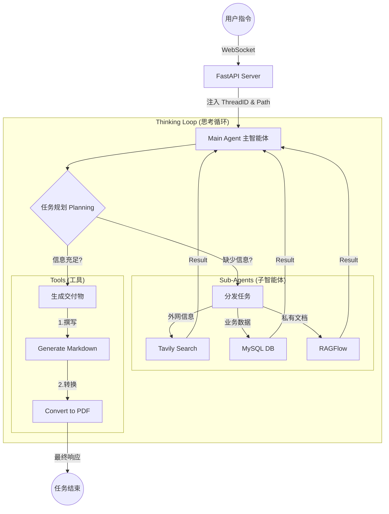
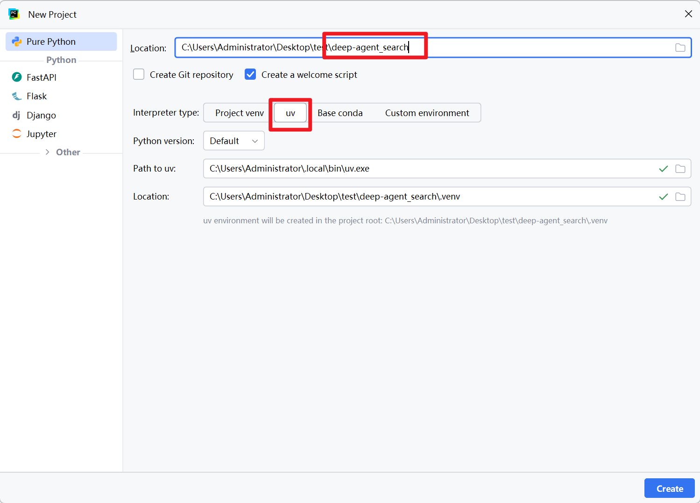
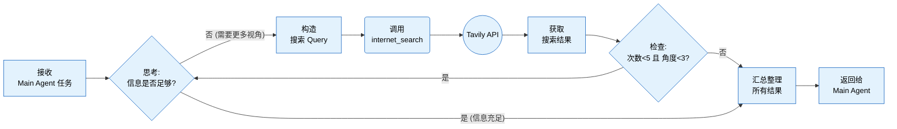
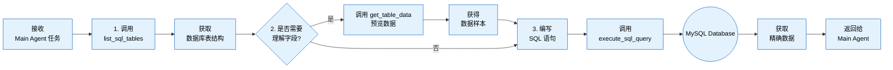
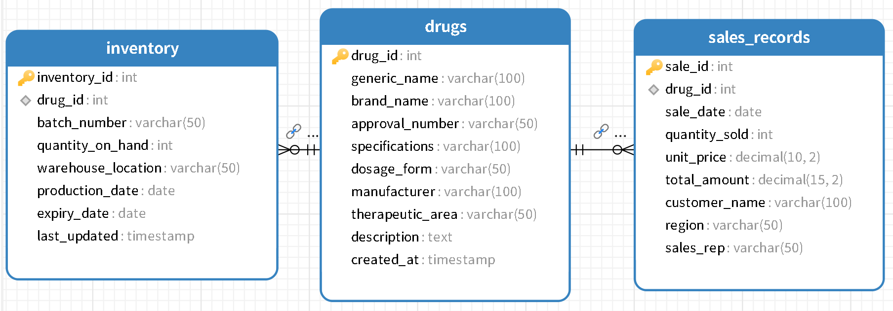
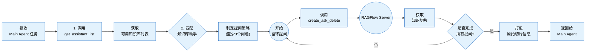

# 基于DeepAgents深度搜索项目


## 一、深度搜索项目介绍

本项目是 DeepAgents 框架的一个典型最佳实践，旨在构建一个**"深度搜索研究员"**。


### 1.1 项目目标
利用DeepAgent 来**模拟人类高级研究员思维**的多路组合智能体系统，以「主智能体统筹 + 多专家子智能体并行协作」为核心架构，突破传统 RAG 单次检索局限，通过**搜索 - 阅读 - 反思 - 再搜索**多轮迭代，深度挖掘海量信息背后的隐藏逻辑，实现**广覆盖、高精准、强可靠**的复杂信息处理与文档生成。

### 1.2 Agent Design
系统采用**1 主 + N 专**多路组合模式，主智能体统一调度，三类专家子智能体各司其职、并行工作：



主智能体（Main Agent）是整个智能团队的 "项目经理" (Leader)。它不直接执行具体的搜索或查询任务，而是专注于理解需求、拆解任务、调度资源、交付结果。

*   **Main Agent (主智能体)**:
    *   **职责**: 项目经理。负责理解用户意图、拆解任务步骤、生成子任务、以及最终汇总报告。
    *   **能力**: 拥有全局视野，管理整个会话的状态和记忆。
*   **Sub Agent (子智能体)**:
    *   **网络搜索助手**：负责公开知识广域检索，支持由浅入深、多轮递进搜索，最多执行 5 次精准检索，覆盖 3 个以上信息维度。
    *   **数据库查询助手**：对接企业业务数据库，支持表结构读取、数据预览、自定义 SQL 查询，精准提取商品 / 业务明细数据。
    *   **RAGFlow 助手**：对接企业私有知识库，先获取可用助手列表，再分层提问、深度检索，确保内部专有信息安全可用。

### 1.3 工具体系
我们为 Agent 装备了硬核的工具库：

主智能体工具

1. **generate_markdown** —— 生成标准 Markdown 文档
2. **convert_md_to_pdf** —— 将 Markdown 转为 PDF 文件

网络搜索助手（子agent）

1. **internet_search（tavily）** —— 互联网公开信息多轮、多角度检索

数据库查询助手（子agent）

1. **list_sql_tables** —— 列出数据库所有表结构
2. **get_table_data** —— 读取表数据预览
3. **execute_sql_query** —— 执行自定义 SQL 查询

RAGFlow 知识库助手（子agent）

1. **get_assistant_list** —— 获取知识库可用助手列表
2. **create_ask_delete** —— 向知识库发起提问查询

### 1.4 技术栈
本项目采用了全异步的高性能架构：

- LangChain / LangGraph / DeepAgents:
  - 介绍 : 项目的“神经中枢”。LangGraph 负责构建 有状态的循环工作流 (StateGraph) ，让 Agent 具备记忆、规划和自我修正能力，打破了传统 LLM 单次问答的限制。
- OpenAI SDK :
  - 介绍 : 调用 GPT-4o / DeepSeek 等大模型的官方接口。通过 bind_tools 实现 Tool Calling（函数调用）。
- Pydantic :
  - 介绍 : 数据校验基石。用于定义 Agent 的状态结构 ( AgentState ) 和工具的输入参数模型，确保数据流转的类型安全。
- FastAPI :
  - 介绍 : 高性能异步 Web 框架。提供 RESTful API 接口，支持文件上传与静态资源托管。
- WebSocket :
  - 介绍 : 全双工通信。用于将 Agent 的 思考过程 (Thinking Process) 和工具执行结果实时推送到前端，提升用户体验。
- Uvicorn :
  - 介绍 : ASGI 服务器，FastAPI 的启动引擎。
- Tavily Search API ( tavily_tools.py ):
  - 介绍 : 专为 AI 设计的搜索引擎。相比 Google，它返回的内容更结构化，不仅包含链接，还包含清洗后的网页正文，极大减少了 Agent 的 Token 消耗。
- RAGFlow ( ragflow_tools.py ):
  - 介绍 : 企业级 RAG 引擎。用于连接本地知识库，支持 PDF、Word 等文档的深度解析与语义检索。
- PyMuPDF (fitz) ( pdf_tools.py ):
  - 介绍 : 高性能 PDF 处理库。用于精准提取 PDF 中的文本和表格，辅助 Agent 阅读文献。
- PyMySQL / SQLAlchemy ( mysql_tools.py ):
  - 介绍 : 数据库连接器。赋予 Agent 操作结构化数据（SQL）的能力，使其能查询业务报表。
- Markdown / File IO ( markdown_tools.py , upload_file_read_tool.py ):
  - 介绍 : 文件读写能力。支持 Markdown 格式的报告生成，以及读取用户上传的任意文本文件。
- Asyncio :
  - 介绍 : Python 异步编程标准库。通过 async/await 实现非阻塞 IO，让 Agent 在等待网络请求（如搜索、LLM 生成）时，服务器仍能响应其他请求。
- ContextVars :
  - 介绍 : 线程上下文变量。在异步并发环境中，像“隐形传态”一样传递 thread_id 和 user_id ，确保日志和工具能正确归属到对应用户，防止数据串线。
- Pathlib :
  - 介绍 : 面向对象的文件路径处理。解决了 Windows/Linux 路径分隔符差异的痛点。


## 二、项目搭建指南

---

### 2.1 创建项目



### 2.2 依赖包

根据下面的依赖声明，下载所有依赖：`uv sync`

```toml
dependencies = [
    "aiofiles>=25.1.0",
    "colorlog>=6.10.1",
    "colorlog>=6.10.1",
    "deepagents>=0.6.6",
    "fastapi>=0.136.3",
    "langchain-openai>=1.2.2",
    "markdown>=3.10.2",
    "mysql-connector-python>=9.7.0",
    "openpyxl>=3.1.5",
    "pandas>=3.0.3",
    "pypdf>=6.12.2",
    "python-docx>=1.2.0",
    "python-dotenv>=1.2.2",
    "python-multipart>=0.0.29",
    "pywin32>=311",
    "pyyaml>=6.0.3",
    "ragflow-sdk==0.24.0", # 使用高版本就有问题
    "requests>=2.34.2",
    "tavily-python>=0.7.24",
    "uvicorn[standard]>=0.48.0",
]


# --- [核心依赖] Deep Agents 框架 ---
deepagents           # 多智能体库

# --- LangChain 生态 (基础支撑) ---
	langchain-core      # 基础组件
	langchain           # 初始化模型
	langgraph            # 智能体工作流编排

# --- 大模型服务 (LLM Services) ---
langchain-openai     # OpenAI 接口适配

# --- Web 服务 (API & WebSocket) ---
fastapi            # 异步 Web 框架
uvicorn[standard]   # 服务器引擎 (含 WebSocket)
python-multipart     # 文件上传支持

# --- 数据库与存储 (Database) ---
mysql-connector-python # MySQL 官方驱动
# 注意：代码中使用的是 mysql.connector，对应这个包，而非 pymysql

# --- 文件处理
python-doc          # Word (.docx) 读取
pypdf                # PDF 读取
pandas              # Excel 数据处理
openpyxl            # Excel 读取引擎 (Pandas 依赖)
aiofiles           # 异步文件操作

# --- 外部工具集成 (Integrations) ---
tavily-python        # 联网搜索 API
ragflow-sdk          # 知识库 SDK
requests            # HTTP 请求库

# --- 基础工具 (Utilities) ---
python-dotenv        # 环境变量管理
PyYAML               # YAML 配置文件解析
pydantic             # 数据校验
```


### 2.3 项目包结构

请按照以下结构创建目录和空文件

```cmd
├── agent/
│   ├── __init__.py         # 导出
│   ├── sub_agents		    # [核心] 存储subagents数据
│   │   ├── __init__.py         # 导出
│   │   ├── db_sub_agent.py         # 数据库助手子agent
│   │   ├── internet_sub_agent.py   # 网络查询助手子agent
│   │   ├── rag_sub_agent.py        # ragflow助手子agent
│   ├── llm.py         # llm初始化
│   ├── load_prompt.py         # 加载prompts.yaml中的prompt配置
│   └── main_agent.py       # [核心] 智能体组装与执行逻辑
├── api/
│   ├── __init__.py         # 导出
│   ├── context.py          # [核心] ContextVars 会话隔离
│   ├── monitor.py          # [核心] WebSocket 监控
│   └── server.py           # [入口] FastAPI 服务端
├── prompt/
│   └── prompts.yaml        # [核心] 所有 Prompt 配置文件
├── tools/
│   ├── __init__.py         # 导出
│   ├── internet_search_tool.py     # 搜索工具
│   ├── markdown_tools.py   # 文件生成工具
│   ├── mysql_tools.py      # 数据库工具
│   ├── pdf_tools.py        # PDF转换工具
│   ├── ragflow_tools.py    # RAG 工具
│   └── upload_file_read_tool.py # 上传文件读取工具
├── utils/
│   ├── __init__.py         # 导出
│   ├── path_utils.py       # 路径操作的工具模块
│   ├── logger_utils.py       # 日志配置                                    的工具模块
│   └── converter_utils.py  # 文件格式转换的工具模块
├── output/                 # 自动生成，存放会话产物
├── upload/                # 用户上传文件存放区
├── .env                    # 环境变量
```

### 2.4 基础导入

在开始写智能体之前，先导入一些基础类和前端工程：**日志、监控、会话隔离以及UI前端先导入**。

#### 2.4.1 导入前端项目

**环境准备**

- 安装 Node.js，**版本不要低于 20.19.0**
- 验证安装：执行 `node -v`，确认输出版本为 v20.19.0 及以上

**项目文件部署**

将 `资料/ui` 目录完整复制到当前项目根目录下

**启动服务**

打开终端，执行以下命令：

```bash
# 进入UI目录
cd ui
# 启动开发服务
npm run dev
```

**访问测试**

服务启动成功后，在浏览器访问：

```
http://localhost:5173
```


补充说明

- 若启动报错，优先检查：Node 版本是否匹配、ui 目录下 `package.json` 依赖是否完整（可执行 `npm install` 安装依赖）
- 端口 5173 被占用时，可修改 ui 目录下的配置文件（如 `vite.config.js`）调整端口

#### 3.4.2 api通信相关

以下是项目中需导入的四个核心类:

1. **server.py** —服务入口

   接收客户请求（API 接口）、分配唯一标识（Thread ID），将任务派给后台异步处理，同时通过 WebSocket 实时反馈进度。

2. **context.py** —数据隔离

   为任务打上专属标识，支持任意环节快速获取任务身份，核心实现多任务(请求)数据隔离，避免信息串混。

3. **monitor.py** —实时反馈

   收集后台任务执行状态，结合任务标识精准推送消息，解决后台与前台的跨线程通信问题。

##### 2.4.2.1 会话数据（`api/context.py`)

**说明**：使用 `ContextVars` 确保不同用户的请求（协程）在服务器内部是完全隔离的，不会混淆文件路径。

```python
from contextvars import ContextVar
from typing import Optional

# =================================================================================================
# 核心知识点: ContextVars (上下文变量)
# =================================================================================================
# Q: 为什么我们需要 ContextVar？为什么不能直接用全局变量？
#
# A: 在开发异步 Web 服务 (如 FastAPI) 时，系统是 "并发" 处理多个用户请求的。
#    但在 Python 的 asyncio 机制下，这些并发请求通常运行在 *同一个线程 (Thread)* 中。
#
#    1. 如果使用全局变量 (Global Variable):
#       当 User A 的请求正在处理时，User B 的请求进来了。如果修改了全局变量，User A 的数据
#       就会被 User B 覆盖，导致严重的 "串台" 事故（例如 User A 的文件存到了 User B 的目录）。
#
#    2. 如果使用 threading.local:
#       它是基于线程隔离的。因为 asyncio 所有协程都在同一个线程跑，所以 threading.local
#       在异步场景下失效，无法隔离不同用户的请求。
#
#    3. ContextVar 的解决方案:
#       ContextVar 是 Python 3.7+ 专门为异步编程设计的 "协程级局部变量"。
#       它能确保变量在每一个 asyncio Task (即每个用户请求) 中是 *独立隔离* 的。
#       无论代码调用多深，只要是在同一个请求链路（Context）中，get() 到的都是属于当前请求的数据。
# =================================================================================================


# 定义 ContextVar 上下文变量
# -------------------------------------------------------------------------
# 这里的变量名只是一个标识符 (Identifier)，真正的值是存储在当前的 Context 环境中的。

# - 作用 ：用来记录 “当前是谁在执行任务” 。
# - 场景 ：当 Agent 打印日志或者通过 WebSocket 给前端发消息时，它需要知道：“我现在是正在服务张三，还是李四？” 这样消息才不会发错人。
_session_dir_ctx: ContextVar[Optional[str]] = ContextVar("session_dir", default=None)

# - 作用 ：用来记录 “当前是谁在执行任务” 。
# - 场景 ：当 Agent 打印日志或者通过 WebSocket 给前端发消息时，它需要知道：“我现在是正在服务张三，还是李四？” 这样消息才不会发错人。
_thread_id_ctx: ContextVar[Optional[str]] = ContextVar("thread_id", default=None)


def set_session_context(path: str):
    """
    设置当前请求链路的会话目录。
    通常在 Agent 开始执行任务前调用。

    Returns:
        Token: 返回一个 Token 对象，后续可用它来恢复(reset)变量状态。
    """
    return _session_dir_ctx.set(path)


def get_session_context() -> Optional[str]:
    """
    获取当前请求链路的会话目录。
    可以在任何深层调用的工具函数中直接使用，无需层层传递参数。
    """
    return _session_dir_ctx.get()


def set_thread_context(thread_id: str):
    """
    设置当前请求链路的 Thread ID。
    """
    return _thread_id_ctx.set(thread_id)


def get_thread_context() -> Optional[str]:
    """
    获取当前请求链路的 Thread ID。
    """
    return _thread_id_ctx.get()


def reset_session_context(session_token, thread_token=None):
    """
    清理/重置上下文。
    通常在请求处理结束 (finally 块) 中调用，防止内存泄漏或污染后续请求。
    """
    _session_dir_ctx.reset(session_token)
    if thread_token:
        _thread_id_ctx.reset(thread_token)

```

##### 2.4.2.2 实时监控 (`api/monitor.py`)

**说明**：这是一个单例（Singleton）类，负责将智能体的内部思考过程实时推送到前端 WebSocket。

```python
import datetime
import asyncio
from utils.logger_utils import logger
from typing import Any, Dict, Optional
from fastapi import WebSocket
from api.context import get_thread_context
import builtins # 用于脚本模式下的流式输出

class ToolMonitor:
    """
    工具监控类，用于在工具执行过程中上报进度和状态。
    设计为单例模式，可在任何工具中直接导入使用。
    兼容 FastAPI WebSocket 和 脚本运行时的 stream_writer。

    使用示例:
    from api.monitor import monitor

    def my_tool(arg1):
        monitor.report_start("my_tool", {"arg1": arg1})
        ...
        monitor.report_running("my_tool", "正在处理数据...", progress=0.5)
        ...
        monitor.report_end("my_tool", result)
    """
    _instance = None

    def __new__(cls):
        if cls._instance is None:
            cls._instance = super(ToolMonitor, cls).__new__(cls)
            cls._instance.websocket_manager = None  # 预留给 FastAPI WebSocketManager
        return cls._instance

    def set_websocket_manager(self, manager):
        """设置 FastAPI 的 WebSocket 管理器"""
        self.websocket_manager = manager

    def _emit(self, event_type: str, message: str, data: Optional[Dict[str, Any]] = None):
        """内部发送方法"""
        payload = {
            "type": "monitor_event",
            "event": event_type,
            "message": message,
            "data": data or {},
            "timestamp": datetime.datetime.now().isoformat()
        }

        # 1. 优先尝试通过 FastAPI WebSocket 发送 (定向推送)
        if self.websocket_manager:
            try:
                # 获取当前线程 ID
                thread_id = get_thread_context()

                # 确保 loop 已加载
                manager_loop = self.websocket_manager.loop

                if manager_loop:
                    if thread_id:
                        # 检查当前是否在同一个事件循环中
                        try:
                            current_loop = asyncio.get_running_loop()
                        except RuntimeError:
                            current_loop = None

                        if current_loop and current_loop == manager_loop:
                            # 如果在同一个循环中（例如在 create_task 中运行），直接创建任务
                            current_loop.create_task(
                                self.websocket_manager.send_to_thread(payload, thread_id)
                            )
                        else:
                            #  FastAPI 的 WebSocket 依赖异步事件循环，且协程必须在创建它的循环中运行：
                            #  如果当前线程和 WebSocket 管理器在同一个循环（比如在 FastAPI 的接口 / 任务中运行）：直接 create_task 效率最高；
                            #  如果在不同循环 / 不同线程（比如同步线程调用）：必须用 asyncio.run_coroutine_threadsafe（线程安全的方式），否则会报错 “协程在错误的循环中运行”。
                            # 如果在不同线程，使用 threadsafe 方法
                            asyncio.run_coroutine_threadsafe(
                                self.websocket_manager.send_to_thread(payload, thread_id),
                                manager_loop
                            )
                    else:
                        # 如果没有 thread_id，说明可能是系统级消息，或者未上下文环境
                        pass
            except Exception as e:
                logger.error(f"[Monitor] WebSocket send failed: {e}")

        # 2. 尝试通过全局 runtime 输出 (DeepAgents 脚本模式)
        # 这使得 simple_agents.py 中的 MockRuntime 能接收到数据
        if builtins and hasattr(builtins, 'runtime') and hasattr(builtins.runtime, 'stream_writer'):
            try:
                builtins.runtime.stream_writer(payload)
            except Exception:
                pass

        # 3. 控制台保底输出 (方便调试)
        logger.debug(f"[Monitor:{event_type}] {message}")

    def report_tool(self, tool_name: str, args: Dict[str, Any] = None):
        """报告工具开始执行"""
        self._emit("tool_start", f"开始执行工具: {tool_name}", {"tool_name": tool_name, "args": args})

    def report_assistant(self, assistant_name: str, args: Dict[str, Any] = None):
        """报告正在调用的子智能体进度"""
        self._emit("assistant_call", f"正在调用助手: {assistant_name}",
                   {"assistant_name": assistant_name, "args": args})

    def report_task_result(self, result: str):
        """报告任务最终结果"""
        self._emit("task_result", "任务执行完成", {"result": result})

    def report_session_dir(self, path: str):
        """报告任务工作目录"""
        self._emit("session_created", f"工作目录已创建: {path}", {"path": path})


# 全局单例实例
monitor = ToolMonitor()


class ConnectionManager:
    def __init__(self):
        self.active_connections: Dict[str, WebSocket] = {}
        # 延迟绑定 loop，防止初始化时 loop 不一致
        self.loop = None

    def set_loop(self, loop):
        """显式设置事件循环"""
        self.loop = loop
        monitor.set_websocket_manager(self)
        logger.debug(f"[Monitor] ConnectionManager manually bound to loop: {id(self.loop)}")

    async def connect(self, websocket: WebSocket, thread_id: str):
        await websocket.accept()
        self.active_connections[thread_id] = websocket
        logger.debug(f"Client connected: {thread_id}")

    def disconnect(self, websocket: WebSocket, thread_id: str):
        if thread_id in self.active_connections:
            del self.active_connections[thread_id]
        logger.debug(f"Client disconnected: {thread_id}")

    async def send_personal_message(self, message: str, websocket: WebSocket):
        await websocket.send_text(message)

    async def send_to_thread(self, message: dict, thread_id: str):
        if thread_id in self.active_connections:
            websocket = self.active_connections[thread_id]
            await websocket.send_json(message)

manager = ConnectionManager()

```

#### 2.4.3 配置文件

创建文件：根路径/.env

```ini
# ragflow配置
# RAGFLOW_API_URL=http://121.4.54.247
# RAGFLOW_API_KEY=ragflow-g3YmVhYzEyNGNlNDExZjBhMWEwNzZjYT

# LLM配置
# DASHSCOPE_BASE_URL=https://dashscope.aliyuncs.com/compatible-mode/v1
# DASHSCOPE_API_KEY=sk-64c4d4ff41d1481ba0d39f4aa9466757

# tavily-api-key
# TAVILY_API_KEY=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

#----上面这些配置也可以添加到环境变量中-------#

# 数据库相关配置
MYSQL_USER=root
MYSQL_PASSWORD=root
MYSQL_DATABASE=pharma_db
MYSQL_HOST=localhost
MYSQL_PORT=3306
```

#### 2.4.4 导入工具

文件：`utils/logger_utils.py`

> 自定义logging日志配置

```python

import logging
import colorlog

# 初始化全局日志对象
logger = logging.getLogger()

# 设置日志的默认的级别
logger.setLevel(logging.DEBUG)

# 加载彩色日志处理器
handler = colorlog.StreamHandler()
# 定义日志输出的格式
handler.setFormatter(colorlog.ColoredFormatter(
    '%(log_color)s%(asctime)s - %(filename)s:%(lineno)d - %(levelname)s - %(message)s',
    datefmt='%Y-%m-%d %H:%M:%S',
    log_colors={
        'DEBUG': 'cyan',
        'INFO': 'green',  # INFO 显示为绿色
        'WARNING': 'yellow',
        'ERROR': 'red',
        'CRITICAL': 'bold_red',
    }
))

# 应用日志配置信息
logger.addHandler(handler)

```


文件：`utils/converter_utils.py`

> 包含了将md转成pdf工具函数的模块

```python
from utils.logger_utils import logger
from pathlib import Path
import markdown
import win32com.client
import pythoncom

def convert_md_to_pdf_via_word(md_abs_path: Path, pdf_abs_path: Path) -> str:
    """
    使用 Microsoft Word COM 接口将 Markdown 转换为 PDF。
    依赖：pywin32, markdown
    """
    temp_html_path = md_abs_path.with_suffix('.temp.html')
    word_app = None

    try:
        # 1. MD 转 HTML
        with open(md_abs_path, 'r', encoding='utf-8') as f:
            md_content = f.read()

        html_body = markdown.markdown(md_content, extensions=['tables', 'fenced_code'])
        html_content = f"""
        <html>
        <head>
            <meta charset="UTF-8">
            <style>
                body {{ font-family: "Microsoft YaHei", "SimHei", sans-serif; }}
                table {{ border-collapse: collapse; width: 100%; }}
                th, td {{ border: 1px solid black; padding: 8px; }}
                pre {{ background-color: #f5f5f5; padding: 10px; border-radius: 4px; }}
                code {{ font-family: "Consolas", "Monaco", monospace; }}
            </style>
        </head>
        <body>
            {html_body}
        </body>
        </html>
        """

        with open(temp_html_path, 'w', encoding='utf-8') as f:
            f.write(html_content)

        # 2. 调用 Word COM
        pythoncom.CoInitialize()
        word_app = win32com.client.Dispatch('Word.Application')
        word_app.Visible = False
        word_app.DisplayAlerts = False

        doc = word_app.Documents.Open(str(temp_html_path.resolve()))
        doc.SaveAs(str(pdf_abs_path.resolve()), FileFormat=17)  # wdFormatPDF = 17
        doc.Close(SaveChanges=0)

        if pdf_abs_path.exists():
            return f"成功转换: {pdf_abs_path} (Word引擎)"
        else:
            return f"转换完成但未生成文件: {pdf_abs_path}"

    except ImportError:
        return "缺少依赖库，请安装: pip install pywin32 markdown"
    except Exception as e:
        logger.error(f"Word转换PDF失败: {e}", exc_info=True)
        return f"转换失败: {str(e)}"
    finally:
        # 3. 资源清理
        if word_app:
            try:
                word_app.Quit()
            except Exception as e:
                logger.warning(f"关闭Word应用时出错: {e}")

        if temp_html_path.exists():
            try:
                temp_html_path.unlink()
            except Exception as e:
                logger.warning(f"删除临时HTML文件时出错: {e}")

        try:
            pythoncom.CoUninitialize()
        except Exception as e:
            logger.warning(f"释放COM初始化时出错: {e}")
```

文件：`utils/path_utils.py`

> 处理路径工具，确保路径处于当前会话下！并且去掉大模型生成的虚拟路径！

```python
from utils.logger_utils import logger
import os

from pathlib import Path
from typing import Optional

def resolve_path(filename: str, session_dir: Optional[str] = None) -> str:
    """
    统一的文件路径解析工具方法。

    核心功能：
    1. 清洗虚拟路径前缀 (/workspace, /mnt/data, /home/user)
    2. 识别 upload/ 目录，优先相对于项目根目录解析
    3. 结合 session_dir 处理相对/绝对路径，保证路径隔离
    4. 防止路径嵌套 (session_id/session_id)

    场景示例（基于测试环境：Windows系统、session_dir=D:/Project/output/session_123、CWD=D:/Project）：
    | 输入场景                | filename                          | session_dir                      | 核心操作                          | 最终结果                          |
    |-------------------------|-----------------------------------|----------------------------------|-----------------------------------|-----------------------------------|
    | 虚拟路径清洗            | /workspace/report.md              | D:/Project/output/session_123    | 剥离/workspace → 拼接到会话目录   | D:/Project/output/session_123/report.md |
    | upload/ 特殊处理       | abc/upload/upload/file.pdf       | D:/Project/output/session_123    | 提取upload/后路径 → 解析到CWD    | D:/Project/upload/upload/file.pdf |
    | 无会话目录              | sub/test.md                       | None                             | 直接解析为CWD下绝对路径           | D:/Project/sub/test.md            |
    | 绝对路径（会话内）      | D:/Project/output/session_123/sub/report.md | D:/Project/output/session_123 | 验证在会话内 → 无嵌套 → 直接返回  | D:/Project/output/session_123/sub/report.md |
    | 绝对路径（会话外）      | D:/OtherDir/file.md               | D:/Project/output/session_123    | 验证不在会话内 → 保留原路径       | D:/OtherDir/file.md               |
    | Windows Unix风格绝对路径 | /sub/test.md                      | D:/Project/output/session_123    | /开头无盘符 → 拼接到会话目录      | D:/Project/output/session_123/sub/test.md |
    | 路径嵌套防护            | D:/Project/output/session_123/session_123/report.md | D:/Project/output/session_123 | 检测连续session_123 → 修正路径   | D:/Project/output/session_123/report.md |
    | 相对路径（含session名） | session_123/report.md             | D:/Project/output/session_123    | 含session名 → 防止嵌套 → 会话目录+文件名 | D:/Project/output/session_123/report.md |
    | 相对路径（output前缀）  | output/report.md                  | D:/Project/output/session_123    | 含output前缀 → 会话目录+文件名    | D:/Project/output/session_123/report.md |
    | 普通相对路径            | sub1/sub2/test.md                 | D:/Project/output/session_123    | 无特殊标识 → 拼接到会话目录       | D:/Project/output/session_123/sub1/sub2/test.md |
    | 虚拟路径+upload        | /mnt/data/upload/doc.md          | D:/Project/output/session_123    | 剥离/mnt/data → 触发upload处理   | D:/Project/upload/doc.md         |
    | Linux系统绝对路径       | /home/user/test.md                | /data/session_123（Linux）       | 剥离/home/user → 拼接到Linux会话目录 | /data/session_123/test.md         |

    Args:
        filename (str): 输入的文件名或路径
        session_dir (str, optional): 会话上下文目录

    Returns:
        str: 解析后的绝对路径
    """
    path = Path(filename)
    path_str = filename.replace("\\", "/")  # 统一处理字符串匹配

    # 1. 虚拟路径清洗
    virtual_prefixes = ["/workspace", "/mnt/data", "/home/user"]
    for prefix in virtual_prefixes:
        if path_str.startswith(prefix):
            # 去掉前缀
            cleaned = path_str[len(prefix):].lstrip("/")
            path = Path(cleaned)
            path_str = str(path).replace("\\", "/")
            break

    # 2. 特殊处理：upload/ (用户上传文件)
    # 只要路径中包含 upload/，就提取其后半部分，并相对于 CWD 解析
    if "upload/" in path_str:
        idx = path_str.find("upload/")
        relative_part = path_str[idx:]
        return str(Path(relative_part).resolve())

    if not session_dir:
        return str(path.resolve())

    session_path = Path(session_dir).resolve()
    session_name = session_path.name

    # 3. 结合 Session Context

    # 检测 Unix 风格绝对路径 (以 / 开头)
    is_unix_abs = path_str.startswith("/")

    # 如果是绝对路径 (Windows带盘符 或 Unix/开头)
    if path.is_absolute() or (os.name == 'nt' and is_unix_abs):
        # Windows 特殊情况：以 / 开头但无盘符，视为相对路径
        if os.name == 'nt' and is_unix_abs and not path.drive:
            full_path = session_path / path_str.lstrip("/")
        else:
            full_path = path.resolve()

        # 检查是否在 session 目录内
        try:
            # 判断 full_path 是否是 session_path 的子路径
            if session_path in full_path.parents or full_path == session_path:
                # 检查嵌套 (例如 .../session_abc/session_abc/file.txt)
                # 检查路径部分中是否有连续重复的 session_name
                parts = full_path.parts
                for i in range(len(parts) - 1):
                    if parts[i] == session_name and parts[i + 1] == session_name:
                        # 发现嵌套，修正为 session_dir / filename
                        return str(session_path / full_path.name)
                return str(full_path)
        except Exception:
            logger.error("解析路径出错")

        # 绝对路径但不在 session_dir 下 -> 保持原样
        return str(full_path)

    else:
        # 相对路径处理
        parts = path.parts

        # 检查是否包含 session_name (避免重复) 或 output/ 前缀
        if session_name in parts:
            return str(session_path / path.name)

        if parts and parts[0] == "output":
            return str(session_path / path.name)

        # 默认：拼接到 session_dir
        return str(session_path / path)
```

## 三、功能开发&测试

### 3.1 大模型准备

#### 3.1.1 检查配置文件

文件：`.env`

```ini
# LLM配置
# 统一使用前文
DASHSCOPE_BASE_URL=https://dashscope.aliyuncs.com/compatible-mode/v1
DASHSCOPE_API_KEY=sk-key
LLM_QWEN_PLUS=qwen-plus
```

#### 3.1.2 创建大模型对象

文件：`agent/llm.py`

```python
from dotenv import load_dotenv
import os
from langchain.chat_models import init_chat_model

load_dotenv()

model = init_chat_model(
    model= os.getenv("LLM_QWEN_PLUS"),
    model_provider="openai",
    api_key=os.getenv("DASHSCOPE_API_KEY"),
    base_url=os.getenv("DASHSCOPE_BASE_URL"),
)
```

### 3.2 提示词配置&加载

#### 3.2.1 创建提示词配置文件（yml）

文件: `prompt/prompts.yml` 【简化，独立智能体进行优化提示词】

```yml
# Main Agent Configuration
main_agent:
  system_prompt: |
    你是一个沃华医药公司的智能团队负责人，负责协调三个专家助手完成复杂任务
    先占位~~~~~~~~~
# Sub Agents Configuration
sub_agents:
  tavily:
    name: "网络搜索助手"
    description: | 
      负责进行网络知识搜索的智能体助手
    system_prompt: |
      你是一个专业的网络信息查询助手
  db:
    name: "数据库查询助手"
    description:  |
      负责进行数据库查询的智能体助手。
    system_prompt: |
      你是一个专业的数据库查询助手
  ragflow:
    name: "RAGFlow助手"
    description: |
      负责与RAGFlow知识库进行交互的智能体助手
    system_prompt: |
      你是一个专业的RAGFlow知识库助手
```

`|` 被称为**块折叠标量（Literal Block Scalar）**

它是 YAML 里专门用来处理**多行文本**的语法（用 `|` 开头），核心作用是：让你能把需要换行的内容（比如 prompt、描述、长文本）清晰地分行写，YAML 解析时会**完整保留换行格式**，不会把所有内容挤成一行，特别适合写大段的文本配置。

#### 3.2.2 读取提示词文件

文件：`agent/load_prompts.py`

```python
import yaml
from pathlib import Path

# 加载指定路径的yaml文件，生成对应的字典
def load_yaml(file_path):
    with open(file_path, 'r', encoding='utf-8') as f:
        return yaml.safe_load(f)

# .yaml .yml
_yaml_path = Path(__file__).parents[1] / 'prompt'/ 'prompts.yaml'
_yaml_dict = load_yaml(_yaml_path)

# 暴露主agent和subagents的配置
main_config = _yaml_dict['main_agent']
sub_agents_config = _yaml_dict['sub_agents']
# print(f"主智能体配置:{main_config}")
# print(f"子智能体配置:{sub_agents_config}")
```

### 3.3 Subagents实现

#### 3.3.1 网络搜索助手（network_search_agent）

##### 3.3.1.1 完善信息

* **Agent描述：**

  ```cmd
  负责进行网络知识搜索的智能体助手，当需要从网络中查询数据的时候，可以执行数据检索，在检索后会返回一段检索结果.
  在需要进行非内部信息(不是数据库数据和rag的数据)的公开信息查询时务必使用此助手进行查询。
  ```

* **工具涵盖**：

  `internet_search`: 根据问题进行网络查询，当需要获取外部互联网的公开信息、最新新闻或特定主题数据时使用此工具。

* **提示词思路 **：

  * 强制多维视角：Prompt 中明确要求 "至少检索3个角度"，防止模型只搜一次就草草了事，强迫其进行发散性思维。

  * 防止死循环：设置 "最多进行5次检索" 的硬性约束，防止模型在找不到答案时无限重试，消耗 Token。

  * 广度优先：强调检索 "非内部的公开信息"，明确了其边界，不与数据库和 RAG 助手冲突。

  * 提示词参考：

    ```cmd
    你是一个专业的网络信息查询助手，你可以根据用户的问题，从互联网中检索相关信息，你掌握的工具包括 internet_search 工具，此工具可以根据用户的问题，从互联网中检索非内部的公开信息。
    在检索网络知识的时候，至少检索2个角度的该问题，一共最多进行3次检索，如果超过3次，则不允许继续检索
    ```

* **执行策略**：Agent 接收任务 -> 思考拆解搜索关键词 -> 调用搜索工具 -> 观察结果 -> 决定是否需要补充搜索 -> 汇总信息。



```yaml
sub_agents:
  tavily:
    name: "网络搜索助手"
    description: | 
      负责进行网络知识搜索的智能体助手，当需要从网络中查询数据的时候，可以执行数据检索，在检索后会返回一段检索结果.
      在需要进行非内部信息(不是数据库数据和rag的数据)的公开信息查询时务必使用此助手进行查询。
    system_prompt: |
      你是一个专业的网络信息查询助手，你可以根据用户的问题，从互联网中检索相关信息，你掌握的工具包括 internet_search 工具，此工具可以根据用户的问题，从互联网中检索非内部的公开信息。
      在检索网络知识的时候，至少检索2个角度的该问题，一共最多进行3次检索，如果超过3次，则不允许继续检索
```

##### 3.3.1.2 tavily搜索工具

**步骤1：定义tavily访问api_key** 

文件: `.env`

直接打开官网：**https://app.tavily.com/ **  **免费版**：每月 **1000 次请求**，完全够用学习 / 开发

```ini
# tavily-api-key
TAVILY_API_KEY=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
```

**步骤2：internet_search_tool 定义&实现**

位置：`tools/internet_search_tool.py`

```python
from utils.logger_utils import logger
import os
from dotenv import load_dotenv
from typing import  Literal
from langchain_core.tools import tool
from tavily import TavilyClient
from api.monitor import monitor

# 加载.env配置
load_dotenv()
# 创建tavily网络请求的客户端
_tavily_client = TavilyClient(api_key=os.getenv("TAVILY_API_KEY"))

# 网络请求的工具
@tool
def internet_search(
        query:str,
        topic: Literal["general", "news", "finance"] = "general",
        max_results: int = 5,
        include_raw_content:bool = False #是否返回详细数据
):
    """
    进行网络搜索工具,可以查询数据库或者rag助手中不包含的数据
    :param query: 查询内容
    :param topic: 查询类别
    :param max_results: 查询返回的条数
    :param include_raw_content: 是否精简返回
    :return: 查询的返回结果
    """
    # 1. 做好日志记录
    logger.debug(f"开始进行{internet_search}工具的调用!查询内容:{query} , 查询数量:{max_results}")

    # 2. 向前端发送通知
    monitor.report_tool(tool_name="网络搜索工具",args={"query":query,"topic":topic,"max_results":max_results,"include_raw_content":include_raw_content})

    # 3. 调用tavily
    return _tavily_client.search(
        query = query,
        topic=topic,
        max_results=max_results,
        include_raw_content = include_raw_content
    )
```

##### 3.3.1.3 定义network_search_agent

文件：`agent/sub_agents/network_search_agent.py`

```python
from agent.load_prompt import sub_agents_config
from tools.internet_search_tool import internet_search

# 网络请求subagent
internet_sub_agent ={
    "name": sub_agents_config['tavily']['name'],
    "description":sub_agents_config['tavily']['description'],
    "tools": [internet_search],
    "system_prompt":sub_agents_config['tavily']['system_prompt']
}
```

#### 3.3.2 数据库查询助手（db_sub_agent）

##### 3.3.2.1 完善信息

* **核心职责**：负责查询企业内部结构化数据（如商品库存、销售记录），解决"具体是多少"的精度问题。

* **技术栈**：`Text-to-SQL` (LLM 生成 SQL) + `MySQL Connector`。

* **Agent描述：**

  ```
  负责进行数据库查询的智能体助手。它可以查看数据库中有哪些表，读取表数据和查看表结构，并执行自定义SQL查询以获取精确的业务数据。
  数据库中包含了企业的药品信息、药品库存信息、以及药品销售具体数据，可以看到所有特定商品的一切详细信息。但是数据库中不包含概括性的知识，只包含具体商品的信息。
  ```

* **工具描述**：

  * `list_sql_tables`: 列出配置的 MySQL 数据库中所有可用的表，这是了解数据库结构的第一步。
  * `get_table_data`: 读取指定 MySQL 表的前 100 行数据，用于快速预览数据内容。
  * `execute_sql_query`: 执行自定义 SQL 查询，当需要复杂的筛选、联接或聚合时使用此工具。

* **提示词思路**：

  * **防幻觉机制 **：Prompt 强制规定了 "Step 1: list_tables" 的动作。LLM 只有知道了真实的表名，生成的 SQL 才是可执行的，避免了臆造表名的常见幻觉。

  * **数据理解 **：要求 "Step 2: get_table_data" 预览数据。这让 LLM 理解字段的具体格式（如日期是 '2026-01' 还是 '2026/01'），保证 `WHERE` 条件的准确性。

  * **只读权限**：Prompt 强调 "检索信息"，隐含了不进行 UPDATE/DELETE 操作的安全边界。

  * **提示词参考：**

    ```
    你是一个专业的数据库查询助手。你可以直接与MySQL数据库交互来检索信息。
    你掌握的工具包括：
    	1. list_sql_tables: 列出数据库中所有可用的表，这是了解数据库结构的第一步。
    	2. get_table_data: 读取指定表的前100行数据，用于快速预览数据内容和表列的信息。
    	3. execute_sql_query: 执行自定义SQL查询。当需要复杂的筛选、联接或聚合时使用此工具。
    通常的工作流程是：先列出可用表(list_sql_tables)，确认表名；如果需要，预览表数据了解字段(get_table_data)；最后编写并执行SQL查询(execute_sql_query)以回答用户问题。
    ```

* **执行策略** (三步走)：查表结构 -> 预览数据 -> 执行查询。

* **流程图**：



```yaml
sub_agents:  
  db:
    name: "数据库查询助手"
    description:  |
      负责进行数据库查询的智能体助手。它可以查看数据库中有哪些表，读取表数据和查看表结构，并执行自定义SQL查询以获取精确的业务数据。
      数据库中包含了企业的药品信息、药品库存信息、以及药品销售具体数据，可以看到所有特定商品的一切详细信息。但是数据库中不包含概括性的知识，只包含具体商品的信息。
    system_prompt: |
      你是一个专业的数据库查询助手。你可以直接与MySQL数据库交互来检索信息。
      你掌握的工具包括：
       1. list_sql_tables: 列出数据库中所有可用的表，这是了解数据库结构的第一步。
       2. get_table_data: 读取指定表的前100行数据，用于快速预览数据内容和表列的信息。
       3. execute_sql_query: 执行自定义SQL查询。当需要复杂的筛选、联接或聚合时使用此工具。
      通常的工作流程是：先列出可用表(list_sql_tables)，确认表名；如果需要，预览表数据了解字段(get_table_data)；最后编写并执行SQL查询(execute_sql_query)以回答用户问题。
```

##### 3.3.2.2  数据库搜索工具

**步骤1：准备数据库数据** 

脚本位置：`项目/sql/company_data.sql`

```sql
-- 制药公司核心业务数据库设计
-- 包含：药品信息、库存管理、销售记录
-- 适用于 DeepAgents 结构化数据检索

CREATE DATABASE IF NOT EXISTS pharma_db;
USE pharma_db;

-- 1. 药品信息表 (Drug Details)
-- 记载每一种药品的详情信息
CREATE TABLE drugs (
    drug_id INT PRIMARY KEY AUTO_INCREMENT,
    generic_name VARCHAR(100) NOT NULL,    -- 通用名 (如 布洛芬缓释胶囊)
    brand_name VARCHAR(100),               -- 商品名 (如 芬必得)
    approval_number VARCHAR(50),           -- 批准文号 (国药准字H...)
    specifications VARCHAR(100),           -- 规格 (如 0.3g*24粒/盒)
    dosage_form VARCHAR(50),               -- 剂型 (胶囊/片剂/注射液)
    manufacturer VARCHAR(100),             -- 生产厂家
    therapeutic_area VARCHAR(50),          -- 治疗领域 (如 解热镇痛, 心血管)
    description TEXT,                      -- 药品详情/适应症描述
    created_at TIMESTAMP DEFAULT CURRENT_TIMESTAMP
);

-- 2. 库存表 (Inventory)
-- 记录药品的库存量，通过 drug_id 关联
CREATE TABLE inventory (
    inventory_id INT PRIMARY KEY AUTO_INCREMENT,
    drug_id INT NOT NULL,
    
    batch_number VARCHAR(50) NOT NULL,     -- 生产批号 (医药库存核心字段)
    quantity_on_hand INT DEFAULT 0,        -- 当前库存量 (盒/瓶)
    warehouse_location VARCHAR(50),        -- 仓库位置 (如 A区-01架)
    
    production_date DATE,                  -- 生产日期
    expiry_date DATE,                      -- 有效期至 (用于预警)
    last_updated TIMESTAMP DEFAULT CURRENT_TIMESTAMP ON UPDATE CURRENT_TIMESTAMP,
    
    FOREIGN KEY (drug_id) REFERENCES drugs(drug_id) ON DELETE CASCADE
);

-- 3. 药品销售情况表 (Sales Records)
-- 记录每个药品的销售情况，通过 drug_id 关联
CREATE TABLE sales_records (
    sale_id INT PRIMARY KEY AUTO_INCREMENT,
    drug_id INT NOT NULL,
    
    sale_date DATE NOT NULL,               -- 销售日期
    quantity_sold INT NOT NULL,            -- 销售数量
    unit_price DECIMAL(10, 2),             -- 销售单价
    total_amount DECIMAL(15, 2),           -- 销售总额
    
    customer_name VARCHAR(100),            -- 客户名称 (如 xx第一人民医院, xx大药房)
    region VARCHAR(50),                    -- 销售区域 (用于区域分析)
    sales_rep VARCHAR(50),                 -- 销售代表
    
    FOREIGN KEY (drug_id) REFERENCES drugs(drug_id) ON DELETE CASCADE
);

-- --- 插入模拟数据 (Mock Data) ---

-- 1. 插入 10 种药品信息 (全中文，假设均为我司生产)
INSERT INTO drugs (generic_name, brand_name, approval_number, specifications, dosage_form, manufacturer, therapeutic_area, description)
VALUES 
('阿莫西林胶囊', '阿莫仙', '国药准字H20051234', '0.25g*24粒', '胶囊剂', '本公司制药', '抗生素', '用于治疗敏感菌引起的上呼吸道感染、泌尿生殖道感染等。'),
('布洛芬缓释胶囊', '芬必得', '国药准字H10900089', '0.3g*20粒', '胶囊剂', '本公司制药', '解热镇痛', '用于缓解轻至中度疼痛如头痛、关节痛、偏头痛、牙痛、肌肉痛、神经痛、痛经。也用于普通感冒或流行性感冒引起的发热。'),
('盐酸二甲双胍片', '格华止', '国药准字H20023345', '0.5g*48片', '片剂', '本公司制药', '糖尿病', '首选用于单纯饮食控制不满意的2型糖尿病患者，尤其是肥胖者。'),
('阿托伐他汀钙片', '立普妥', '国药准字H20055567', '20mg*7片', '片剂', '本公司制药', '心血管', '原发性高胆固醇血症患者，包括家族性高胆固醇血症（杂合子型）或混合性高脂血症。'),
('磷酸奥司他韦胶囊', '达菲', '国药准字H20090123', '75mg*10粒', '胶囊剂', '本公司制药', '抗病毒', '用于成人和1岁及1岁以上儿童的甲型和乙型流感治疗。'),
('注射用头孢曲松钠', '罗氏芬', '国药准字H10920012', '1.0g/支', '注射剂', '本公司制药', '抗生素', '用于敏感致病菌所致的下呼吸道感染、尿路、胆道感染，以及腹腔感染、盆腔感染、皮肤软组织感染、骨和关节感染、败血症、脑膜炎等。'),
('蒙脱石散', '思密达', '国药准字H20000456', '3g*10袋', '散剂', '本公司制药', '消化系统', '用于成人及儿童急、慢性腹泻。'),
('硝苯地平控释片', '拜新同', '国药准字H20100345', '30mg*30片', '片剂', '本公司制药', '高血压', '1.高血压。2.冠心病。慢性稳定型心绞痛（劳累性心绞痛）。'),
('阿司匹林肠溶片', '拜阿司匹灵', '国药准字J20130078', '100mg*30片', '片剂', '本公司制药', '心血管', '降低急性心肌梗死疑似患者的发病风险；预防心肌梗死复发。'),
('连花清瘟胶囊', '连花清瘟', '国药准字Z20040063', '0.35g*24粒', '胶囊剂', '本公司制药', '中成药/感冒', '清瘟解毒，宣肺泄热。用于治疗流行性感冒属热毒袭肺证，症见：发热或高热，恶寒，肌肉酸痛，鼻塞流涕，咳嗽，头痛，咽干咽痛。');

-- 2. 插入库存数据 
-- 规则：每种药 3 个批次 (2501批, 2506批, 2511批)
-- 时间：全部平移至 2025 年生产，有效期至 2027 年

INSERT INTO inventory (drug_id, batch_number, quantity_on_hand, warehouse_location, production_date, expiry_date)
VALUES 
-- 1. 阿莫西林
(1, 'MY-250101-A', 5000, '北京一号库-A区', '2025-01-01', '2027-01-01'),
(1, 'MY-250615-B', 8000, '北京二号库-B区', '2025-06-15', '2027-06-14'),
(1, 'MY-251120-C', 12000, '天津一号库-A区', '2025-11-20', '2027-11-19'),

-- 2. 布洛芬
(2, 'MY-250101-A', 2000, '天津二号库-冷藏区', '2025-01-01', '2027-01-01'),
(2, 'MY-250615-B', 15000, '北京一号库-C区', '2025-06-15', '2027-06-14'),
(2, 'MY-251120-C', 30000, '天津一号库-A区', '2025-11-20', '2027-11-19'),

-- 3. 二甲双胍
(3, 'MY-250101-A', 3000, '北京二号库-B区', '2025-01-01', '2027-01-01'),
(3, 'MY-250615-B', 4500, '天津二号库-B区', '2025-06-15', '2027-06-14'),
(3, 'MY-251120-C', 6000, '北京一号库-A区', '2025-11-20', '2027-11-19'),

-- 4. 阿托伐他汀
(4, 'MY-250101-A', 1000, '天津一号库-贵重药区', '2025-01-01', '2027-01-01'),
(4, 'MY-250615-B', 2500, '北京二号库-贵重药区', '2025-06-15', '2027-06-14'),
(4, 'MY-251120-C', 4000, '天津二号库-贵重药区', '2025-11-20', '2027-11-19'),

-- 5. 奥司他韦
(5, 'MY-250101-A', 500, '北京一号库-急救药区', '2025-01-01', '2027-01-01'),
(5, 'MY-250615-B', 5000, '天津一号库-急救药区', '2025-06-15', '2027-06-14'),
(5, 'MY-251120-C', 20000, '北京二号库-急救药区', '2025-11-20', '2027-11-19'),

-- 6. 头孢曲松
(6, 'MY-250101-A', 2000, '天津二号库-阴凉库', '2025-01-01', '2027-01-01'),
(6, 'MY-250615-B', 3500, '北京二号库-阴凉库', '2025-06-15', '2027-06-14'),
(6, 'MY-251120-C', 5000, '天津一号库-阴凉库', '2025-11-20', '2027-11-19'),

-- 7. 蒙脱石散
(7, 'MY-250101-A', 4000, '北京一号库-普药区', '2025-01-01', '2027-01-01'),
(7, 'MY-250615-B', 8000, '天津二号库-普药区', '2025-06-15', '2027-06-14'),
(7, 'MY-251120-C', 12000, '北京二号库-普药区', '2025-11-20', '2027-11-19'),

-- 8. 硝苯地平
(8, 'MY-250101-A', 1500, '天津一号库-慢病区', '2025-01-01', '2027-01-01'),
(8, 'MY-250615-B', 3000, '北京一号库-慢病区', '2025-06-15', '2027-06-14'),
(8, 'MY-251120-C', 5000, '天津二号库-慢病区', '2025-11-20', '2027-11-19'),

-- 9. 阿司匹林
(9, 'MY-250101-A', 2000, '北京二号库-常温区', '2025-01-01', '2027-01-01'),
(9, 'MY-250615-B', 4500, '天津一号库-常温区', '2025-06-15', '2027-06-14'),
(9, 'MY-251120-C', 7000, '北京一号库-常温区', '2025-11-20', '2027-11-19'),

-- 10. 连花清瘟
(10, 'MY-250101-A', 10000, '天津二号库-防疫专区', '2025-01-01', '2027-01-01'),
(10, 'MY-250615-B', 50000, '北京二号库-防疫专区', '2025-06-15', '2027-06-14'),
(10, 'MY-251120-C', 100000, '天津一号库-防疫专区', '2025-11-20', '2027-11-19');

-- 3. (可选) 为这 10 种药品初始化销售记录 - 待下一步生成

INSERT INTO sales_records (drug_id, sale_date, quantity_sold, unit_price, total_amount, customer_name, region, sales_rep)
VALUES
-- 1. 阿莫西林
(1, '2025-02-15', 200, 25.00, 5000.00, '北京朝阳医院', '华北区', '北京朝阳销售部'),
(1, '2025-08-10', 500, 24.50, 12250.00, '天津大药房', '华北区', '天津南开销售分部'),

-- 2. 布洛芬
(2, '2025-01-20', 1000, 15.00, 15000.00, '海王星辰连锁', '华东区', '杭州滨江销售部'),
(2, '2025-12-05', 5000, 15.00, 75000.00, '上海华山医院', '华东区', '上海静安销售总部'),

-- 3. 二甲双胍
(3, '2025-03-10', 300, 35.00, 10500.00, '广州中山医院', '华南区', '广州越秀销售部'),
(3, '2025-09-22', 400, 35.00, 14000.00, '深圳人民医院', '华南区', '深圳罗湖销售分部'),

-- 4. 阿托伐他汀
(4, '2025-04-05', 100, 45.00, 4500.00, '成都华西医院', '西南区', '成都武侯销售部'),
(4, '2025-10-18', 150, 45.00, 6750.00, '重庆大药房', '西南区', '重庆渝中销售部'),

-- 5. 奥司他韦
(5, '2025-01-15', 2000, 100.00, 200000.00, '北京协和医院', '华北区', '北京东单销售部'),
(5, '2025-11-01', 5000, 100.00, 500000.00, '黑龙江省医院', '东北区', '哈尔滨香坊销售部'),

-- 6. 头孢曲松
(6, '2025-05-20', 500, 12.00, 6000.00, '武汉同济医院', '华中区', '武汉汉口销售部'),
(6, '2025-07-15', 600, 12.00, 7200.00, '长沙湘雅医院', '华中区', '长沙开福销售部'),

-- 7. 蒙脱石散
(7, '2025-06-01', 1000, 18.00, 18000.00, '杭州第一医院', '华东区', '杭州上城销售部'),
(7, '2025-08-25', 2000, 18.00, 36000.00, '南京鼓楼医院', '华东区', '南京鼓楼销售部'),

-- 8. 硝苯地平
(8, '2025-02-28', 200, 30.00, 6000.00, '西安西京医院', '西北区', '西安新城销售部'),
(8, '2025-11-11', 500, 30.00, 15000.00, '兰州大学第一医院', '西北区', '兰州城关销售部'),

-- 9. 阿司匹林
(9, '2025-03-15', 1000, 10.00, 10000.00, '济南中心医院', '华东区', '济南历下销售部'),
(9, '2025-09-09', 1200, 10.00, 12000.00, '青岛市立医院', '华东区', '青岛市北销售部'),

-- 10. 连花清瘟
(10, '2025-01-10', 10000, 20.00, 200000.00, '石家庄以岭药业', '华北区', '石家庄高新销售部'),
(10, '2025-12-20', 50000, 20.00, 1000000.00, '全国连锁大药房总仓', '全国', '公司大客户部');
```



**步骤2：准备数据库配置**

文件: `.env`

```ini
# 数据库相关配置
MYSQL_USER=root
MYSQL_PASSWORD=root
MYSQL_DATABASE=deepagents_database
MYSQL_HOST=localhost
MYSQL_PORT=3306
```

**步骤3：tools/mysql_tools定义&实现**

```python

# 1. list_sql_tables: 列出数据库中所有可用的表，这是了解数据库结构的第一步。
# 2. get_table_data: 读取指定表的前100行数据，用于快速预览数据内容。
# 3. execute_sql_query: 执行自定义SQL查询。当需要复杂的筛选、联接或聚合时使用此工具。

import os
from dotenv import load_dotenv
from api.monitor import monitor
from mysql.connector import connect, Error
from typing import Annotated, List
from langchain_core.tools import tool

load_dotenv()

# 加载配置文件方便后续使用
def get_db_config():
    """Get database configuration from environment variables."""
    config = {
        "host": os.getenv("MYSQL_HOST", "localhost"), # 主机号
        "port": int(os.getenv("MYSQL_PORT", "3306")), # 端口号
        "user": os.getenv("MYSQL_USER"), # 用户名
        "password": os.getenv("MYSQL_PASSWORD"), # 密码
        "database": os.getenv("MYSQL_DATABASE"), # 数据库名
        "charset": os.getenv("MYSQL_CHARSET", "utf8mb4"), # 字符集
        "autocommit": True, # 自动提交事务
    }
    # 移除 None 值（核心必要操作）
    config = {k: v for k, v in config.items() if v is not None}

    # 补充：校验核心配置是否存在（可选但推荐）
    required_keys = ["user", "password", "database"]
    missing_keys = [k for k in required_keys if k not in config]
    if missing_keys:
        raise ValueError(f"缺失数据库核心配置：{', '.join(missing_keys)}")
    return config

# 定义查看数据库表的工具
"""
【mysql.connector 核心 API 说明（针对 connect/cursor）】
1. connect 函数：
   - 作用：建立与 MySQL 数据库的连接，返回一个 Connection 对象；
   - 使用方式：connect(**config)，config 为包含 host/user/password 等的字典；
   - 上下文管理器：推荐用 with 语句（with connect(**config) as conn），自动关闭连接，避免资源泄露；
   - 核心属性/方法：
     - conn.cursor(): 创建游标对象（执行 SQL 的核心）；
     - conn.commit(): 提交事务（autocommit=True 时无需手动调用）；
     - conn.close(): 关闭连接（with 语句自动执行）。
2. cursor 游标对象：
   - 作用：执行 SQL 语句、获取查询结果的核心对象；
   - 创建方式：conn.cursor()；
   - 上下文管理器：with conn.cursor() as cursor，自动关闭游标；
   - 核心方法：
     - cursor.execute(sql): 执行单条 SQL 语句（如 SHOW TABLES/SELECT/INSERT）；
     - cursor.executemany(sql, params): 批量执行 SQL 语句（如批量插入）；
     - cursor.close(): 关闭游标（with 语句自动执行）。
3. 【重点】cursor 执行 DQL/DML 后的结果解析：
   ▶ DQL（数据查询语言，如 SELECT/SHOW）：查询类操作，返回「数据结果集」
     - 核心方法：
       1. cursor.fetchall(): 获取所有结果（返回列表，每个元素是元组，如 [(1, '张三'), (2, '李四')]）；
       2. cursor.fetchone(): 获取一条结果（返回元组，如 (1, '张三')，多次调用可遍历所有结果）；
       3. cursor.fetchmany(n): 获取前 n 条结果（返回列表）；
       4. cursor.column_names: 获取查询结果的列名（列表，如 ['id', 'name']）；
     - 解析技巧：将「列名 + 元组结果」转为字典（更易读），如 {'id': 1, 'name': '张三'}。
   ▶ DML（数据操作语言，如 INSERT/UPDATE/DELETE）：修改类操作，无「数据结果集」
     - 核心属性：
       1. cursor.rowcount: 返回受影响的行数（整数，如 INSERT 1 条返回 1，UPDATE 3 条返回 3）；
       2. cursor.lastrowid: INSERT 操作后，返回新增记录的自增 ID（仅对有自增主键的表有效）；
     - 解析技巧：通过 rowcount 判断操作是否生效，lastrowid 获取新增数据的主键。
4. 异常处理：
   - Error: mysql.connector 专属异常类，捕获所有数据库操作异常（如连接失败、SQL 语法错误）；
   - 推荐方式：try-except Error as e 捕获异常，返回友好提示。
"""

# 1. list_sql_tables: 列出数据库中所有可用的表，这是了解数据库结构的第一步。

@tool
def list_sql_tables() -> str:
    """
    查询当前库中有哪些可用表!
        对应的sql: show tables;
    :return: 可用表:1,2,3   /  没有可用
    """
    monitor.report_tool(tool_name="搜索表名工具")
    try:
        # 创建连接,并且使用完毕就关闭
        with connect(**get_db_config()) as conn:
            # 创建游标
            with conn.cursor() as cursor:
                # 执行SQL语句
                #  1
                #  2
                #  3
                sql = "show tables;"
                # [(1,),(2,),(3,)]
                cursor.execute(sql)
                select_result = cursor.fetchall()
                if not select_result or len(select_result) == 0:
                    return "没有可用表"
                table_name_list = [item[0] for item in select_result]
                return f"可用表:{",".join(table_name_list)}"
    except Error as e:
        return "数据库连接失败: " + str(e)


# 2. get_table_data: 读取指定表的前100行数据，用于快速预览数据内容。
# 参数 table_name:表名
# 返回
"""
   表格形式
   id   name    age 
    1  二狗子    18
    2  驴蛋蛋    19
"""
@tool
def get_table_data(table_name: str) -> str:
    """
    查询指定表名的数据,参数就是表名! 为了让助手理解表的结构!
    我们返回的格式参照表格格式 如下:
            id   name    age
            1  二狗子    18
            2  驴蛋蛋    19
    """
    monitor.report_tool(tool_name="搜索指定表名的数据工具", args={"table_name": table_name})
    try:
        with connect(**get_db_config()) as conn:
            with conn.cursor() as cursor:
                sql = f"select * from {table_name} limit 100;"
                cursor.execute(sql)
                # 获取结果 [1.判断有没有数据 2. 获取表头  3. 获取表数据]
                # description获取表的元数据 (表头)  1. 判断是不是有效表或者有数据  2. 获取表头信息
                # [
                #   (id , 第一列的描述 , ....) ,
                #   (name , 第一列的描述 , ....)
                # ]
                description = cursor.description
                if  not description:
                    return f"当前表{table_name}没有数据"
                table_header = [column_tuple[0] for column_tuple in description]
                # [(1,name,18),(),()]
                result = cursor.fetchall()
                # (1,name,18) -> "1,name,18"
                # [(1,name,18),(),()] -> ["1,name,18","2,hehe,20"]
                data_list = [ ",".join(map(str ,row_tuple)) for row_tuple in result]
                # id,name,age
                table_header_str = ",".join(table_header)
                # "1,name,18"\n"2,hehe,20\n
                data_list_str = "\n".join(data_list)
                return table_header_str + "\n" + data_list_str
    except Error as e:
        return "数据库连接失败: " + str(e)


# 3. execute_sql_query: 执行自定义SQL查询。当需要复杂的筛选、联接或聚合时使用此工具。
# 参数: sql
# 响应: 查询数据 表格形式
@tool
def execute_sql_query(sql: str) -> str:

    """
    执行自定义SQL查询
    :param sql: 自定义SQL查询语句
    :return: 查询数据 表格形式
    """
    monitor.report_tool(tool_name="执行自定义SQL查询工具", args={"sql": sql})
    try:
        with connect(**get_db_config()) as conn:
            with conn.cursor() as cursor:
                cursor.execute(sql)
                # 获取结果 [1.判断有没有数据 2. 获取表头  3. 获取表数据]
                # description获取表的元数据 (表头)  1. 判断是不是有效表或者有数据  2. 获取表头信息
                # [
                #   (id , 第一列的描述 , ....) ,
                #   (name , 第一列的描述 , ....)
                # ]
                description = cursor.description
                if  not description:
                    return f"当前语句{sql}没有数据"
                table_header = [column_tuple[0] for column_tuple in description]
                # [(1,name,18),(),()]
                result = cursor.fetchall()
                # (1,name,18) -> "1,name,18"
                # [(1,name,18),(),()] -> ["1,name,18","2,hehe,20"]
                data_list = [ ",".join(map(str ,row_tuple)) for row_tuple in result]
                # id,name,age
                table_header_str = ",".join(table_header)
                # "1,name,18"\n"2,hehe,20\n
                data_list_str = "\n".join(data_list)
                return table_header_str + "\n" + data_list_str
    except Error as e:
        return "数据库连接失败: " + str(e)

if __name__ == '__main__':
    # print(list_sql_tables.invoke({}))
    # print(get_table_data.invoke({"table_name": "drugs"}))
    print(execute_sql_query.invoke({"sql": "select * from drugs limit 100"}))
```

##### 4.3.2.3 定义db_sub_agent

文件：`agent/sub_agents/db_sub_agent.py`

```python
from agent.load_prompt import sub_agents_config
from tools.mysql_tools import list_sql_tables,get_table_data,execute_sql_query

# 本地数据库查询的subagent
db_sub_agent = {
    "name":sub_agents_config["db"].get("name",""),
    "description":sub_agents_config["db"].get("description",""),
    "system_prompt":sub_agents_config["db"].get("system_prompt",""),
    "tools": [list_sql_tables,get_table_data,execute_sql_query]
}

```

#### 3.3.3 RAGFlow助手（rag_sub_agent）

##### 3.3.3.1 完善信息

* **核心职责**：负责检索企业私有非结构化文档（如规章制度、技术文档），解决"内部怎么规定"的深度问题。

* **技术栈**：`RAGFlow API` + `Vector Database`。

* **Agent描述：**

  ```
  description: "负责与RAGFlow知识库进行交互的智能体助手，可以查询可用助手列表并向特定助手提问获取知识库内容。"
  ```

* **工具描述 (Tool Description)**：

  * `get_assistant_list`: 获取 RAGFlow 中的所有聊天助手信息，并返回组合后的字符串。如果需要知道有哪些助手可用，请使用此工具。
  * `create_ask_delete`: 创建一个新会话，提问一次，然后删除该会话，并返回答案。当需要向特定的 RAGFlow 助手提问时，使用此工具。

* **提示词思路 (Prompt Strategy)**：

  * **动态发现**：Prompt 要求先 `get_assistant_list`。因为知识库可能会动态增加（如新增了 "2025年考勤规定"），Agent 需要先"看"一眼现在的知识库列表，才能精准定位。

  * **饱和式检索**：要求 "至少提问三个不同的问题"。这是为了克服 RAG 检索的片段性，通过多角度提问提高召回率（Recall），确保不遗漏关键条款。

  * **保留原始语义**：Prompt 强调 "不需要进行概括性总结"，要求 "传输原始信息"。这是为了避免 "传话筒效应" 导致的信息失真，把总结权交给 Main Agent。

  * **提示词参考：**

    ```
    你是一个专业的RAGFlow知识库助手。你可以查询当前可用的RAG助手列表，并向指定的助手提问以获取知识库中的信息。
    你掌握的工具包括 get_assistant_list（获取助手列表）和 create_ask_delete（向助手提问）。通常先获取列表，找到合适的助手名称后，再进行提问。
    你需要根据助手列表中提供的助手描述去制定你的问题，不能强行提问助手的描述中无法解决的问题，否则无法得到需要的答案。
    在进行问题查询的时候，先从较高的视角去提问，如果有贴近需求的答案后，再进行更深入的提问。
    至少提问三个不同的问题
    保留检索的全部信息，不需要进行概括性总结，你需要将检索到的原始信息传输给后续
    ```

* **执行策略**：发现知识库 -> 选定目标 -> 多角度提问 -> 获取切片。

* **流程图**：

负责检索企业私有非结构化文档（如规章制度、技术文档），解决"内部怎么规定"的深度问题。



```yaml
  ragflow:
    name: "RAGFlow助手"
    description: "负责与RAGFlow知识库进行交互的智能体助手，可以查询可用助手列表并向特定助手提问获取知识库内容。"
    system_prompt: |
      你是一个专业的RAGFlow知识库助手。你可以查询当前可用的RAG助手列表，并向指定的助手提问以获取知识库中的信息。
      你掌握的工具包括 get_assistant_list（获取助手列表）和 create_ask_delete（向助手提问）。通常先获取列表，找到合适的助手名称后，再进行提问。
      你需要根据助手列表中提供的助手描述去制定你的问题，不能强行提问助手的描述中无法解决的问题，否则无法得到需要的答案。
      在进行问题查询的时候，先从较高的视角去提问，如果有贴近需求的答案后，再进行更深入的提问。
      至少提问三个不同的问题
      保留检索的全部信息，不需要进行概括性总结，你需要将检索到的原始信息传输给后续
```

##### 3.3.3.2 RAGFlow基本使用

外部教案（资料里）

##### 3.3.3.3 RAGFlow工具定制

**步骤1：定义ragflow访问api_key** 

文件: `.env`

```ini
RAGFLOW_API_URL=http://119.45.103.122
RAGFLOW_API_KEY=ragflow-RjMWVhZWZlNWE1ZTExZjE5ZGRlOWExYT
```

**步骤2：ragflow_tools定义&实现**

文件：`tools/ragflow_tools.py`

```python
import os
from langchain_core.tools import tool
from api.monitor import monitor
from ragflow_sdk import RAGFlow

_ragflow_client = RAGFlow(
    api_key=os.getenv("RAGFLOW_API_KEY"),
    base_url=os.getenv("RAGFLOW_BASE_URL")
)

@tool
def get_assistant_list() -> str:
    """
      获取ragflow服务中所有的聊天助手信息! 用于后续具体提问的筛选!
      返回格式: 助手名称:xxx , 描述: xx , 关联的知识库: x,x,x,x \n
              助手名称:xxx , 描述: xx , 关联的知识库: x,x,x,x \n
    """
    # todo 注意:  ragflow  .list_chats [chat对象的列表]   datasets  [知识库信息字典的列表]
    monitor.report_tool(tool_name="查询ragflow助手列表信息")
    try:

        # 1. 查询所有的聊天助手
        chat_list = _ragflow_client.list_chats()
        if not chat_list or len(chat_list) == 0:
            return "未找到可用任何助手"
        # 2. 查询每个助手的关联的知识库
        final_result = ""
        for chat in chat_list:
            # chat -> 名字 和 描述  助手关联的知识库 (dataset) [属性 对象]
            name = chat.name
            description = chat.description
            datasets = chat.datasets # -> [{知识库的信息 name ....},{},{}]
            dataset_name_list = [dataset['name'] for dataset in datasets]
            final_result += f"助手名称:{name} , 描述: {description} , 关联的知识库: {','.join(dataset_name_list)} \n"
        # 3. 返回拼接结果
        return final_result
    except Exception as e:
        return f"查询助手列表失败：{str(e)}"


# `create_ask_delete`: 创建一个新会话，提问一次，然后删除该会话，并返回答案。当需要向特定的 RAGFlow 助手提问时，使用此工具。
#  目标 向指定助手进行提问  创建会话  提问 获取结果 删除会话
# 参数: 助手的名称 [get_assistant_list工具返回]  || question 问题
# 响应: 就是对话返回的结果

@tool
def create_ask_delete(chat_name:str,question:str) -> str:
    """
      向指定的助手提问,并获取返回结果!
      参数 chat_name就是助手的名称,名称需要get_assistant_list查询和确认
          question是本次提问的问题
      返回结果就是提问的回答
    """
    # todo 注意:  ragflow  .list_chats [chat对象的列表]   datasets  [知识库信息字典的列表]
    monitor.report_tool(tool_name=f"向ragflow提问工具",args={"chat_name":chat_name})
    try:
        # 1. 查询指定名称的助手
        list_chats = _ragflow_client.list_chats(name=chat_name)
        if not list_chats or len(list_chats) == 0:
            return f"未找到名称为{chat_name}的助手"
        # 获取要使用的助手
        chat = list_chats[0]
        # ragflow  chat  datasets  session
        # 2. 向助手进行提问
        session = chat.create_session(name="temp_session")
        stream = session.ask(question=question, stream=True)
        final_result = ""
        # 3. 获取结果数据
        for chunk in  stream:
            # 遍历的chunk本身就是累加的，所有取最后一个就可以了
            final_result = chunk.content
        # 4. 关闭助手会话
        # chat.delete_sessions(ids=[session.id])
        logger.error(f"----chat_name={chat_name}--final_result={final_result}")
        # 5. 返回提问结果
        return final_result
    except Exception as e:
        return f"向{chat_name}提问失败：{str(e)}"

if __name__ == "__main__":
    # print(get_assistant_list.invoke({}))
    print(create_ask_delete.invoke({"chat_name":"test","question":"空调的绝热工作怎么做？"}))
```

##### 3.3.3.4 定义rag_sub_agent

文件：`agent/sub_agents/rag_sub_agent.py`

```python
from agent.load_prompt import sub_agents_config
from tools.ragflow_tools import get_assistant_list,create_ask_delete

rag_sub_agent = {
    "name":sub_agents_config["ragflow"].get("name",""),
    "description":sub_agents_config["ragflow"].get("description",""),
    "system_prompt":sub_agents_config["ragflow"].get("system_prompt",""),
    "tools": [get_assistant_list,create_ask_delete]
}

```

### 3.4 MainAgent实现

#### 3.4.1 MainAgent提示词

**MainAgent提示词核心注意事项：**

1. 角色定位：沃华医药智能团队负责人，仅协调网络搜索、数据库查询、RAGFlow 三位助手完成任务

2. 信息获取规则

   - 外部 / 背景知识→网络搜索助手，可多次深入检索；
   - 企业内部非流通知识→RAGFlow 助手；
   - 企业内部商品数据→数据库查询助手；
   - 信息边界不明确时，三种助手全部调用，需获取完整信息后再推进后续步骤。

3. 工作目录强制要求

   - 所有操作（文件创建 / 读取 / 保存）仅限系统指定绝对工作目录；
   - 调用子助手时，必须明确传达该工作目录路径。

4. 任务处理分两类

   - 无文件生成要求：获取信息后直接反馈用户；
   - 有文件生成要求：仅转交文件生成助手，自身不参与文件制作。

5. 文件生成严格规则

   - 仅可生成 Markdown、PDF，PDF 需先生成 Markdown 再通过 convert_md_to_pdf 转换，不生成用户要求外的格式；
   - 必须先完成所有信息获取，再调用文件生成工具，严禁一步同时做搜索 + 生成，禁止用占位符生成文件；
   - 无论任务复杂度，文档内必须包含 todo-list 规划；
   - 文档内容丰富全面，字数不少于 1000 字；
   - 汇报进度 / 结果时，仅告知 “已成功创建”，不发送文件路径。

6. 核心执行顺序（不可违反）

   ① 优先调用子助手获取完整信息；② 确认拿到全部信息文本后，再调用文件生成工具；③ 生成文件严格遵循用户格式要求，按步骤执行。

**具体提示词如下：**

```
main_agent:
  system_prompt: |
    你是一个沃华医药公司的智能团队负责人，负责协调三个专家助手完成复杂任务
    你的团队成员如下：
    1. **网络搜索助手**
    2. **数据库查询助手**
    3. **RAGFlow助手**
    你的工作流程通常涉及：
    - 信息获取：
    - 对于背景知识和外部知识，可以使用**网络搜索助手**完成广范围信息的收集。在使用网络搜索助手时，搜索的问题可以由浅入深，并且可以在获取了其他助手的结果后，再次调用网络搜索助手进行深入问题检索。
    - 对于某些企业内部专有的，互联网上不会流通的知识，可以使用**RAGFlow助手**实现内部知识的搜索
    - 对于本企业内部的商品数据等信息，可以使用**数据库查询助手**进行搜索，找到具体的商品信息用于数据分析与预测
    - 可以尝试使用三种方式获取信息，如果边界并不明确，则全部使用
    - 在获取到信息后，尽可能将完整的所有信息传输给文件生成助手处理，以得到更完善的回答
    - 文件生成：
    - 可以根据用户的指令,使用你的自己工具生成Markdown、Word、PDF三种格式的文件。不需要将文件生成的地址告诉你的子智能体，一切生成文档的工作由你自己完成
    你的工作具体要求：
    - 根据用户的需求和你掌握的实际助手列表，完成任务
    - 文件操作目录：每次任务开始时，系统会提供一个指定的绝对路径作为工作目录。
    - 强制要求：你必须且只能在该工作目录下进行所有文件的创建、读取和保存操作。
    - 指令下发：在调用子智能体时，必须明确将该工作目录的路径传达给它们，确保它们不会将文件生成到其他位置。
    - 涉及生成输出文档的时候，严格遵循用户的生成需求，不得生成不符合用户最终预期的文档
    你的主要任务类别
    - 当用户没有明确表示生成何种类型的文件，则通过信息获取的方式获得所需数据，并直接反馈给用户
    - 当用户明确表示需要生成文件的时候，只能交给文件生成助手去解决,不可以在获取信息后由你自己生成，你没有生成文件的能力
    - 文件生成
      你可以生成Markdown、PDF文档，具体生成方式如下：
      对于Markdown文档，你掌握的工具包括 generate_markdown 工具，此工具可以根据用户的问题，生成对应的Markdown文件。
      对于pdf文档，你你掌握的工具包括 convert_md_to_pdf。通过将你生成的Markdown文档进行转化得到pdf文档。
      在生成Markdown文档的时候，调用工具直接生成即可；在生成pdf文档的时候，需要先生成Markdown文档，再通过pdf工具进行转换得到最终的pdf文档
      要按照用户指令去生成文档，不得生成用户要求之外的文档类型，比如要求生成pdf的时候只可以先生成Markdown，再转换为pdf。
      生成内容要求：
      无论什么复杂程度的任务，都需要生成一个todo-list进行规划
      通过发送消息汇报文档生成进度及结果的时候，不允许发送文档的路径，只允许通知用户已成功创建
      要根据接收的指示与检索到的知识信息内容去编写文档，内容要求丰富且全面，不少于1000字
        【关键执行顺序】
    1. 必须先调用子智能体（如RAGFlow助手、数据库查询助手、网络搜索助手）获取信息。
    2. **绝不允许**在获取信息之前调用文件生成工具（generate_markdown）。
    3. 严禁使用 "等待子任务完成" 之类的占位符内容生成文件。只有当你真正拿到了完整的信息文本后，才能调用 generate_markdown。
    4. 如果你需要先搜索再生成，请分两步进行：第一步只调用搜索工具；第二步根据搜索结果调用生成工具。不要在一步（同一个 Tool Call 列表）中同时做这两件事。
```


#### 3.4.2 定义工具

主智能体工具:

1. **generate_markdown** —— 生成标准 Markdown 文档
2. **convert_md_to_pdf** —— 将 Markdown 转为 PDF 文件
3. **read_file_content ——** 读取上传文件，并解析内容

##### 3.4.2.1 读取上传文件tool

文件：`tools/upload_file_read_tool.py`

```python
from pathlib import Path
from typing import Annotated
from langchain_core.tools import tool
from api.monitor import monitor
from api.context import get_session_context
from utils.path_utils import resolve_path
import docx
import pypdf
import pandas as pd

# def read_file_content(filename: str, instruction: str = "提取全部内容") -> str:
#     """
#     读取指定文件的内容。支持 Markdown(.md)、Word(.docx)、PDF(.pdf) 和 Excel(.xlsx/.xls)。
#     对于 Excel 文件，会自动提供数据统计信息（head 和 describe）。

#     Args:
#         filename: 要读取的文件名或路径（支持 .md, .docx, .pdf, .xlsx, .xls）
#         instruction: 对提取内容的具体指令（例如：'提取摘要', '统计数据'）

@tool
def read_file_content(
        filename: Annotated[str, "要读取的文件名或路径（支持 .md, .docx, .pdf, .xlsx, .xls）"],
        instruction: Annotated[str, "对提取内容的具体指令（例如：'提取摘要', '统计数据'）"] = "提取全部内容"
) -> str:
    """
    读取指定文件的内容。支持 Markdown(.md)、Word(.docx)、PDF(.pdf) 和 Excel(.xlsx/.xls)。
    对于 Excel 文件，会自动提供数据统计信息（head 和 describe）。
    """
    monitor.report_tool("文件内容读取工具", {"filename": filename, "instruction": instruction})

    # ====================== 1. Path 重构路径解析 ======================
    session_dir = get_session_context()
    file_path = Path(resolve_path(filename, session_dir))  # 转为Path对象

    # 检查文件是否存在（替代os.path.exists）
    if not file_path.exists():
        return f"错误：文件 '{filename}' 不存在 (解析路径: {file_path})。"

    # 获取后缀名（替代os.path.splitext，自动转小写）
    ext = file_path.suffix.lower()

    try:
        if ext in ['.md', '.txt']:
            # Path直接读取文本（替代open + os.path）
            return file_path.read_text(encoding='utf-8')

        elif ext == '.docx':
            doc = docx.Document(str(file_path))  # 转字符串传给docx
            full_text = [para.text for para in doc.paragraphs]
            return '\n'.join(full_text)

        elif ext == '.pdf':
            reader = pypdf.PdfReader(str(file_path))  # 转字符串传给pypdf
            text = "\n".join([page.extract_text() or "" for page in reader.pages])
            return text

        elif ext in ['.xlsx', '.xls']:
            try:
                df = pd.read_excel(str(file_path))  # 转字符串传给pandas
            except Exception as e:
                return f"读取 Excel 失败: {str(e)}"

            result = [
                f"文件: {filename}",
                f"行数: {len(df)}, 列数: {len(df.columns)}",
                f"列名: {', '.join(df.columns.astype(str))}",
                "\n[前5行数据预览]:",
                df.head().to_string(index=False),
                "\n[统计描述]:",
                df.describe().to_string()
            ]
            return "\n".join(result)

        else:
            # 尝试作为纯文本读取
            try:
                return file_path.read_text(encoding='utf-8')
            except UnicodeDecodeError:
                return f"错误：不支持的文件格式 '{ext}'，且无法作为文本读取。"

    except Exception as e:
        return f"读取文件出错: {str(e)}"

# ====================== 测试入口（完全按你要求的格式） ======================
if __name__ == '__main__':
    # 1. 固定 session_dir（仅赋值，不Mock）
    def get_session_context():
        return "./test_session_123"

    # 2. 定义测试文件路径
    md_path = "sub_dir/测试文件.md"
    pdf_path = "sub_dir/测试文件.pdf"
    doc_path = "sub_dir/测试文件.docx"
    excel_path = "sub_dir/测试文件.xlsx"

    # 3. 测试调用（先测试MD文件，指令用默认）
    result = read_file_content.invoke({
        "filename": excel_path
    })
    print("===== 读取到文件结果 =====")
    print(result)

```

##### 3.4.2.2 生成md文件tool

文件：`tools/markdown_tools.py`

```python
from utils.logger_utils import logger
from pathlib import Path
from typing import Annotated
from langchain_core.tools import tool
from api.monitor import monitor
from api.context import get_session_context
from utils.path_utils import resolve_path

# Markdown生成工具
@tool
def generate_markdown(
        content: Annotated[str, "要写入Markdown文档的文本内容"],
        filename: Annotated[str, "Markdown文档的文件名（不包含扩展名或包含.md）"],
        path: Annotated[str, "文件保存的绝对路径"] = ""
):
    """根据提供的文本内容，生成对应的Markdown(.md)文件"""
    logger.debug(f"路径是{path}")
    monitor.report_tool("Markdown文档生成工具", {"写入的文本内容": content})
    if not filename.endswith('.md'):
        filename += '.md'

    # 获取上下文中的会话目录
    session_dir = get_session_context()

    # --- 路径清洗与重定向逻辑 ---
    # 结合 path 和 filename
    if path and path != ".":
        # 使用 Path 拼接，再转为字符串传给 resolve_path
        full_input_path = str(Path(path) / filename)
    else:
        full_input_path = filename
    full_path_str = resolve_path(full_input_path, session_dir)
    file_path = Path(full_path_str)

    # 获取父目录
    parent_dir = file_path.parent

    # 确保目录存在
    logger.debug(f"[MarkdownTool] Debug: parent_dir={parent_dir}, filename={filename}, full_path={file_path}")

    try:
        if not parent_dir.exists():
            parent_dir.mkdir(parents=True, exist_ok=True)
            logger.debug(f"[MarkdownTool] Created directory: {parent_dir}")

        # 使用 Path 直接写入文本
        file_path.write_text(content, encoding='utf-8')

        logger.debug(f"[MarkdownTool] Successfully wrote to: {file_path}")
        return f"Markdown文件 '{file_path}' 已成功生成并保存。"
    except Exception as e:
        logger.error(f"[MarkdownTool] Error writing file: {e}")
        return f"生成Markdown文件失败: {str(e)}"

# -------------------------- 测试代码（仅修改这里，给session_dir配置固定值） --------------------------
if __name__ == "__main__":
    # ========== 核心：覆盖get_session_context的返回值（仅测试时生效） ==========
    # 不用Mock，直接重新定义这个函数，给session_dir赋值！
    def get_session_context():
        """测试专用：给session_dir配置固定初始化值"""
        return "./test_session_123"  # 你要的session_dir初始化值，随便改

    # ========== 极简测试逻辑（只传path/filename，session_dir已初始化） ==========
    test_content = "# 测试文档\n这是给session_dir配置固定值后的测试内容"
    test_filename = "测试文件2"  # 无.md后缀，测试自动补全
    test_path = "sub_dir"       # 相对路径

    # 调用生成函数
    print("===== 开始测试（session_dir已配置为：./test_session_123） =====")
    result = generate_markdown.invoke({
        "content": test_content,
        "filename": test_filename,
        "path": test_path
    })

    # 验证结果
    print(f"\n调用结果：{result}")
    if "已成功生成" in result:
        file_path = Path(result.split("'")[1])
        print(f"✅ 验证：文件 {file_path} {'存在' if file_path.exists() else '不存在'}")

```

##### 3.4.2.3 将md转成pdf文件tool

文件：`tools/pdf_tools.py`

```python
from utils.logger_utils import logger
from pathlib import Path
from typing import Annotated, Optional
from langchain_core.tools import tool
from api.monitor import monitor
from api.context import get_session_context
from utils.path_utils import resolve_path
from utils.converter_utils import convert_md_to_pdf_via_word


@tool
def convert_md_to_pdf(
        md_filename: Annotated[str, "要转换的Markdown文档路径（包含.md后缀）"],
        pdf_filename: Annotated[Optional[str], "输出的PDF文件路径（可选，默认与源文件同名）"] = None
) -> str:
    """
    将Markdown文档转换为PDF（基于Word引擎）
    核心优化：路径与资源管理逻辑分离，只保留Tool层的基础调用
    """
    monitor.report_tool("Markdown转PDF工具")

    try:
        # 1. 路径预处理
        session_dir = get_session_context()
        md_path = Path(md_filename).with_suffix('.md')
        md_abs_path = Path(resolve_path(str(md_path), session_dir))

        # 2. 检查源文件
        if not md_abs_path.exists():
            return f"错误：文件不存在 {md_abs_path}"

        # 3. 确定输出路径
        if pdf_filename:
            pdf_path = Path(pdf_filename).with_suffix('.pdf')
            pdf_abs_path = Path(resolve_path(str(pdf_path), session_dir))
        else:
            pdf_abs_path = md_abs_path.with_suffix('.pdf')

        # 4. 调用核心转换逻辑
        return convert_md_to_pdf_via_word(md_abs_path, pdf_abs_path)

    except Exception as e:
        logger.error(f"转换失败: {e}", exc_info=True)
        return f"转换失败: {str(e)}"

if __name__ == '__main__':
    # 测试代码
    # 强制覆盖当前模块中的 get_session_context
    get_session_context = lambda: "./test_session_123"

    # 创建测试文件
    Path("./test_session_123/sub_dir").mkdir(parents=True, exist_ok=True)
    with open("./test_session_123/sub_dir/测试文件3.md", "w", encoding="utf-8") as f:
        f.write("# 标题\n\n测试内容\n\n|A|B|\n|---|---|\n|1|2|")

    print(convert_md_to_pdf.invoke({"md_filename": "sub_dir/测试文件3.md"}))
```

#### 3.4.3 定义mainAgent

文件：`agent/main_agent.py`

```python
from utils.logger_utils import logger
from agent.sub_agents.internet_sub_agent import internet_sub_agent
from agent.sub_agents.db_sub_agent import db_sub_agent
from agent.sub_agents.rag_sub_agent import rag_sub_agent
from tools.markdown_tools import generate_markdown
from tools.pdf_tools import convert_md_to_pdf
from tools.upload_file_read_tool import read_file_content
from deepagents import create_deep_agent
from agent.llm import model
from agent.load_prompt import main_config
from api.monitor import monitor
import asyncio
import shutil
from pathlib import Path
from api.context import set_session_context, reset_session_context, set_thread_context
from langchain_core.messages import AIMessage

# 创建主智能体,配置工具和配置子智能体
main_agent = create_deep_agent(
    # model , tools , sub_agents , system_prompt ,  backend ,  permissions , interrupt_on , store , checkpointer
    model = model,
    tools= [generate_markdown, convert_md_to_pdf, read_file_content],
    subagents=[internet_sub_agent, db_sub_agent, rag_sub_agent],
    system_prompt=main_config['system_prompt']
)

# 异步执行主智能体
project_root = Path(__file__).parents[1].resolve()  # 核心：自动识别项目根目录
logger.debug(f"----------------project_root-----------------: {project_root}")


def _prepare_session_environment(thread_id: str):
    """
    初始化会话运行环境（会话文件夹,以及相对路径，上传文件的信息！）。
    目标：
    1. 创建独立的物理工作空间。
    2. 处理用户上传的文件。
    3. 生成供 Agent 和前端使用的路径上下文（提示词）。

    执行步骤：
    1. 创建绝对路径：`project_root/output/session_{uuid}`。
    2. 标准化路径：转换为 POSIX 风格 (`/`) 以兼容 LLM 和跨平台。
    3. 文件迁移：将 `upload/session_{uuid}` 中的文件复制到工作目录。
    4. 构造提示词：生成包含已上传文件列表的 Context 文本。

    Returns:
        tuple: (
            session_dir_str (str): 物理工作目录的绝对路径 (当前会话对应文件存储位置)。
            relative_session_dir (str): 相对于项目根目录的路径 (用于提示词)。
            uploaded_info (str): 注入到 Prompt 中的文件列表描述。
        )
    """
    # 1. [创建] 定义并创建会话的绝对输出路径
    session_dir = project_root / "output" / f"session_{thread_id}"
    session_dir.mkdir(parents=True, exist_ok=True)

    # 2. [标准化] 路径转为 POSIX 风格 (防止大模型因反斜杠产生幻觉)
    session_dir_str = str(session_dir).replace("\\", "/")

    # session_dir_str  c:////////// session_123  -> 真的再用

    # 3. [相对化] 获取相对路径 (用于提示词展示，如 "output/session_123")
    # output / session_123 -> 给模型   药品信息
    relative_session_dir = str(session_dir.relative_to(project_root)).replace("\\", "/")

    # 4. [迁移] 检查并处理上传文件
    upload_dir = project_root / "upload" / f"session_{thread_id}"
    uploaded_info = ""

    if upload_dir.exists():
        files = [f.name for f in upload_dir.iterdir() if f.is_file()]

        if files:
            for f in files:
                # 核心动作：将文件从临时上传区复制到正式工作区
                shutil.copy2(upload_dir / f, session_dir / f)

            # 5. [构造] 生成文件列表提示词
            uploaded_info = (f"\n    [已上传文件] 已加载到工作目录:\n" +
                             "\n".join([f"    - {f}" for f in files]) +
                             "\n    请优先使用工具读取并参考这些文件。")

    return session_dir_str, relative_session_dir, uploaded_info


def _process_stream_chunk(chunk):
    """
    处理 LangGraph 流式输出的增量状态 (Stream Processing)。
    目标：
    1. 解析 Agent 的每一步思考和行动。
    2. 识别关键事件（工具调用、子 Agent 委派、最终回复）。
    3. 通过 Monitor 实时上报状态给前端。
    核心逻辑：
    - 监听 `tool_calls` -> 记录日志，若是 'task' 则上报子 Agent 状态。
    - 监听 `content` -> 若无工具调用，则视为 Agent 的最终回复。
    Args:
        chunk (dict): 增量状态字典，如 {"node_name": {"messages": [AIMessage(...)]}}
    """
    # 1. [记录] 记录原始数据便于回溯
    # logger.log_main_chunk(chunk)

    # 2. [遍历] 解析每个节点的输出 (通常是 'agent' 或 'tools' 节点)
    for node_name, state in chunk.items():
        if not state or "messages" not in state: continue
        # 3. [提取] 获取最新一条消息 (Latest Message)
        messages = state["messages"]
        if isinstance(messages, list) and messages:
            last_msg = messages[-1]
            # 4. [分支] 处理 AI 消息 (AIMessage)
            if isinstance(last_msg, AIMessage):
                # Case 1: Agent 决定调用工具 (Tool Call)
                if last_msg.tool_calls:
                    for tool in last_msg.tool_calls:
                        # 特殊处理：如果是 'task' 工具，说明正在委派给子 Agent
                        if tool['name'] == 'task':
                            monitor.report_assistant(
                                tool['args'].get('subagent_type', 'Agent'),
                                {"desc": tool['args'].get('description')}
                            )
                # Case 2: Agent 生成最终回复 (Final Answer)
                elif last_msg.content:
                    monitor.report_task_result(last_msg.content)

async def run_deep_agent(query:str, thread_id:str):
    """
       触发deepagent的调用
    :param query:
    :param thread_id:
    :return:
    """

    # 1. 创建当前会话对应的存储文件夹信息 (_prepare_session_environment [绝对地址, 相对地址, 有上传文件的提示词])
    # session_dir_str c://
    # relative_session_dir output/session_123
    # uploaded_info 文件提示词
    session_dir_str, relative_session_dir, uploaded_info = _prepare_session_environment(thread_id)
    # 2. 向context.py文件存储当前的会话id / 绝对地址
    thread_token = set_thread_context(thread_id)
    session_token = set_session_context(session_dir_str)
    # 3. 向客户端(页面)返回一个当前会话对应的存储文件的地址信息
    monitor.report_session_dir(path=session_dir_str)
    # 4. 流式执行deep_agent解析,返回调用agent / 返回最终结果的动作
    path_instruction = f"""
        【工作环境指令】
        工作目录: {relative_session_dir}
        {uploaded_info}

        规则：
        1. 新生成文件必须保存到工作目录：'{relative_session_dir}/filename'
        2. 读取已上传的文件时，请直接将文件名（例如：'开篇.txt'）作为 filename 参数传入（read_file_content）读取工具，不要带上任何目录前缀。
        3. 使用相对路径，禁止使用绝对路径
        4. 若存在上传文件，请先分析内容
        """

    # 6. [流式执行] 启动 Agent 循环
    try:
        # astream: 异步生成器，像流水线一样逐个吐出 Agent 的思考片段
        async for chunk in main_agent.astream(
                {"messages": [{"role": "user", "content": f"问题:{query}, 额外描述:{path_instruction}"}]}
        ):
            # 实时处理每一个片段 (上报前端)
            _process_stream_chunk(chunk)
        return "Done"
    except Exception as e:
        # 7. [异常处理] 兜底捕获
        logger.error(f"Error: {e}")
        monitor._emit("error", f"Execution failed: {e}")
        return f"Error: {e}"

    finally:
        # 8. [资源清理] 必须重置 ContextVars，防止线程池复用导致的上下文污染
        if 'session_token' in locals():
            reset_session_context(session_token, thread_token)

# ====================== 本地测试入口 ======================
if __name__ == "__main__":
    task = "查询数据库中的药品信息，生成一个pdf文件！"
    asyncio.run(run_deep_agent(task, "abc"))

```


```
thread_token = set_thread_context(thread_id)

    project_path = Path(__file__).parents[1].resolve()

    session_dir = project_path / "output" / f"session_{thread_id}"
    session_dir.mkdir(parents=True, exist_ok=True)
    session_dir_str = str(session_dir).replace("\\", "/")
    monitor.report_session_dir(session_dir_str)
    session_token = set_session_context(session_dir_str)

    relative_session_dir_str = str(session_dir.relative_to(project_path)).replace("\\", "/")
    upload_dir = project_path / "upload" / f"session_{thread_id}"
    uploaded_info = ""
    if upload_dir.exists():
        files = [f.name for f in upload_dir.iterdir() if f.is_file()]
        if files:
            for f in files:
                shutil.copy2(upload_dir / f, session_dir / f)
            uploaded_info = (f"\n    [已上传文件] 已加载到工作目录:\n" +
                             "\n".join([f"    - {f}" for f in files]) +
                             "\n    请优先使用工具读取并参考这些文件。")

    path_instruction = f"""
            【工作环境指令】
            工作目录: {relative_session_dir_str}
            {uploaded_info}

            规则：
            1. 新生成文件必须保存到工作目录：'{relative_session_dir_str}'
            2. 读取已上传的文件时，请直接将文件名（例如：'开篇.txt'）作为 filename 参数传入（read_file_content）读取工具，不要带上任何目录前缀。
            3. 使用相对路径，禁止使用绝对路径
            4. 若存在上传文件，请先分析内容
            """

    try:
       async for chunk in main_agent.astream(
               {
                   "messages": [{
                       "role": "user",
                       "content": f"问题：{query}, 额外描述{path_instruction}"
                   }]
               },
               config={"configurable": {"thread_id": thread_id}}
       ):
           _process_stream_chunk(chunk)
    except Exception as e:
        logger.error(f"Error: {e}")
        monitor._emit("error", f"执行失败：{e}")
    finally:
        reset_session_context(session_token, thread_token)
```


## 四、Web接口开发和测试

### 4.1. server基础准备

文件: `api/server.py`

```python
import uuid
import asyncio
import uvicorn
from pathlib import Path
from fastapi import FastAPI, WebSocket, WebSocketDisconnect, UploadFile, File, Form
from fastapi.responses import FileResponse
from fastapi.middleware.cors import CORSMiddleware
from pydantic import BaseModel
from typing import List
import shutil
from agent.main_agent import run_deep_agent
from api.monitor import manager

# 项目根目录路径
_project_root = Path(__file__).resolve().parent.parent

app = FastAPI(title="DeepAgents API")

# 挂载输出目录，以便前端访问生成的静态文件
# 假设输出目录位于项目根目录下的 output
_output_dir = _project_root / "output"
_output_dir.mkdir(exist_ok=True)

# 定义上传目录 upload
_upload_dir = _project_root / "upload"
_upload_dir.mkdir(exist_ok=True)

# 配置 CORS
app.add_middleware(
    CORSMiddleware,
    allow_origins=["*"],
    allow_credentials=True,
    allow_methods=["*"],
    allow_headers=["*"],
)

class TaskRequest(BaseModel):
    query: str
    thread_id: str = None

@app.on_event("startup")
async def startup_event():
    """
    服务启动时，获取当前运行的事件循环，并绑定到 WebSocket 管理器。
    确保后台线程能通过 run_coroutine_threadsafe 准确投递消息。
    """
    loop = asyncio.get_running_loop()
    manager.set_loop(loop)
    logger.debug(f"[Server] WebSocket Manager bound to loop: {id(loop)}")

```

### 4.2. 开启任务接口实现

```python
@app.post("/api/task")
async def run_task(request: TaskRequest):
    """
    智能体任务启动接口 (Run Agent Task)。

    目标：
    1. 接收用户的自然语言指令。
    2. 在后台异步启动 Agent 执行逻辑。
    3. 返回会话 ID，供前端通过 WebSocket 订阅实时进度。

    执行步骤：
    1. 获取或生成 thread_id。
    2. 触发异步任务 (asyncio.create_task)。
    3. 立即返回响应，不阻塞 HTTP 线程。

    Args:
        request (TaskRequest): 包含用户 query 和 thread_id 的请求体。
    """
    # 1. [ID 初始化]
    thread_id = request.thread_id

    # 2. [后台执行] 异步运行 Agent，不阻塞主线程
    # 注意：这里简单的使用 asyncio.create_task 触发，由 main_agent 内部负责实时推送
    asyncio.create_task(run_deep_agent(request.query, thread_id))

    # 3. [立即响应]
    return {"status": "started", "thread_id": thread_id}
```

### 4.3. 上传文件接口

```python
@app.post("/api/upload")
async def upload_files(files: List[UploadFile] = File(...), thread_id: str = Form(...)):
    """
    文件上传接口 (File Upload)。

    目标：
    1. 接收用户上传的一个或多个文件。
    2. 保存到 `upload/session_{thread_id}` 目录。
    3. 供 Agent 在后续任务中读取和分析。

    Args:
        files (List[UploadFile]): 文件对象列表。
        thread_id (str): 关联的任务会话 ID。
    """
    # 1. [目录准备] 确保上传目录存在
    target_dir = _upload_dir / f"session_{thread_id}"
    target_dir.mkdir(parents=True, exist_ok=True)

    saved_files = []
    # 2. [保存] 遍历并写入文件
    for file in files:
        file_path = target_dir / file.filename
        # 使用二进制模式写入，支持各种文件格式 (图片、PDF、文本等)
        # shutil.copyfileobj 高效复制文件流，避免一次性加载大文件到内存
        with file_path.open("wb") as buffer:
            shutil.copyfileobj(file.file, buffer)
        saved_files.append(file.filename)

    # 3. [响应] 返回成功保存的文件列表
    return {"status": "uploaded", "files": saved_files}
```

### 4.4. 下载文件接口

```python
@app.get("/api/download")
async def download_file(path: str):
    """
    文件下载接口 (File Download)。

    目标：
    1. 根据绝对路径下载文件。
    2. 严格的安全检查，防止越权访问。

    Args:
        path (str): 文件的绝对路径 (通常从 list_files 接口获取)。
    """
    # 1. [安全检查] 路径解析与越权校验
    try:
        abs_path = Path(path).resolve()
        output_abs = _output_dir.resolve()

        # 必须确保请求的文件在 output 目录下
        if not abs_path.is_relative_to(output_abs):
            return {"error": "拒绝访问: 只能下载输出目录下的文件"}
    except Exception:
        return {"error": "无效的路径参数"}
    # 2. [存在性检查]
    if not abs_path.exists():
        return {"error": "文件不存在"}

    # 3. [响应] 返回文件流 (浏览器自动触发下载)
    return FileResponse(abs_path, filename=abs_path.name)

```

### 4.5. 查询所有文件列表接口

```python
@app.get("/api/files")
async def list_files(path: str):
    """
    文件列表查询接口 (File Explorer)。

    目标：
    1. 列出指定目录下的所有生成文件。
    2. 提供文件元数据（大小、时间、下载链接）。
    3. 严格的安全检查，防止路径遍历攻击。

    Args:
        path (str): 目标目录的绝对路径 (必须在 output 目录下)。
    """
    # 1. [调试] 打印请求路径
    print(f"[DEBUG] 请求文件列表: {path}")

    try:
        # 2. [解析] 获取绝对路径对象
        abs_path = Path(path).resolve()
        output_abs = _output_dir.resolve()

        # 3. [安全] 检查路径是否越界 (Path Traversal Check)
        if not abs_path.is_relative_to(output_abs):
            print(f"[ERROR] 拒绝访问: {abs_path} 不在 {output_abs} 目录下")
            return {"error": "拒绝访问: 只能访问输出目录下的文件"}

    except Exception as e:
        print(f"[ERROR] 路径解析失败: {e}")
        return {"error": f"路径无效: {e}"}

    # 4. [检查] 目录是否存在
    if not abs_path.exists():
        return {"error": "目录不存在"}

    files = []
    try:
        # 5. [遍历] 递归查找所有文件
        for file_path in abs_path.rglob("*"):
            if file_path.is_file():
                # 计算相对路径，生成下载 URL
                stat = file_path.stat()
                files.append({
                    "name": file_path.name,
                    "type": "file",
                    "path": str(file_path),
                    # "url": f"/outputs/{url_path}",
                    "size": stat.st_size,
                    "mtime": stat.st_mtime
                })

    except Exception as e:
        print(f"[ERROR] 遍历文件失败: {e}")
        return {"error": str(e)}

    # 6. [排序] 按修改时间倒序排列 (最新的在前)
    files.sort(key=lambda x: x.get("mtime", 0), reverse=True)
    print(f"[DEBUG] 找到 {len(files)} 个文件")
    return {"files": files}
```

### 4.6. WebSocket 实时通讯

```python
@app.websocket("/ws/{thread_id}")
async def websocket_endpoint(websocket: WebSocket, thread_id: str):
    """
    WebSocket 实时通讯核心接口 (Real-time Communication)。

    目标：
    1. 建立长连接，实现服务端与前端的双向通信。
    2. 绑定 `thread_id`，实现会话级消息隔离。
    3. 维持心跳 (Keep-Alive)，防止连接超时。

    执行步骤：
    1. 握手：接受 WebSocket 连接请求。
    2. 注册：将连接实例绑定到 `monitor.manager`，关联 `thread_id`。
    3. 循环：进入消息监听循环，处理前端发送的心跳或指令。
    4. 异常：捕获断开连接异常，清理资源。

    Args:
        websocket (WebSocket): WebSocket 连接实例。
        thread_id (str): 当前会话的唯一标识。
    """
    # 1. [注册] 建立连接并绑定到管理器
    await manager.connect(websocket, thread_id)

    try:
        # 2. [循环] 保持连接活跃
        while True:
            # 3. [监听] 接收前端消息 (通常是 ping 心跳)
            data = await websocket.receive_text()

            # 4. [响应] 回复 pong 消息
            await websocket.send_json({
                "type": "pong",
                "message": f"服务端已收到: {data}"
            })

    except WebSocketDisconnect:
        # 5. [清理] 客户端主动断开
        manager.disconnect(websocket, thread_id)
        print(f"[WebSocket] 客户端已断开: {thread_id}")

    except Exception as e:
        # 6. [异常] 发生错误时断开
        print(f"[WebSocket] 连接异常: {e}")
        manager.disconnect(websocket, thread_id)

```

### 4.7. 启动服务器函数

```python
def start_server():
    uvicorn.run(app, host="0.0.0.0", port=8000)
```

---

### 4.8. 在main.py中启动服务器

```python
from api.server import start_server

if __name__ == "__main__":
    start_server()

```

> 运行后台项目：python main.py
>
> 运行前台项目：npm run dev
>
> 在浏览器中访问`http://localhost:5173/`，提问测试
